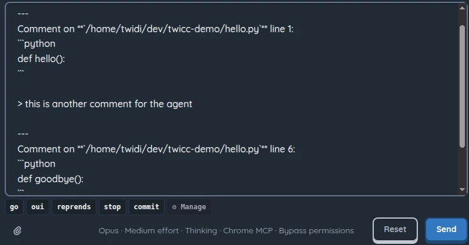
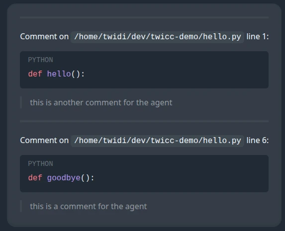

# Changelog

All notable changes to this project will be documented in this file.

The format is based on [Keep a Changelog](https://keepachangelog.com/en/1.1.0/), and this project adheres to [Semantic Versioning](https://semver.org/spec/v2.0.0.html). Some entries include illustrative screenshots in nested sub-lists.

## [Unreleased]

### Added

- `--version` / `-V` flag to the CLI to display the current version without starting the server

### Changed

- Improve windowed burn rates in usage tooltips and graphs: remove misleading smoothed rate, add cross-period calculation for early-window accuracy, rename to "Burn rate (last X)", and add 6h/12h range options to the graph
- Add permanent install instructions (`uv tool install twicc`) to the README alongside the existing `uvx` quick start
- Auto-focus the terminal when switching to the terminal tab, and auto-focus the message input when switching to the chat tab via keyboard navigation

### Fixed

- Sessions with cron jobs no longer silently stop retrying after an API error (e.g. 529 overloaded) — the auto-restart loop now correctly retries until the session recovers
- "View in Files tab" now always reloads the file from the backend, even if it was already open, to avoid displaying stale content
- CLI subcommands (`twicc usage`, `twicc projects`, etc.) failing when `DJANGO_SETTINGS_MODULE` was not set or pointed to another project

## [1.3.0] - 2026-04-05

### Added

- Unread sessions: eye icon (orange) marks sessions with new assistant content you haven't seen yet, visible in the session list and aggregated at the project level
  - 
- Message history picker: type `!` at start of input or press PageUp on the first line to browse and reuse previous messages from the current session
  - 
- Message input snippets: reusable text snippets with placeholder support, scoped globally or per-project, synced across devices
  - 
  - 
  - 
- Allow pining session settings (model, effort level, thinking style...) to the session regardless of default and "always apply" settings
  - 
- Inline code comments: click a line number to annotate code, then send formatted comments to Claude via the message input
  - 
  - 
  - 
  - 
  - 
  - 
- Auto-restart sessions with active cron jobs when they die from API errors or crashes (infinite retry with exponential backoff, max 5 min between attempts)
- Confirmation dialog when stopping or archiving a session that has active cron jobs, warning that crons will be lost
  - 
- Allow opening multiple terminal sessions simultaneously, with better presets handling
  - 
  - 
- Terminal extra keys bar on mobile: tabbed bar (Essentials / More / F-keys) with modifiers (tap = one-shot, double-tap = lock), arrow keys, special characters, paste, and function keys
  - 
  - 
  - 
- Custom combos for terminal: user-defined key combos/sequences on mobile
  - 
  - 
  - 
- Custom snippets (with placeholders) for terminal: text global or project-scoped snippets (mobile & desktop)
  - 
  - 
  - 
- Context-aware terminal scroll across all modes (normal, tmux, alternate screen) on both mobile and desktop, including scroll-during-selection with an indexed text buffer for tmux (with some inspiration from a commit by @dguerizec)
  - 
- Terminal action bar with disconnect button, scroll-to-top/bottom buttons, and mobile scroll/select mode toggle with copy button
  - 
- Hover over a session or the Chat tab while dragging files/text for 1s to auto-switch, then drop to attach
- Terminal Ctrl+C copies selected text to clipboard, ESC cancels selection and returns to bottom
  - 
- Keyboard shortcuts for tab navigation: Alt+Shift+1-4 (Chat/Files/Git/Terminal), Alt+Shift+←/→ (Left tab/ Right tab), Alt+Shift+↑/↓ (last visited tab)
- Usage history graphs: "View graph" button in quota tooltips opens a dialog with time-series charts of utilization and burn rate for 5h and 7d quotas
  - 
  - 
- Auto-show the "What's New" dialog on first visit after upgrading to a new version
  - 
- List main keyboard shortcuts in the settings panel
  - 
- Add "View in Files tab" button for Read/Write/Edit tools
  - 
- Display image files (PNG, JPG, GIF, WebP…) in the Files tab instead of "Binary file cannot be displayed", with SVG preview toggle
  - 
  - 
- Dynamic favicon: colored dot with a gentle pulse (1s cycle) reflects global session activity (blue for active work, orange for unread content)
  - 
  - 

### Changed

- Replace Monaco Editor with CodeMirror 6 for code viewing, editing, and diffs — adds mobile support
  - 
- Better rendering of diffs for Edit and Write tools
  - 
  - 
- Reorganize the settings panel with a section navigation sidebar
  - 
- File tree: typing a letter jumps to the next same-level entry starting with that letter
- Remove toast notification for 15-minute user inactivity timeout
- Bump `claude-agent-sdk` from 0.1.48 to 0.1.56 (bundled Claude Code CLI: 2.1.71 → 2.1.92)

### Fixed

- Fix terminal special keys sometimes not working on mobile devices
- Stop alerting about Anthropic outage on every reconnect
- Terminal opened on a draft session now starts in the project directory instead of home
- Search overlay now pre-selects the current project filter when not in "All projects" mode
- Fix "Delete draft" from sidebar menu not navigating back to project home
- Draft badge now really disappears immediately when sending a message
- Fix Claude Agent SDK options to make it uses the real Claude Code CLI system prompt preset.

## [1.2.1] - 2026-03-20

### Fixed

- Crash on macOS at startup (`AppRegistryNotReady` in background compute process)

## [1.2.0] - 2026-03-20

### Added

- Full-text search across all sessions (Ctrl+Shift+F) with in-session search bar (Ctrl+F), powered by Tantivy
- Support for 1M context window
- Cron job persistence and automatic renewal: cron jobs survive TwiCC restarts and are transparently recreated before their 3-day CLI expiry
- Display diff stats (+N -N) on Edit and Write tool uses
- Setting to auto-open Edit/Write tool details to show diffs
- Show error indicator and running spinner on all tool uses
- Display tool error messages directly in the tool use body
- Option to auto-apply title suggestions on new sessions (no rename dialog)
- CLI subcommands: `projects`, `project`, `sessions`, `session` (with `content` and `agents` subcommands), `usage`, and `search` — all output JSON
- TwiCC Claude Code plugin with skills for each CLI command (usable only from within TwiCC)

### Changed

- Dedicated display for Edit (inline diff) and Write (syntax-highlighted code) tool uses
- Popup filter keystrokes (@ file picker, / slash picker) are now mirrored into the textarea transparently (inspired by @dguerizec)
- File picker (@) only triggers at start of text or after whitespace (inspired by @dguerizec)
- Greatly optimized session recomputation on TwiCC updates requiring it

### Fixed

- Set SDK `max_buffer_size` to 10 MB to prevent crashes on large tool outputs (e.g. screenshots)
- Draft session stayed in draft state for seconds or minutes after sending, until the SDK wrote the user message to JSONL
- Mobile: layout no longer breaks when the browser chrome (address bar) hides/shows during scrolling
- Quota cutoff time now visible even when cost display is disabled (cutoff is burn-rate-based, not cost-based)
- Bash tool input commands no longer incorrectly rendered as Markdown
- Refresh button in Files tab now also reloads the currently open file (unless it has unsaved changes)
- Stop process button shows a loading state to prevent duplicate clicks

## [1.1.2] - 2026-03-09

### Added

- Slash command picker: type `/` at the start of the message input to browse and insert slash commands (built-in, custom, and plugin commands)
- File picker popup: type `@` in the message input to browse and select files to reference
- Git root selector in the Git tab (in sync with the one in the Files tab)
- Option to remove a project's name from the edit dialog
- Directory picker in the project creation dialog
- Track cron jobs on running sessions: prevent auto-stop timeout and show clock icon when crons are active
- Command palette (Ctrl+K / Cmd+K) for quick access to navigation, actions, and settings
- Configurable "Claude built-in Chrome MCP" setting: the `--chrome` / `--no-chrome` flag is now  in settings.

### Changed

- Agent tabs now open scrolled to the top instead of the bottom

### Fixed

- Bash tool results no longer incorrectly rendered as Markdown

## [1.1.1] - 2026-03-08

### Added

- Auto-reload frontend when backend version changes
- Notify users when a new version is available on PyPI
- Monitor Claude Code status via status.claude.com and show toast notifications on outages

## [1.1.0] - 2026-03-08

### Added

- Effort level and thinking settings for Claude sessions
- Live tracking of Bash commands, agents and other possibly long-running tools
- Syntax-highlighted code display for Read tool results
- Show URL/query in WebFetch, WebSearch, and ToolSearch tool summaries

### Changed

- Upgrade Web Awesome 3.2 → 3.3.1 (removes many workarounds)
- Update claude-agent-sdk 0.1.45 → 0.1.48 (Claude Code CLI 2.1.63 → 2.1.71)
- Replace selects for model, permission, etc... in message input by simple button + popopver

### Fixed

- Classify `/clear` command items as system instead of user message, rewrite titles of sessions saved with "/clear" title
- "starting" state of process wasn't visible
- Fix custom session title not persisting on some circumstances
- Fix mobile layout issues
- Handle invalid TodoWrite
- Missed file attachments in optimistic user messages
- Improve backend resilience (watcher crash prevention, empty session handling, WebSocket error isolation)

## [1.0.3] - 2026-03-04

### Added

- Display unnamed projects as a directory tree
- Persist "show archived sessions" and "compact view" sidebar toggles
- Project archiving
- Improved session item rendering: tool use summaries and title changes
- Filtering of WebSocket message (for twicc external tooling) (contributed by @dguerizec, closes #3)
- Rate limiting on the login endpoint (contributed by @dguerizec)

### Changed

- Hide sessions without any user message
- More reliable git directory and branch detection (Closes #2)
- Performance improvements on the session chat
- Update claude-agent-sdk 0.1.44 → 0.1.45 (Claude Code CLI 2.1.59 → 2.1.63)

### Fixed

- Fix stale project detection
- Strip inherited `CLAUDE_*` environment variables at startup to prevent false nested SDK session detection
- Limit project selector height
- Disable diff editor compact mode
- Fix virtual keyboard behavior on mobile (read-only editors, draft screens)
- Block message sending while attached images are still being processed, preventing partial uploads

## [1.0.2] - 2026-02-28

### Added

- Smart permission suggestions: auto-generate actionable suggestions for all tool types (file Read/Edit/Write, WebFetch, WebSearch, MCP tools) when the SDK doesn't provide them
- Wildcard MCP tool suggestions: offer server-wide permission alongside tool-specific ones
- Ungroup multi-rule permission suggestions so users can accept/reject each rule independently
- Destination selector for permission suggestions (user/project/local settings or session)
- File type icons in tool use summaries
- Display relative file paths in tool use summaries (relative to session working directory)

### Fixed

- Improve pending request form layout on mobile (reordered sections, wrapping buttons)
- Work around SDK bug serializing null `ruleContent` in permission responses
- Hide "Approve with changes" button when tool input is empty

## [1.0.1] - 2026-02-28

### Added

- Create new projects from the home page and from session dropdown menus, with directory path validation
- Dedicated component for displaying thinking blocks (instead of generic fallback)
- Show file path in tool use summary for Edit/Write/Read tools
- Stale project handling: hide stale projects from "new session" dropdowns and disable the button

### Fixed

- Detect stale projects based on actual working directory existence, not just the Claude projects folder
- Support HTTP access on LAN (non-secure contexts) by replacing `crypto.randomUUID()` with a fallback
- Avoid creating empty projects for folders with no sessions (defer creation until first session with content)
- Clean up existing empty projects via migration

## [1.0.0] - 2026-02-27

Initial release.
