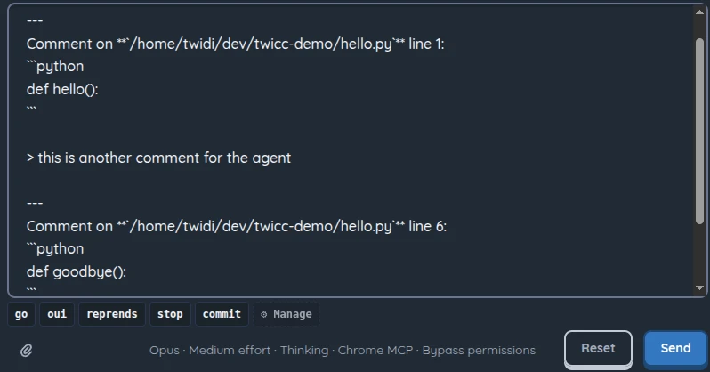
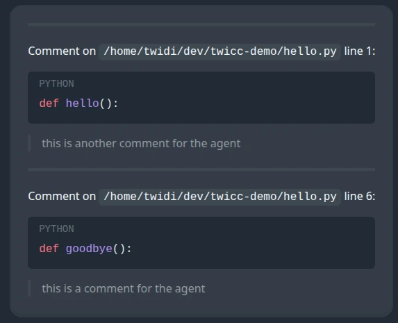

# Changelog

All notable changes to this project will be documented in this file.

The format is based on [Keep a Changelog](https://keepachangelog.com/en/1.1.0/), and this project adheres to [Semantic Versioning](https://semver.org/spec/v2.0.0.html). As a small deviation, each release opens with a one-line **Summary** recapping its highlights, and some entries include illustrative screenshots in nested sub-lists.

## [Unreleased]

### Fixed

- **OAuth client compatibility** — Accept OAuth 2.1 code exchanges without a repeated redirect URI. Allow native clients to select an available HTTP loopback callback port while preserving the callback address and path, PKCE, and existing client authentication.
- **OAuth abuse protection** — Limit new requests per client and network source, preserve authorized token budgets, and pause new connections for ten minutes when abuse is suspected. Show an owner alert and add manual suspension without revoking authorizations.
- **WebSocket security** — Reject browser connections from a different host or port before opening the main stream, terminals, or live shares. Preserve local, development-proxy, and HTTPS tunnel connections.
- **External MCP** — Require a TwiCC password to enable external access. Starting without a password disables access while preserving existing authorizations for manual reactivation. Settings show a disabled switch and a danger callout.
- **Connection loss** — Sessions in the background no longer miss messages written while the connection was down.
- **Codex goals** — Follow-up messages sent during `/goal` now reach the agent without a timeout error.

## [1.94.0] - 2026-09-05

### Summary

- **v1.94.0: GPT-6 Astra** — OpenAI's new flagship model for your Codex sessions, a peer inbox within reach and filterable by project, and title suggestions from the model of your choice.

### Added

- **GPT-6 Astra** — OpenAI's new flagship model is now available for Codex sessions.
- **Command palette** — New entries for the peer inbox and peers, the help pages, moving through a conversation, muting a session, bookmarking and sharing an artifact, and the Browser tab's saved URLs.
- **Title suggestions** — You can now use Claude Haiku or GPT-5.6 Luna for every session, or keep matching each session's provider.
- **Peer inbox** — Filter messages by project, alongside the peer and text filters.
- **Another Claude Code or Codex home** — TwiCC can now work with a Claude Code or Codex home other than the default one, configured in your `.env`.

### Changed

- **Peer inbox** — The inbox button stays next to Settings even when nothing is waiting, so you can open the inbox and its history whenever you want. It still stays hidden until peers are set up.
- **Backend log** — The log file no longer grows forever: TwiCC trims it at startup.
- **Claude Agent SDK** — Upgrade from 0.2.151 to 0.2.152 (bundled Claude Code CLI: 2.1.258 → 2.1.259)
- **Codex runtime** — Update from v0.150.1 to v0.153.4 (migration of existing sessions to Codex's new rollout format; a session stays unavailable until its rebuild finishes).

### Fixed

- **Toast notifications** — Fixed some visibility and contrast issues.

## [1.93.1] - 2026-09-02

### Summary

- **v1.93.1: Claude Fable 5.1 & peer enhancements** — a new version of Anthropic's flagship model, peer messages you write yourself, and better peer notifications.

### Added

- **Claude Fable 5.1** — support for Anthropic's new Fable model, now the latest Fable (Fable 5 remains selectable).
- **Peer messages, by hand** — You can now write to a peer yourself, including replying to a received message, without going through an agent. And when a message needs nothing more, mark it **done**.
- **Peer notifications** — A message or a pairing request from a peer can now reach you outside the app: a sound, a browser notification, or a push to your devices. The in-app notices were reviewed at the same time.

### Changed

- **The keyboard on touch devices** — Opening a session's Files, Git, Artifacts or Browser tab no longer pops the on-screen keyboard; tap a filter field yourself to type. The Terminal tab still opens it.
- **Include files in a prompt** — Inside an included file, an `@@./path` or `@@../path` marker now points next to that file, so only the first file of a set of prepared prompts needs an absolute path (CLI/skill/API only, not the UI).
- **Claude Agent SDK** — Upgrade from 0.2.149 to 0.2.151 (bundled Claude Code CLI: 2.1.252 → 2.1.258)

### Fixed

- **Retired models** — GPT-5.4 and GPT-5.4 mini retired on August 31 but were still offered in the model pickers, where choosing one silently ran a different model. They no longer appear anywhere.
- **Provider status alerts** — One notice per provider, following the incident step by step; dismiss it once and it is gone everywhere.
- **Peer inbox badge** — The count of what awaits you stays visible whatever the state of the sidebar.

## [1.93.0] - 2026-08-31

### Summary

- **v1.93.0: Peers & artifacts that remember** — pair your TwiCC with another person's so your agents can exchange messages and files under human review, plus interactive artifacts that save your choices, Codex's new subagents, and a long round of interface fixes.

### Added

- **Peer messaging** — Pair your TwiCC with another person's so you can work together through your agents, exchanging messages and files under human review.
- **Artifacts can save data** — An interactive artifact can now remember your choices, and the agent can read them back.
- **Codex Subagents v2** — Subagents spawned by Codex's new multi-agent mode are now visible (their prompt stays hidden, encrypted by OpenAI).
- **Download a file** — In the Files, Artifacts and Git tabs, a file's menu can now save it to your device — or, in Git, its changes as a patch.
- **Buttons on code blocks** — Wherever Markdown is displayed, each code block can be copied, or have its long lines wrapped. A Markdown block can also be shown rendered.
- **Jump around a conversation** — A toolbar in the bottom-right corner of the chat moves you from message to message.
- **Mute a session** — A button in its header silences that session's "finished working" notification, while every other alert from it still reaches you; it can also be set when creating or updating a session (+CLI/skill/API).
- **Turn off the "finished working" toast** — A new Notifications setting hides it, leaving the sound, browser notification and push untouched.
- **Answers to questions survive a reload** — What you picked or typed when an agent asks you questions is kept if the page reloads before you submit (as long as the agent is still running).
- **Attachments on their own** — In an ongoing conversation, you can now send images or files without writing any text.
- **Agent-created share links** — Two new Sharing settings, off by default, let agents create and manage public links for the sessions and artifacts of their own spawn subtree.
- **Include files in a prompt** — An `@@/abs/path` marker in a prompt or message is replaced by that file's content before sending; `--no-expand` disables it (CLI/skill/API only, not the UI).
- **Send a snippet in one gesture** — On touch devices, press and hold a message snippet to send it right away, without the keyboard opening.

### Changed

- **Public addresses** — External, Share, and Peer addresses now use one validation format. TwiCC repairs existing External and Share values when safe and ignores unsafe values until you correct them. The former “External URL” label is now “External address”.
- **Messages between sessions** — A session that writes to another one is now always named, instead of its message looking like it came from you.
- **Quoted text in a message** — Comments on a selection, quotes, and messages from another session now stand out as their own block instead of blending into the text around them.
- **Comments on a selection** — On desktop, the selection comment widget in the conversation puts the cursor back in the message box when you add your comment, so you can send it right away.
- **More room for the session title** — When a session header gets narrow, the action icons before the title fold behind a single button. Click it to show them.
- **GPT-5.4 leaves Codex** — GPT-5.4 and GPT-5.4 mini retire on August 31, 2026. The model pickers now show the date, and sessions still on them move to a supported model on the day.
- **Claude Agent SDK** — Upgrade from 0.2.130 to 0.2.149 (bundled Claude Code CLI: 2.1.222 → 2.1.252)
- **Codex runtime** — Update from v0.146.0 to v0.150.1.

### Fixed

- **Reading while streaming** — You no longer lose your scroll position when the reply you were reading finishes streaming.
- **Text jumping while a reply streams** — The activity line below a reply no longer appears and disappears on short pauses, so the text stops jumping as you read it.
- **Scroll position when switching sessions** — Coming back to a session returns you where you were.
- **Tab bars on touch** — Swiping a session's tab bars with a finger scrolls them again, instead of only the arrows working.
- **Navigation inside a session** — Moving between a session's tabs no longer sends the sidebar to another project or workspace.
- **Minimized docks** — The strip of icons now shows which tab a minimized dock is on, and which one is open.
- **Refreshing the Files tab** — The open file keeps its preview mode, zoom and scroll position, instead of falling back to raw text on every refresh.
- **Buttons in notifications** — In light mode, they no longer blend into the notification's background.
- **"Share viewed" notifications** — They now name the shared session or artifact, and the link's own label, instead of an internal identifier.
- **Project icons** — The project selector now shows the current project's icon, not only its color dot.
- **Quota tooltips** — no longer close before you can reach the buttons inside them (attempt #2).
- **Sessions stuck as working** — A Claude session no longer stays shown as working once it has finished replying and is waiting for you.
- **Claude cron jobs** — A session with cron jobs is now always resumed, and its jobs are no longer duplicated.
- **Codex sessions spawned by an agent** — They can now put their questions in the conversation instead of a click-only dialog, so a hidden one no longer gets stuck.

## [1.92.8] - 2026-08-05

### Summary

- **v1.92.8: Claude Opus 5** — Anthropic's new Opus model is available, alongside refreshed Claude and Codex runtimes.

### Added

- **Claude Opus 5** — support for Anthropic's new Opus model, now the latest Opus (Opus 4.8 remains selectable).

### Changed

- **Claude Agent SDK** — Upgrade from 0.2.124 to 0.2.130 (bundled Claude Code CLI: 2.1.216 → 2.1.222)
- **Codex runtime** — Update from v0.144.6 to v0.146.0.

## [1.92.7] - 2026-07-21

### Summary

- **v1.92.7: Maintenance round** — A fix for artifacts sending data to online services, a Codex context-window rollback and a Claude SDK upgrade.

### Changed

- **Codex context window** — GPT-5.6 models temporarily use a 272K context window, like the other Codex models, until the larger window returns.
- **Claude Agent SDK** — Upgrade from 0.2.122 to 0.2.124 (bundled Claude Code CLI: 2.1.214 → 2.1.216)

### Fixed

- **Interactive artifacts** — Artifacts that send data to an online service (for example to query an API) now work, instead of failing silently.

## [1.92.6] - 2026-07-19

### Summary

- **v1.92.6: Polished share pages** — Public share pages now follow dark mode, with sharper image and Mermaid rendering in shared artifacts.

### Added

- **Dark mode on shared pages** — Public share pages that didn't already support it now follow light and dark mode.

### Fixed

- **Shared artifacts** — A pass of fixes and improvements to how images and Mermaid diagrams render in public links.

## [1.92.5] - 2026-07-18

### Summary

- **v1.92.5: Codex Fast mode & anonymous telemetry** — Run supported Codex models up to 1.5× faster, plus opt-out anonymous usage statistics and reliability fixes.

### Added

- **Anonymous telemetry** — TwiCC now sends anonymous usage counters — never content, messages or names — to help its author understand how the project is used. Enabled by default, disabled in one click from the settings; a [transparency page](https://twicc-telemetry.twidi.com/) details every field, and the exact data sent is viewable in the app.
- **Codex Fast mode** — Run supported Codex models up to 1.5× faster when speed matters.

### Changed

- **Codex runtime** — Update from v0.144.5 to v0.144.6.

### Fixed

- **Browser tab** — Back and Forward now reliably move within the embedded page, on single-page and multi-page sites alike, instead of sometimes navigating TwiCC itself backwards.
- **Codex tools** — Improve the display of several tools following tool-handling changes in Codex 5.6.

## [1.92.4] - 2026-07-18

### Summary

- **v1.92.4: Project icons** — Projects now show an auto-detected favicon or logo (or your own), plus automatic colors, a richer artifacts menu and reliability fixes.

### Added

- **Project icons** — Projects can show an icon instead of the color dot: a favicon or logo found in the repository is picked up automatically, or set your own.
- **Project colors** — Projects now get an automatic color based on their name; change it anytime.

### Changed

- **Claude extra usage** — The usage widget and the extra-usage alerts now show your spending as an amount against your monthly limit (e.g. 44.19 EUR / 80) instead of a percentage.
- **Artifacts list** — The menu on each artifact now also offers Edit, Open in session and Remove.
- **Claude Agent SDK** — Upgrade from 0.2.120 to 0.2.122 (bundled Claude Code CLI: 2.1.211 → 2.1.214)

### Fixed

- **Claude task lists** — Tasks are no longer duplicated after a conversation compaction.

## [1.92.3] - 2026-07-17

### Fixed

- **Shared sessions** — Public session links show the conversation again.

## [1.92.2] - 2026-07-17

### Summary

- **v1.92.2: Codex Plan mode & Auto-review** — Codex gains a Plan mode and a new Auto-review permission mode, plus small adjustments and reliability fixes.

### Added

- **Codex Plan mode** — Plan before coding with the `/plan` command: Codex explores and proposes a plan, then one click implements it — in the same session or in a new one seeded with the plan.
- **Multiple saved browser URLs** — Save several URLs per project or workspace for the Browser tab, with optional labels and a Home default; manage them from the Browser toolbar or the edit dialogs.
- **Codex new permission mode** — Auto-review has Codex vet its own risky actions: it keeps going on the safe ones and only asks you about the ones it refuses.
- **Divider double-click** — Double-click the divider next to a dock to maximize it.

### Changed

- **Browser tab warnings** — When a page can't be embedded, the warning now links to the Browser tab guide to help you get your dev server showing.

### Fixed

- **Claude monitoring** — Prevent auto-stop for Claude sessions with a running Monitor tool.
- **Codex work directories** — Keep session scratch and artifact directories writable for Codex-owned continuations such as `/goal`, including when a command starts a new session.
- **Simplified session view** — Expanding live Claude thinking no longer shows a duplicate switch.

## [1.92.1] - 2026-07-16

### Summary

- **v1.92.1: Drag-and-drop layouts & session artifacts** — arrange tool panes by dragging them into place, and find bookmarked artifacts directly in each session’s Artifacts tab, alongside Codex and interface reliability fixes.

### Added

- **Drag-and-drop layouts** — Arrange tool tabs by dragging them between the main area and docks.
- **Scoped artifact bookmarks** — Browse project, workspace, and everywhere bookmarks consistently from sessions and the dedicated Artifacts view.

### Changed

- **Claude Agent SDK** — Upgrade from 0.2.118 to 0.2.120 (bundled Claude Code CLI: 2.1.209 → 2.1.211)
- **Codex runtime** — Update from v0.144.4 to v0.144.5.

### Fixed

- **Dock controls** — docks now minimize and maximize on the first click.
- **Agent settings popover** — stays in place while settings update, and now displays correctly on mobile.
- **Disk usage** — Old Codex versions are now removed automatically.
- **Codex error recovery** — provider errors now stay visible in the conversation with a one-click resend or retry action.

## [1.92.0] - 2026-07-14

### Summary

- **v1.92.0: Public Sharing, New Model Picker & New Usage Widget** — share sessions and artifacts through secure public links, choose a model and effort with clearer guidance, and see your quota, pace and projected cutoff at a glance.

### Added

- **Public sharing** — Share sessions and artifacts through read-only public links, with optional passwords and expiry.
  - 
- **Model & effort picker** — Choose agent settings from a model × effort matrix, with benchmark-based recommendations tuned to the task's difficulty.
  - 
- **Artifact bookmark names** — New bookmarks now get a suggested name from the artifact's title or filename.

### Changed

- **Current agent settings** — The summary below the message input is now more compact and visual, with an icon for each setting.
  - 
- **Usage quotas** — The sidebar now shows usage, elapsed time and burn rate as stacked bars, including where a projected cutoff would occur.
  - 
- **Native links** — Session tabs and artifact bookmarks are now regular links and can be used as such.
- **Codex `ultra` effort** — Temporarily unavailable; existing selections fall back to the closest supported effort.
- **Claude Agent SDK** — Upgrade from 0.2.116 to 0.2.118 (bundled Claude Code CLI: 2.1.207 → 2.1.209)
- **Codex runtime** — Update from v0.144.2 to v0.144.4.

### Fixed

- **Codex GPT-5.6 tools** — Task plans and output from long-running commands work correctly again.

## [1.91.3] - 2026-07-13

### Changed

- **Codex runtime** — Update from v0.144.1 to v0.144.2.

## [1.91.2] - 2026-07-13

### Summary

- **v1.91.2: GPT 5.6 rendering & better MCP support** — correct tool and thinking rendering for GPT-5.6 sessions, add interactive forms for MCP input requests and Codex MCP approvals and a round of fixes.

### Added

- **MCP input requests** — MCP servers that need something from you mid-task now show a form right in the conversation.
- **Codex question widget** — Codex questions now come through the same interactive widget as Claude's (and not only in Plan mode).

### Changed

- **Codex 5.6 rendering** — Tools and Thinking blocks for GPT-5.6 sessions are now correctly rendered.
- **Claude Agent SDK** — Upgrade from 0.2.111 to 0.2.116 (bundled Claude Code CLI: 2.1.202 → 2.1.207)
- **Codex runtime** — Update from v0.144.0 to v0.144.1.

### Fixed

- **Codex MCP approvals** — Codex asking permission to run an MCP tool now shows a proper approval form.
- **Form focus** — approval and question forms are focused automatically again when they appear.
- **Codex quotas** — Codex 7 days usage stays correct when OpenAI temporarily disables 5-hour quota (5-hour quota still shown as "Not started yet")
- **Quota tooltips** — no longer close before you can reach the buttons inside them.

## [1.91.1] - 2026-07-10

### Summary

- **v1.91.1: Codex GPT-5.6** — the new GPT-5.6 family (Sol, Terra and Luna), a table of contents for markdown previews, cheaper cache reuse when you return to a session, and a round of fixes.

### Added

- **GPT-5.6 on Codex** — OpenAI's new GPT-5.6 family is selectable as three tiers — Sol, Terra and Luna — with higher reasoning-effort levels than before; new Codex sessions now start on Terra.
- **Table of contents** — markdown previews in the Files, Plan and Git tabs now show a collapsible outline to jump to any section, with a quick way back to the top.

### Changed

- **Codex runtime** — Update the vendored SDK to rust-v0.144.0; the Codex CLI runtime is now downloaded on first launch, since OpenAI stopped publishing stable Codex binaries to PyPI.
- **Returning to a session** — coming back to an idle session within the hour now reuses its prompt cache instead of rebuilding it, so the next turn is faster and cheaper.

### Fixed

- **Terminals** — interactive git commands (like `git rebase -i`) now open your editor as expected inside TwiCC terminals.
- **Artifact network prompt** — the network-access consent prompt no longer becomes unclickable when it opens over an artifact's HTML preview in the Files tab.
- **Reconnect** — diffs written while you were disconnected now auto-open, and stuck tool spinners stop.

## [1.91.0] - 2026-07-07

### Summary

- **v1.91.0: A browser and an MCP server** — preview a page beside the conversation and point the agent at on-page elements, plus MCP tools to drive TwiCC.

### Added

- **Browser tab** — preview a page (typically your project's dev server) right next to the conversation: browse it, view it at any device size, and point the agent straight at elements on the page.
- **Artifacts tools** — rendered web pages get the same tools as the Browser tab: pick an element to comment on it to the agent, and preview at any device size.
- **MCP server** — agents can now drive TwiCC through built-in MCP tools (spawn sessions, send messages, orchestrate) instead of shell commands.

### Changed

- **Plan tab** — now covers every plan-like document a session touched (plans, specs, handoffs…), for Claude and Codex alike (+CLI/skill/API).
- **Authentication** — to avoid interfering with other sites running on localhost previewed in the new Browser tab, the session cookie changed; users who have set a TwiCC password will need to sign in again.
- **Claude Agent SDK** — Upgrade from 0.2.110 to 0.2.111 (bundled Claude Code CLI: 2.1.191 → 2.1.202)

### Fixed

- **Reconnect** — messages arrived while disconnected (e.g. phone asleep) no longer stay missing until a page refresh.
- **"Finished working" notifications** — no longer sent while background agents are still running.
- **Codex service status** — issues on OpenAI's side are now reported; they previously went unnoticed.
- **Claude scheduled wake-up** — correctly handle Claude's ScheduleWakeup tool, and don't stop sessions that are waiting on one.

## [1.90.0] - 2026-07-03

### Summary

- **v1.90.0: The release you were never told about** — fixes update notifications that silently skipped 1.10.0, with a version jump to 1.90 so already-installed clients notice it.

### Fixed

- **Update notifications** — new releases were no longer announced (1.10.0 went unnoticed). Fixed — and this release jumps to 1.90 so that installs still running the old check are notified again.
- **Claude background agents** — proper handling of Claude now launching its subagents in the background by default.

## [1.10.0] - 2026-07-02

### Summary

- **v1.10.0: Fable 5, Sonnet 5 & New Session Tabs** — Fable 5 is back, Sonnet 5 arrives, three new session tabs (Plan, Tasks, Workflows), plus session goals, mid-run interruption, and a round of fixes.

### Added

- **Claude Sonnet 5** — support for Anthropic's new Sonnet model, now the latest Sonnet (Sonnet 4.6 remains selectable).
- **Plan tab** — a Claude session with a plan now shows it in a dedicated, read-only tab; the plan is also retrievable from the CLI (+skill/API).
- **Tasks tab** — a session with a task list now shows its latest state in a dedicated tab; the tasks list is also accessible via CLI (+skill/API) with other session info.
- **Workflows tab** — a Claude session that ran workflows now shows them in a dedicated tab, live as they run; workflows are also accessible via CLI (+skill/API).
- **`/goal` command** — give a Claude or Codex session a standing objective to work toward, and refine or clear it as you go.
- **Codex `view_image` tool** — dedicated display that shows the viewed image instead of a raw tool result.
- **Interrupting the assistant** — stop it mid-task without ending the session, ready for your next message.
- **Search safeguard** — TwiCC now catches a common Claude search mistake (`rg -r`, mistaken for "recursive" when it actually means "replace") and has it retry, instead of letting it return silently garbled results.

### Changed

- **Claude Fable 5** — available again (Anthropic restored access); it is once more the strongest selectable Claude model and the target of the `max` / `strongest` model aliases.
- **Stopping sessions** — more reliable stop handling, plus a new force-stop (hard kill) for a session that won't stop in time (+CLI/skill/API).
- **Git diff → Files** — opening a Git diff in the Files tab now lands on the line you were looking at.
- **Image preview** — small images now open in a roomier view, making them more practical to zoom into.
- **Tips** — automatically shown tips now appear at most once a day.
- **Dockable layouts** — several small improvements.
- **Claude Agent SDK** — Upgrade from 0.2.106 to 0.2.110 (bundled Claude Code CLI: 2.1.185 → 2.1.191)

### Fixed

- **Reconnect** — after a WebSocket reconnect (common on mobile), the open session no longer stays frozen on a "thinking" block.
- **Terminals** — several fixes to the multi-terminal setup and to attaching tabs from higher scopes.
- **Worktree sessions** — filtering a project on a fresh page load now correctly includes its git worktrees' sessions.
- **Artifacts** — returning to an artifact preview no longer breaks its approved network calls.
- **Archived sessions** — an archived session is no longer marked as unread.
- **Session switcher** — a just-created session now stays in the Ctrl+` switcher.

## [1.9.2] - 2026-06-24

### Fixed

- **Layouts** — starting a Codex session from a draft now keeps the draft's layout instead of reverting to the default.

## [1.9.1] - 2026-06-23

### Summary

- **v1.9.1: Wake-up, tips & fixes** — a new quota wake-up that opens your provider's 5-hour quota window early each day, over 30 new in-app tips, five help pages, and an assortment of fixes.

### Added

- **Quota wake-up** — a per-provider daily time that opens your 5-hour quota window early, so more windows fit into a working day.
  - 
  - 
- **In-app tips & help** — lots of new contextual tips across the UI, plus help pages (projects, workspaces, worktrees, layouts, artifacts…) that open the first time you reach a feature.
- **Session search button** — a header button that opens the in-session search where only the Ctrl+F shortcut worked before (e.g. on mobile).

### Changed

- **Worktree directory** — the "default worktree directory" setting is now a template with placeholders (`{git_root}`, `{project_name}`, `{project_basedir}`), replacing the previous system that could only place worktrees under the git root — worktrees can now live anywhere.
- **Dockable layouts** — several small improvements.
- **Git tab** — the commit list now refreshes live, so commits made in the background show up without a manual refresh.
- **Session switcher** — archived sessions stay reachable (tagged "Arch."), so you can jump straight back to one you just archived.
- **Settings CLI** — reading settings now returns only the keys you can actually change, and `--help` is clearer about what each key accepts and what it's for.

### Fixed

- **Drafts** — a draft's dockable layout and agent settings are now saved and applied to the session created from it.
- **Chat focus** — arriving on the Chat tab via keyboard navigation focuses the message input again.

## [1.9.0] - 2026-06-22

### Summary

- **v1.9.0: Layouts and Artifacts** — dock tool tabs into custom multi-pane layouts, render agent-made artifacts and rich file previews in-app, and recover from provider errors in one click.

### Added

- **Dockable layout** — dock a session's tool tabs (Files, Git, Terminal, …) into a multi-pane layout around the chat — resize and maximize panes, and save named layouts with per-project and global defaults.
  - 
- **Artifacts** — agents can create artifacts (images, interactive playgrounds that make network calls you approve, …) rendered inside TwiCC and bookmarkable in a dedicated view (+CLI/skill/API).
  - 
- **File previews** — the file viewer renders HTML pages, Mermaid diagrams, PDFs, audio and video, with a full-window view.
- **Error recovery** — after a provider error, a one-click resend or retry gets a stuck conversation moving again.
- **Sidebar separators** — separators now group the session and artifacts lists by date and set off the sidebar's sections.
  - 
- **Attach parent terminals** — a session's terminal panel can show terminals shared from a higher scope.
  - 
- **CLI session messages** — can now be filtered by text (`--contains`) from the CLI, skills and API.
- **Terminal copy-on-select** — an optional setting to copy selected text to the clipboard automatically.
- **Sidebar toggle** — show or hide the sidebar with `Alt+Shift+B`.
- **Settings from the CLI** — read and change TwiCC synced settings from the command line (and API).

### Changed

- **Git tab** — the change tree now updates live and shows more at a glance: staged/unstaged status badges, surfaced conflicts, and per-file +/− line counts.
- **Remote access** — with no password set, TwiCC accepts connections only from the same machine; set a password to reach it from other devices.
- **Question widget** — ability to cancel or partially submit Claude's questions.
- **Claude Agent SDK** — Upgrade from 0.2.99 to 0.2.106 (bundled Claude Code CLI: 2.1.175 → 2.1.185)

### Fixed

- **Navigation** — returning to a session, project or workspace reopens your last tab instead of resetting to the start.
- **Provider authentication** — more reliable handling of expired or stale provider credentials.
- **Unread sessions** — an idle device left open no longer marks your sessions read.

## [1.8.3] - 2026-06-15

### Summary

- **v1.8.3: Smoother & steadier** — fewer approval prompts (a session can use its own working folders without asking), no more intermittent 500s under load, and a worktree-session-creation fix.

### Added

- **Future Hybrid mode** — groundwork for running a Claude session through the real `claude` CLI inside TwiCC instead of the SDK, keeping your usage on your subscription quota instead of API rates. Built for Anthropic's billing change (announced for 15 June 2026, now postponed), it ships dormant until that lands.

### Changed

- **Providers Usage** — TwiCC stops refreshing your provider usage when there's no activity for a long time.

### Fixed

- **Git worktrees** — "new session in a worktree" now shows up for projects whose git repo wasn't detected at creation.
- **RPC concurrency** — overlapping requests and config-file writes no longer collide, fixing intermittent 500s under load.
- **Approvals** — a session no longer asks for approval to read or write its own working folders (its artifacts and scratch space).

## [1.8.2] - 2026-06-13

### Summary

- **v1.8.2: Exit Fable 5** — the Claude Fable 5 model is [no longer available](https://x.com/i/status/2065597531644743999).

### Changed

- **Claude Fable 5** — no longer available ([Anthropic cut access at the US government's request](https://x.com/i/status/2065597531644743999)); anything using it falls back to Opus 4.8.
- **Notification sounds** — more short, distinctive sounds to choose from.

### Fixed

- **Message input** — the clear/reset button now also removes attachments.

## [1.8.1] - 2026-06-13

### Summary

- **v1.8.1: Never miss a beat** — extra-usage alerts, push notifications to your devices, and a quick session switcher.

### Added

- **Extra usage alerts** — get notified when a provider starts using your paid extra usage credits (configurable notification).
  - 
- **External notifications** — push notifications to your devices via [Apprise](https://appriseit.com) (ntfy, Pushover, Telegram, and 130+ other services), with a per-target "Only when you're away" option.
  - 
- **Session switcher** — hold Ctrl and tap the key above Tab (the backtick on QWERTY) to flip between your recently-visited sessions; add Shift to pick from the sessions shown in the sidebar instead.
  - 
- **Terminal (Mac)** — new settings to choose whether the Option (⌥) key types special characters like `|` or acts as the Meta key for shell shortcuts.
- **File editor** — Alt+E to toggle edit mode for the current file.

### Changed

- **Claude Agent SDK** — Upgrade from 0.2.96 to 0.2.99 (bundled Claude Code CLI: 2.1.172 → 2.1.175)

### Fixed

- **Workspaces auto-add** — now correctly add new projects to workspaces with auto-add patterns.
- **Trust flags** — some fixes to make the trust system more reliable. 

## [1.8.0] - 2026-06-11

### Summary

- **v1.8.0: Worktrees, trust & Fable 5** — full git worktree support, a project trust model, and per-project defaults.

### Added

- **Claude Fable 5** — support for the new frontier model from Anthropic (removed in 1.8.2, [reason](https://x.com/i/status/2065597531644743999)).
- **Git worktrees** — full worktree support across the app.
  - 
  - 
- **Project trust** — a TwiCC-level trust model that builds on Claude Code's and Codex's one, gating session permissions per project.
  - 
- **Per-project agent defaults** — default provider and agent settings set per project, inherited when a session is created.
  - 
- **Command palette** — significantly expanded (project/workspace management, worktrees, read-state, archived projects, richer search), now also mouse and mobile-accessible.
- **Session list** — multi-select with batch actions.
  - 
- **Project selector** — each entry has its own actions menu.
  - 
- **Message input** — collapsible once it grows beyond a certain size, to free up space for reading; also stays usable while a pending request is shown.
- **Orchestration, CLI & skills** — session content filter (`--contains`), `--siblings` filter with peer communication, and a per-provider orchestration opt-out.
- **Code line comment** — Ctrl/Cmd+Enter to insert the comment into the message input.
- **Activity stats** — provider filter.
- **File editor** — Ctrl+G to jump to a line.

### Changed

- **Mermaid** — reduced flickering during streaming, and diagram theme now follows the active color scheme.
- **Question widget** — the "Other" field is now a textarea instead of a single-line input.
- Bump `claude-agent-sdk` from 0.2.91 to 0.2.96 (bundled Claude Code CLI: 2.1.165 → 2.1.172)

### Fixed

- **git** — fixed session git roots that could land on the wrong or unrelated folders.
- **Codex** — usage sync recovers when the OAuth token cache is stale.

## [1.7.2] - 2026-06-06

### Summary

- **v1.7.2: Build hotfix** — republishes 1.7.1 with the correct frontend bundle.

### Fixed

- The 1.7.1 wheel and sdist published to PyPI shipped a stale frontend build that was missing the latest UI changes; 1.7.2 republishes the same release with a correctly rebuilt frontend.

## [1.7.1] - 2026-06-06

### Summary

- **v1.7.1: Batch & timestamps** — act on many sessions at once from the CLI, and see when each message was sent.

### Added

- A session can now show the time of each message and a divider when the day changes — enable it under Settings → Sessions → Message timestamps.
- New batch CLI commands (+matching skills and API): `update-sessions` and `send-messages` to work on many sessions at once.
- The session create/update CLI commands (+matching skills and API) now accept generic keywords (`max`, `min`, `open`, `strict`, …) in addition of each provider's exact settings, so a single call can configure or update a mix of Claude Code and Codex sessions at once.

### Changed

- The Orchestration tab now shows each node's project, turn count and context usage, and auto-refreshes while any session in the tree is live.
- When using CLI/skills with `--remote`, file paths for a prompt or an attachment are resolved on your local machine by default; prefix the path with `remote:` to read it on the server instead.
- Bump `claude-agent-sdk` from 0.2.90 to 0.2.91 (bundled Claude Code CLI: 2.1.163 → 2.1.165)

### Fixed

- Codex approval banners now show the actual command when a patch is applied through the shell, instead of an empty "wants to modify 0 files".
- Codex sessions no longer silently lose TwiCC's skills after a restart or a version change.

## [1.7.0] - 2026-06-05

### Summary

- **v1.7.0: CLI, API & orchestration** — a scriptable twicc CLI and HTTP API, an orchestrator skills family, and Opus 4.8.

### Added

- Added support for Claude Opus 4.8, now the latest Opus model (Opus 4.7 remains selectable).
- Added support for Claude Code's "auto" permission mode, which runs without per-tool prompts while a classifier reviews and blocks risky actions.
- Added support for Claude Code Opus fast mode (billed against extra usage credits).
- Through a system-prompt addendum, agents are now aware of their TwiCC context and of the settings they run under.
- Lots of new `twicc` CLI commands (and matching skills) to manage sessions, processes, projects, and workspaces.
- The `twicc` CLI is now also exposed as a token-gated HTTP API, and a `--remote <url>` flag lets one TwiCC instance drive another over the network.
- A new orchestrator skills family lets one agent split a task into sub-tasks across spawned sessions, with a shared scratch space.
- Agents can save images and screenshots outside the project repo, and TwiCC serves them and renders them inline in chat.
- Clicking an image or a Mermaid diagram in a message now opens a full-screen viewer with pan/zoom and navigation.
- Added support for Codex's `/compact` command.
- The sidebar usage panel now shows your remaining Codex extra-usage credits.
- The workspace edit dialog gained a per-dialog "Show archived" toggle for its project list.

### Changed

- When you send a message while Claude Code is working, it now quotes your message at the top of its reply so your request stays visible in the transcript.
- Codex's Approve button now approves "Once" in one click; the chevron still exposes the other approval variants.
- Sidebar filter now supports exact substring matching: prefix the query with `"` or `'`.
- Tool-approval and question forms can now be minimized to their header, to read the conversation behind a tall request.
- Bulk archive now respects the sidebar text filter, with an option to include sessions from archived projects.
- Ctrl+F now cooperates with embedded code editors.
- Codex sessions now report their subprocess memory usage, like Claude Code.
- Bump `claude-agent-sdk` from 0.2.82 to 0.2.90 (bundled Claude Code CLI: 2.1.142 → 2.1.163)
- Bump vendored Codex Python SDK to rust-v0.136.0 (bundled Codex CLI: 0.131.0a4 → 0.136.0)

### Fixed

- In a non-tmux terminal, the Escape key is now properly forwarded to programs like vim, less, or htop.
- Session titles were sometimes not saved correctly.
- Sessions started outside the current sidebar scope now reliably appear without needing a page reload.
- The context usage ring on Claude Code sessions no longer briefly drops to 0% when resuming a session.
- Commands launched into a freshly-opened terminal tab (login command, snippets opened in a new tab) no longer occasionally fail to run.
- Workspace activity heatmaps and graphs now include archived projects.
- On macOS, TwiCC now tries to trigger fewer repeated Keychain confirmation prompts.

## [1.6.1] - 2026-05-20

### Summary

- **v1.6.1: Quiet fix** — no more "CLI not authenticated" warnings for providers you've disabled.

### Fixed

- TwiCC no longer surfaces "CLI not authenticated" warnings for providers that you have disabled.

## [1.6.0] - 2026-05-19

### Summary

- **v1.6.0: Codex arrives** — drive Codex alongside Claude Code, with bulk archiving and product tips.

### Added

- TwiCC can now be used with Codex from OpenAI in addition to Claude Code from Anthropic.
  - 
- Bulk-archive old sessions from the sidebar.
  - 
  - 
- Permission mode picker on Claude Code approval screens: switch the session to `acceptEdits` or `bypassPermissions` in the same form as approving the current tool.
  - 
- Product-discovery tips to help discover features of the application.
  - 
- Improved rendering of the Claude Code Monitor and Task tools.
- The floating Comment widget now has a Copy button and is accessible on files in the Files and Git tabs.
  - 
- Approval and question forms now auto-focus their primary control when they appear.
- Full-text search date filter split into two independent bounds: "Newer than X" and "Older than X".
- Submit the approval or question forms by using the **Cmd / Ctrl + Enter** keyboard shortcut.
- Focus the chat form from any session tab using the **Alt+Shift+M** keyboard shortcut.
- While in the message input, open or close agent settings (model, effort, …) using the **Alt+Shift+O** keyboard shortcut.
- In question forms, navigate options using **Arrow keys** (and **Space / Enter** to select).
- New CLI commands `create-session`, `session messages`, `workspaces` (and matching skills) to create a session, list its messages, or list workspaces.
- New CLI commands `password set`, `password clear`, and `password status` to manage the optional password protection interactively, without editing `.env` by hand.

### Changed

- Image attachments now support the higher resolutions accepted by Opus 4.7 (2576 px for max dimension, still at 1568 for other Claude models, 2048 for Codex)
- In the `@`, `/`, `$`, and `!` popovers, pressing Enter when nothing matches now closes the popover and keeps the typed text in the textarea.
- Bump `claude-agent-sdk` from 0.1.69 to 0.2.82 (bundled Claude Code CLI: 2.1.121 → 2.1.142)
- Password storage upgraded to salted PBKDF2-SHA256 (legacy SHA-256 hashes still accepted, auto-upgraded on next `password set`), with the `.env` forced to mode 0600.
- Logged-in sessions are now invalidated when the password is changed (or cleared), so rotating the password actually logs out from everywhere.

### Fixed

- Scrolling in long chat sessions on Chrome no longer jump uncontrollably (reported by @LeoPartt)
- Claude Code SDK instances are now properly killed when you stop the agent during an assistant turn (based on PR #13 by @LeoPartt)
- Draft sessions no longer falsely show "Forced to 1M" when 200K is explicitly picked.
- The current session stays unread when the agent finishes while the tab is inactive.
- Workspace auto-add rules now work more reliably.
- Better handling of tool calls in "Claude is..."
- Improved highlighting of search terms.
- In-session search (Ctrl+F) is now pre-filled with the selected text.
- The title-suggestion system prompt setting no longer fights with the cursor while typing — changes are now committed with an explicit Apply button.

## [1.5.5] - 2026-04-28

### Summary

- **v1.5.5: Smoother sign-in** — graceful handling when you're not logged in to Claude, plus assorted fixes.

### Added

- Better handling when you are not authenticated on Claude: TwiCC now starts anyway and tells you the command to run to log in, with the option to run it directly in an integrated terminal

### Changed

- "Show hidden files" and "Show git ignored files" toggles in the file picker and Files tab now persist across sessions and are shared between both places (proposed by @LeoPartt)
- Bump `claude-agent-sdk` from 0.1.68 to 0.1.69 (bundled Claude Code CLI: 2.1.119 → 2.1.121)

### Fixed

- Session context selector and usage ring now correctly show 1M when a session is auto-switched to the 1M window (after passing 85% of the 200K default)
- Should be fewer macOS Keychain prompts
- Fixed streaming messages in simplified and conversation display modes
- Make buttons in toaster more visible in light mode

## [1.5.4] - 2026-04-26

### Summary

- **v1.5.4: Tiny fix (for real)** — really handles failing tools in the "Claude is…" status.

### Fixed

- Really correctly handle failing tools in "Claude is..."

## [1.5.3] - 2026-04-26

### Summary

- **v1.5.3: Tiny fix** — handles failing tools in the "Claude is…" status.

### Fixed

- Correctly handle failing tools in "Claude is..."

## [1.5.2] - 2026-04-26

### Summary

- **v1.5.2: Scroll & pickers** — fewer scroll jumps and pickers that fit small screens.

### Fixed

- Reduce jumps in session chat while scrolling
- Make pickers (message history, slash commands, file picker) fit in small screen heights (mobile with keyboard open)
- Deduplicate messages in the message history picker

## [1.5.1] - 2026-04-25

### Summary

- **v1.5.1: Presets & pinning** — reusable Claude presets, session pinning, a live working status, and a markdown toolbar.

### Added

- Floating toolbar on rendered markdown content with buttons to view the raw markdown source and copy it to the clipboard (proposed by @didouye)
  - 
- Pin a session to your current project, across a whole workspace, or across every project — pinned sessions stay at the top of the sidebar in every matching context
  - 
- New "Always show active sessions" sidebar option that surfaces running and unread sessions from other projects at the top, so you never lose track of them while working in a different scope
  - 
- Live working status now reveals the tool the assistant is using and its target (file path, command, query, etc.) as soon as it starts, filling in in real time — instead of staying on a generic "Claude is thinking" until the tool is fully prepared
  - 
- Define reusable Claude config presets (model, context, effort, thinking, permission, Chrome MCP) and apply them in one click from a session's settings panel
  - 
  - 
  - 
  - 
  - 
- Triple-press Escape quickly on a session's chat tab to stop the running Claude Code process (proposed by @LeoPartt and @dguerizec)
  - 
- New `/` and `@` buttons below the message input textarea to quickly open the slash command picker and the file path picker
  - 
- Command palette can now change Claude settings for the current session
  - 
- New "Tmux config file" setting in the Terminal section to load your own `tmux.conf` (status bar, colors, key bindings, etc.) in TwiCC terminals (proposed by @LeoPartt)
  - 

### Changed

- Improved auto scroll to bottom behavior in the chat tab
- Word wrap and side-by-side toggles in diff and editor toolbars now persist across sessions and stay in sync with the Settings panel (proposed by @LeoPartt)
- Bump `claude-agent-sdk` from 0.1.63 to 0.1.68 (bundled Claude Code CLI: 2.1.114 → 2.1.119)
- Minor improvements to the command palette (added some missing commands, added indicators for workspaces, projects, and sessions)

### Fixed

- Parallel tool permission requests are now all shown and answered one by one, instead of only the last one being visible (bug report by @LeoPartt)
- Code comments gutter button is now correctly positioned on the hovered line
- Git commit selector no longer renders raw error JSON and stays interactive (opens the commit list) when the requested commit cannot be found

## [1.5.0] - 2026-04-20

### Summary

- **v1.5.0: Themes & streaming** — new visual themes, real-time assistant streaming, Opus 4.7, and per-view tabs.

### Added

- Added support for Opus 4.7, and allow selecting older Claude model versions (Available: Opus 4.7, Opus 4.6, Opus 4.5, Sonnet.4.6, Sonnet 4.5).
  - 
- Added "xHigh" new effort for Opus 4.7, and "Max" effort for Opus 4.7, Opus 4.6, and Sonnet 4.6 
- Project, workspace, and all-projects home views now have their own Files, Git (projects only), and Terminal tabs
  - 
- Real-time streaming of assistant text and thinking content during active sessions (avoid waiting undefined time before a visual response)
- Quotas/usage settings section with JSON file read and dump modes
  - 
- Text selection comments now also work in the terminal tab
  - 
  - 
- New default theme (simpler), with a choice of 3 visual themes (customizable accent color); "Theme" (dark/light) setting renamed to "Color scheme"
  - 
  - 
  - 
  - 
  - 
  - 
  - 
  - 
- Right-click context menu in file browser for file operations (Files tab) and git operations (Git tab)
  - 
  - 
- Granular URL routing: terminal index, file selection, and git commit are now encoded in the URL — browser Back/Forward, reload, bookmarks, and other links restore the expected screen
- Session list items are now proper links — middle-click or right-click to open a session in a new browser tab
- Pan/zoom on all image displays
- "Compacting" status indicator during live sessions (and better rendering of compaction summaries)
  - 
- Click the commit hash in the Git tab header to view commit details and easily copy the hash
  - 
- Message history picker: in addition to typing `!` at start of input or press PageUp on the first line to browse and reuse previous messages from the current session, you can now also use the Up arrow key, or click on the Up arrow under the textarea.
- Add a `claude` subcommand to the TwiCC CLI to run the Claude CLI that is bundled with the Claude Agent SDK

### Changed

- Text selection can now be added to the message input without requiring a comment
- Improved usage tooltip rendering: better recent burn rate computation and display, more visible buttons in dark mode
- Better initial page load with consolidated config loading and eliminated background flash
- Improved text selection comment UX: better overflow handling, keyboard shortcut to add to message, button positioning based on selection direction, and panel now draggable via the panel background
- Snippet buttons show a scope (workspace ou project) indicator
- Re-clicking the active project/workspace in the sidebar deselects the current session and navigates to the home view (to access the new tabs)
- On small-height screens, tabs can be switched directly from the compact header via a dropdown without expanding it first
  - 
- Image diffs in git now show side-by-side comparison instead of "binary file cannot be diffed"
  - 
- Creating a new project inside TwiCC now allows you to pick a non existent directory that will be created after confirmation 
- Bump `claude-agent-sdk` from 0.1.58 to 0.1.63 (bundled Claude Code CLI: 2.1.97 → 2.1.114)

### Fixed

- More reliable usage quota retrieval (auto-refresh OAuth token on API errors, macOS Keychain support for reading OAuth credentials)
- Fixed settings sync race condition between multiple clients
- Unified text selection color across the app
- Text selection comments now detected on mobile and the panel repositions when the keyboard opens
- Process indicator aggregation (workspaces and projects) fixed: priority corrected and missing indicators restored in sidebar
- Edit/Write diffs auto-close when the tool result is an error
- Some sessions were incorrectly marked as read
- Session titles were sometimes lost after renaming
- File path header shown in desktop layout when viewing files
- Edit toggle hidden for non-writable files

## [1.4.0] - 2026-04-11

### Summary

- **v1.4.0: Workspaces** — group projects into workspaces, and comment on any selected text in chat.

### Added

- Workspaces: organize projects into named groups with optional color, scoped session list, search, snippets, aggregated stats, and auto-add projects via directory patterns
  - 
  - 
  - 
- Text selection comments: select any text in the chat and add a comment to include in your next message to Claude
  - 
  - 
- `--version` / `-V` flag to the CLI to display the current version without starting the server

### Changed

- Bump `claude-agent-sdk` from 0.1.56 to 0.1.58 (bundled Claude Code CLI: 2.1.92 → 2.1.97)
- Improve windowed burn rates in usage tooltips and graphs: remove misleading smoothed rate, add cross-period calculation for early-window accuracy, rename to "Burn rate (last X)", and add 6h/12h range options to the graph
- Add permanent install instructions (`uv tool install twicc`) to the README alongside the existing `uvx` quick start
  - 
- Auto-focus the terminal when switching to the terminal tab, and auto-focus the message input when switching to the chat tab via keyboard navigation
- Redesign Claude session settings (model, effort, permissions...): replace "Always apply" and "Pin to session" with a simpler "Default" vs "Forced" model, and apply changes at the right time depending on the setting type

### Fixed

- Sessions with cron jobs no longer silently stop retrying after an API error (e.g. 529 overloaded) — the auto-restart loop now correctly retries until the session recovers
- "View in Files tab" now always reloads the file from the backend, even if it was already open, to avoid displaying stale content
- CLI subcommands (`twicc usage`, `twicc projects`, etc.) failing when `DJANGO_SETTINGS_MODULE` was not set or pointed to another project

## [1.3.0] - 2026-04-05

### Summary

- **v1.3.0: Big terminal & unread update** — unread tracking, snippets, inline code comments, and usage graphs.

### Added

- Unread sessions: eye icon (orange) marks sessions with new assistant content you haven't seen yet, visible in the session list and aggregated at the project level
  - 
- Message history picker: type `!` at start of input or press PageUp on the first line to browse and reuse previous messages from the current session
  - 
- Message input snippets: reusable text snippets with placeholder support, scoped globally or per-project, synced across devices
  - 
  - 
  - 
- Allow pining session settings (model, effort level, thinking style...) to the session regardless of default and "always apply" settings
  - 
- Inline code comments: click a line number to annotate code, then send formatted comments to Claude via the message input
  - 
  - 
  - 
  - 
  - 
  - 
- Auto-restart sessions with active cron jobs when they die from API errors or crashes (infinite retry with exponential backoff, max 5 min between attempts)
- Confirmation dialog when stopping or archiving a session that has active cron jobs, warning that crons will be lost
  - 
- Allow opening multiple terminal sessions simultaneously, with better presets handling
  - 
  - 
- Terminal extra keys bar on mobile: tabbed bar (Essentials / More / F-keys) with modifiers (tap = one-shot, double-tap = lock), arrow keys, special characters, paste, and function keys
  - 
  - 
  - 
- Custom combos for terminal: user-defined key combos/sequences on mobile
  - 
  - 
  - 
- Custom snippets (with placeholders) for terminal: text global or project-scoped snippets (mobile & desktop)
  - 
  - 
  - 
- Context-aware terminal scroll across all modes (normal, tmux, alternate screen) on both mobile and desktop, including scroll-during-selection with an indexed text buffer for tmux (with some inspiration from a commit by @dguerizec)
  - 
- Terminal action bar with disconnect button, scroll-to-top/bottom buttons, and mobile scroll/select mode toggle with copy button
  - 
- Hover over a session or the Chat tab while dragging files/text for 1s to auto-switch, then drop to attach
- Terminal Ctrl+C copies selected text to clipboard, ESC cancels selection and returns to bottom
  - 
- Keyboard shortcuts for tab navigation: Alt+Shift+1-4 (Chat/Files/Git/Terminal), Alt+Shift+←/→ (Left tab/ Right tab), Alt+Shift+↑/↓ (last visited tab)
- Usage history graphs: "View graph" button in quota tooltips opens a dialog with time-series charts of utilization and burn rate for 5h and 7d quotas
  - 
  - 
- Auto-show the "What's New" dialog on first visit after upgrading to a new version
  - 
- List main keyboard shortcuts in the settings panel
  - 
- Add "View in Files tab" button for Read/Write/Edit tools
  - 
- Display image files (PNG, JPG, GIF, WebP…) in the Files tab instead of "Binary file cannot be displayed", with SVG preview toggle
  - 
  - 
- Dynamic favicon: colored dot with a gentle pulse (1s cycle) reflects global session activity (blue for active work, orange for unread content)
  - 
  - 

### Changed

- Replace Monaco Editor with CodeMirror 6 for code viewing, editing, and diffs — adds mobile support
  - 
- Better rendering of diffs for Edit and Write tools
  - 
  - 
- Reorganize the settings panel with a section navigation sidebar
  - 
- File tree: typing a letter jumps to the next same-level entry starting with that letter
- Remove toast notification for 15-minute user inactivity timeout
- Bump `claude-agent-sdk` from 0.1.48 to 0.1.56 (bundled Claude Code CLI: 2.1.71 → 2.1.92)

### Fixed

- Fix terminal special keys sometimes not working on mobile devices
- Stop alerting about Anthropic outage on every reconnect
- Terminal opened on a draft session now starts in the project directory instead of home
- Search overlay now pre-selects the current project filter when not in "All projects" mode
- Fix "Delete draft" from sidebar menu not navigating back to project home
- Draft badge now really disappears immediately when sending a message
- Fix Claude Agent SDK options to make it uses the real Claude Code CLI system prompt preset.

## [1.2.1] - 2026-03-20

### Summary

- **v1.2.1: Startup fix** — fixes a macOS crash in the background compute process.

### Fixed

- Crash on macOS at startup (`AppRegistryNotReady` in background compute process)

## [1.2.0] - 2026-03-20

### Summary

- **v1.2.0: Search & 1M context** — full-text search across all sessions, a 1M context window, and a JSON CLI.

### Added

- Full-text search across all sessions (Ctrl+Shift+F) with in-session search bar (Ctrl+F), powered by Tantivy
- Support for 1M context window
- Cron job persistence and automatic renewal: cron jobs survive TwiCC restarts and are transparently recreated before their 3-day CLI expiry
- Display diff stats (+N -N) on Edit and Write tool uses
- Setting to auto-open Edit/Write tool details to show diffs
- Show error indicator and running spinner on all tool uses
- Display tool error messages directly in the tool use body
- Option to auto-apply title suggestions on new sessions (no rename dialog)
- CLI subcommands: `projects`, `project`, `sessions`, `session` (with `content` and `agents` subcommands), `usage`, and `search` — all output JSON
- TwiCC Claude Code plugin with skills for each CLI command (usable only from within TwiCC)

### Changed

- Dedicated display for Edit (inline diff) and Write (syntax-highlighted code) tool uses
- Popup filter keystrokes (@ file picker, / slash picker) are now mirrored into the textarea transparently (inspired by @dguerizec)
- File picker (@) only triggers at start of text or after whitespace (inspired by @dguerizec)
- Greatly optimized session recomputation on TwiCC updates requiring it

### Fixed

- Set SDK `max_buffer_size` to 10 MB to prevent crashes on large tool outputs (e.g. screenshots)
- Draft session stayed in draft state for seconds or minutes after sending, until the SDK wrote the user message to JSONL
- Mobile: layout no longer breaks when the browser chrome (address bar) hides/shows during scrolling
- Quota cutoff time now visible even when cost display is disabled (cutoff is burn-rate-based, not cost-based)
- Bash tool input commands no longer incorrectly rendered as Markdown
- Refresh button in Files tab now also reloads the currently open file (unless it has unsaved changes)
- Stop process button shows a loading state to prevent duplicate clicks

## [1.1.2] - 2026-03-09

### Summary

- **v1.1.2: Pickers & palette** — slash-command and file pickers, plus the Ctrl+K command palette.

### Added

- Slash command picker: type `/` at the start of the message input to browse and insert slash commands (built-in, custom, and plugin commands)
- File picker popup: type `@` in the message input to browse and select files to reference
- Git root selector in the Git tab (in sync with the one in the Files tab)
- Option to remove a project's name from the edit dialog
- Directory picker in the project creation dialog
- Track cron jobs on running sessions: prevent auto-stop timeout and show clock icon when crons are active
- Command palette (Ctrl+K / Cmd+K) for quick access to navigation, actions, and settings
- Configurable "Claude built-in Chrome MCP" setting: the `--chrome` / `--no-chrome` flag is now  in settings.

### Changed

- Agent tabs now open scrolled to the top instead of the bottom

### Fixed

- Bash tool results no longer incorrectly rendered as Markdown

## [1.1.1] - 2026-03-08

### Summary

- **v1.1.1: Stay current** — auto-reload on update, new-version alerts, and Claude status monitoring.

### Added

- Auto-reload frontend when backend version changes
- Notify users when a new version is available on PyPI
- Monitor Claude Code status via status.claude.com and show toast notifications on outages

## [1.1.0] - 2026-03-08

### Summary

- **v1.1.0: Effort & thinking** — per-session effort and thinking controls, with live tracking of long-running tools.

### Added

- Effort level and thinking settings for Claude sessions
- Live tracking of Bash commands, agents, and other possibly long-running tools
- Syntax-highlighted code display for Read tool results
- Show URL/query in WebFetch, WebSearch, and ToolSearch tool summaries

### Changed

- Upgrade Web Awesome 3.2 → 3.3.1 (removes many workarounds)
- Update claude-agent-sdk 0.1.45 → 0.1.48 (Claude Code CLI 2.1.63 → 2.1.71)
- Replace selects for model, permission, etc... in message input by simple button + popopver

### Fixed

- Classify `/clear` command items as system instead of user message, rewrite titles of sessions saved with "/clear" title
- "starting" state of process wasn't visible
- Fix custom session title not persisting on some circumstances
- Fix mobile layout issues
- Handle invalid TodoWrite
- Missed file attachments in optimistic user messages
- Improve backend resilience (watcher crash prevention, empty session handling, WebSocket error isolation)

## [1.0.3] - 2026-03-04

### Summary

- **v1.0.3: Project archiving** — archive projects, browse unnamed ones as a tree, and persist sidebar toggles.

### Added

- Display unnamed projects as a directory tree
- Persist "show archived sessions" and "compact view" sidebar toggles
- Project archiving
- Improved session item rendering: tool use summaries and title changes
- Filtering of WebSocket message (for twicc external tooling) (contributed by @dguerizec, closes #3)
- Rate limiting on the login endpoint (contributed by @dguerizec)

### Changed

- Hide sessions without any user message
- More reliable git directory and branch detection (Closes #2)
- Performance improvements on the session chat
- Update claude-agent-sdk 0.1.44 → 0.1.45 (Claude Code CLI 2.1.59 → 2.1.63)

### Fixed

- Fix stale project detection
- Strip inherited `CLAUDE_*` environment variables at startup to prevent false nested SDK session detection
- Limit project selector height
- Disable diff editor compact mode
- Fix virtual keyboard behavior on mobile (read-only editors, draft screens)
- Block message sending while attached images are still being processed, preventing partial uploads

## [1.0.2] - 2026-02-28

### Summary

- **v1.0.2: Smarter permissions** — auto-generated, granular permission suggestions for every tool type.

### Added

- Smart permission suggestions: auto-generate actionable suggestions for all tool types (file Read/Edit/Write, WebFetch, WebSearch, MCP tools) when the SDK doesn't provide them
- Wildcard MCP tool suggestions: offer server-wide permission alongside tool-specific ones
- Ungroup multi-rule permission suggestions so users can accept/reject each rule independently
- Destination selector for permission suggestions (user/project/local settings or session)
- File type icons in tool use summaries
- Display relative file paths in tool use summaries (relative to session working directory)

### Fixed

- Improve pending request form layout on mobile (reordered sections, wrapping buttons)
- Work around SDK bug serializing null `ruleContent` in permission responses
- Hide "Approve with changes" button when tool input is empty

## [1.0.1] - 2026-02-28

### Summary

- **v1.0.1: Create projects in-app** — make new projects from the home page, with stale-project handling.

### Added

- Create new projects from the home page and from session dropdown menus, with directory path validation
- Dedicated component for displaying thinking blocks (instead of generic fallback)
- Show file path in tool use summary for Edit/Write/Read tools
- Stale project handling: hide stale projects from "new session" dropdowns and disable the button

### Fixed

- Detect stale projects based on actual working directory existence, not just the Claude projects folder
- Support HTTP access on LAN (non-secure contexts) by replacing `crypto.randomUUID()` with a fallback
- Avoid creating empty projects for folders with no sessions (defer creation until first session with content)
- Clean up existing empty projects via migration

## [1.0.0] - 2026-02-27

### Summary

- **v1.0.0: Hello, TwiCC** — the first public release: a web UI for your Claude Code sessions.

Initial release.
