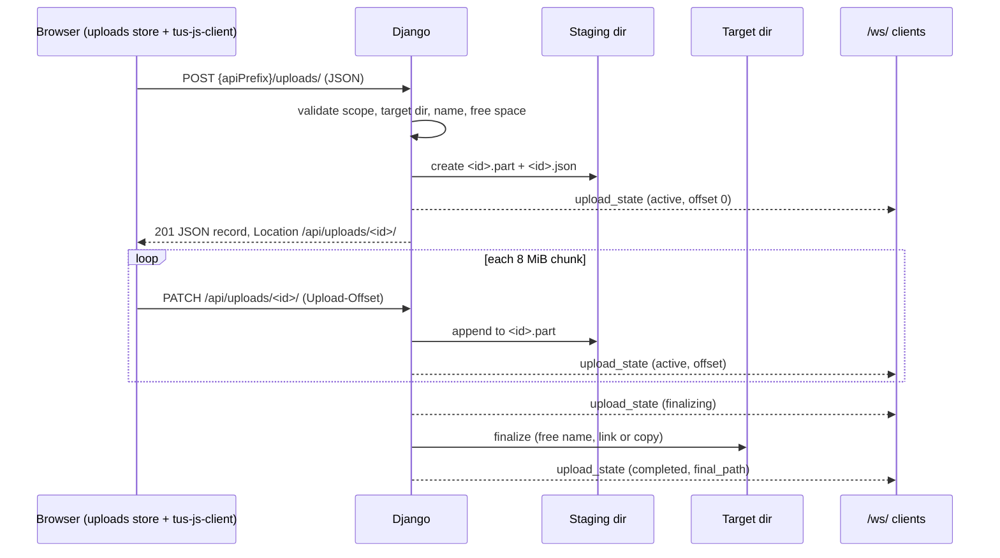

# File upload in the Files and Artifacts tabs — design

Date: 2026-09-28
Status: draft

## 1. Goal

Let the user upload files from their browser into a directory shown in the
**Files** or **Artifacts** tab.

The main use case is **remote use**: TwiCC is reached from a phone, a tablet or
another computer, often through a tunnel. On the machine that runs TwiCC the
user can use the OS file manager; remotely they cannot. Typical files: a screen
recording, a screenshot, any document.

Requirements:

- An upload never blocks the page.
- An upload continues when the user switches session, project or layout.
- A large upload **resumes** where it stopped after a network cut, a backend
  restart or a page reload.

## 2. Decisions (settled — not open for review)

These choices come from the user. A review must not challenge them.

| Topic | Decision |
|---|---|
| Entry point | **Only** the directory context menu of the file tree (the menu with *New file*, *New folder*, *Rename*, *Move*, *Delete*). New item **"Upload files…"**. No drag & drop, no toolbar button, no other entry point. |
| Scope | The **Files** tab and the **Artifacts** tab, and every other place that mounts the same file tree in `files` context-menu mode (the project detail panel's Files tab). |
| Destination | The directory on which the menu is opened. No default destination. |
| Folder upload | Not in v1. Files only (multiple selection allowed). |
| Global UI | **None.** No tray, no floating panel. |
| Tab label | While an upload runs, the Files / Artifacts tab label shows a very short status. Same mechanism as the Git tab change counts (commit `db04129b`). |
| In-tab UI | A compact progress indicator inside the tab, with a cancel action. Nothing more. |
| Global state | The backend broadcasts every upload's state over the `/ws/` WebSocket, so a future global indicator can use it. |
| Toasts | Success → toast, 15 s. Failure → toast, 15 s. No persistent toast. |
| Name conflict | **Keep both**: the uploaded file gets `name (1).ext`, `name (2).ext`, … Never overwrite, no dialog. |
| Size limit | None (disk space only). |
| Protocol / library | **tus** (resumable upload protocol, v1.0.0) for the transfer. Frontend: **`tus-js-client`**. Backend: a minimal tus server written in Django async. |
| Staging | Chunks go to a TwiCC-owned staging area. The file is moved to the target directory only when complete. |
| Resume check | A resume needs the same file: same size and same fingerprint (§6.8). No special handling for a resume from another device: it is only a consequence of the same rule. |
| Out of scope | Inserting the uploaded path into a message, any other convenience. |

## 3. Existing code this design builds on

- **Context menu:** `frontend/src/components/files/FileTreeContextMenu.vue`.
  In `files` mode, a directory node shows *New file* / *New folder*, disabled
  while `writableLoading || !writable`. The menu emits one event per item from
  its `wa-select` handler, synchronously inside the item click;
  `FileTreePanel.vue` handles it (`handleCreateFile`, `handleCreateFolder`).
- **Touch:** `FileTree.vue` opens the same menu on long press, so the entry
  point works on a phone. The root node is a regular node with a label, so the
  root directory also has the menu.
- **Endpoint scoping:** `FileTreePanel.vue` computes `apiPrefix` from its
  `projectId` / `sessionId` / `isDraft` props:
  - `/api` (standalone endpoints) when there is no `projectId`;
  - `/api/projects/<id>` for a draft session or a project-level panel;
  - `/api/projects/<id>/sessions/<sid>` otherwise.
  Existing file operations exist under all three prefixes (`src/twicc/urls.py`).
  Project/session scope is checked by `validate_path` (`src/twicc/file_tree.py`):
  sync, ORM access, raises `Http404` for an unknown project/session, and
  returns a `(session, dir_path, error)` tuple whose `error` is a
  `JsonResponse` — `403` for a path out of scope, `404` for a missing
  directory. Standalone scope is checked by `validate_standalone_root`
  (`src/twicc/views.py`): `403` out of root, and everything allowed when `root`
  is empty.
- **Panels that mount `FilesPanel`:**
  - `SessionView.vue`, tab `files` — project/session scope.
  - `SessionView.vue`, tab `artifacts` — `api-prefix="/api"`,
    `root-restriction="artifactsDir"`.
  - `ProjectDetailPanel.vue`, tab `files`. Single-project mode:
    `/api/projects/<id>`, no root restriction. All-projects mode: `/api`, no
    root restriction. Workspace mode: `/api` with the workspace common ancestor
    as root restriction (`filesApiPrefix`, `filesRootRestriction`).
- **`FilesPanel` internals:** `refresh(hints)` refetches the tree, scrolls to
  (and focuses) a target, clears the selection when the target is not found,
  and always reloads the open file. `refreshTreeSoft()` refetches the tree in
  place without touching the selection or the preview, but replaces the whole
  tree: the backend listing (`get_directory_tree`) stops expanding after
  `NODE_THRESHOLD` nodes and returns deeper directories as stubs
  (`loaded: false`). `lazyLoadDir(path)` fetches the listing of one
  directory as a breadth-first subtree (the same `NODE_THRESHOLD` budget, its
  own children always loaded); `FileTree.vue` stores it by mutating the node
  in place. A `started` flag is
  set once the panel was opened. The tree (`FileTreePanel`) is re-parented between
  a desktop and a mobile layout (`.mobile-layout` / `.mobile-tree-slot`); on
  mobile its tree overlay is absolutely positioned against the nearest
  positioned ancestor, today `.files-panel`.
- **Tab label extras:** `SessionView.vue` exposes `toolTabChangeStats(tabId)`
  (the Git stats for tab `git`). It renders `GitChangeStats` directly in the
  center tab strip (`orderedCenterToolTabs` loop), and passes the function as
  `tabChangeStats` through `SessionLayout.vue` to `DockRegion.vue`,
  `DockGutter.vue` (label chips and their measurement mirrors, label mode only)
  and `LayoutOverlay.vue`. `ProjectDetailPanel.vue` renders its own tab labels
  (`TABS` loop in its `TabBar`).
- **Artifact live refresh:** `ArtifactsWatcher` (`src/twicc/artifacts_watcher.py`)
  broadcasts `artifact_files_changed`. `SessionView.handleArtifactFilesChanged`
  forwards it **only when the session view is active** (a KeepAlive-cached view
  ignores it) to `FilesPanel.onArtifactFilesChanged`, which calls
  `refreshTreeSoft()` and reloads an HTML preview when `changeAffectsHtmlPage`
  says so (a page's own `data/` is excluded). The Files tab has no watcher.
- **Request bodies:** `DATA_UPLOAD_MAX_MEMORY_SIZE = 12 MiB`
  (`src/twicc/settings.py`) is checked only by `request.body`. The peer inbound
  view reads with `request.read()` instead (`src/twicc/peer/inbound_views.py`).
  Django's `ASGIHandler`:
  - reads and spools the whole body (to a temp file above
    `FILE_UPLOAD_MAX_MEMORY_SIZE`) **before** any middleware or view; a
    disconnect during that read raises `RequestAborted` and the view never
    runs;
  - when the client disconnects **after** the body was read, cancels the view
    task, waits for it, then closes the body file.
- **Broadcasts:** `channel_layer.group_send("updates", {"type": "broadcast",
  "data": {...}})`, as in `artifacts_watcher.py`. Frontend dispatch:
  `handleMessage` in `frontend/src/composables/useWebSocket.js`; the watcher on
  the socket `OPEN` status runs at each (re)connection and calls
  `onReconnected`.
- **Toasts:** `frontend/src/composables/useToast.js` (`toast.success`,
  `toast.error`, `duration` option).
- **Hashing without a secure context:** `frontend/src/utils/hash.js`
  (`hashString`, FNV-1a). Its comment explains why `crypto.subtle` is not used:
  absent over plain `http://` from a LAN IP. `frontend/src/utils/crypto.js`
  has `generateUUID()` with a non-secure-context fallback.
- **401 handling:** `apiFetch` (`frontend/src/utils/api.js`) calls
  `useAuthStore().handleUnauthorized()` and redirects to the login route.
  After a login, `LoginView.redirectAway()` does a full page load
  (`window.location.href`).
- **App-initiated reloads:** `App.vue` reloads the page 3 s after a backend
  version mismatch; `utils/resync.js` `reloadNow()` reloads on a resync.
- **Draft sessions:** a draft can be re-bound to a canonical session id
  (`bindDraftSession` / `draftAliases` in `frontend/src/stores/data.js`).
- **Detached tasks:** `_spawn_detached` in `src/twicc/asgi.py` keeps a strong
  reference to a task until it ends and logs its exception.
- **Periodic tasks:** started with `asyncio.create_task(...)` in
  `src/twicc/cli/run.py` ("Cross-provider periodic tasks") and cancelled at
  shutdown in the same file; pattern: `src/twicc/session_dirs_cleanup_task.py`.
- **Data dir helpers:** `src/twicc/paths.py` (`get_data_dir()`, one
  `get_*_dir()` per sub-directory, path only). **JSON writes:**
  `src/twicc/atomic_json.py` (`atomic_write_json`, temp file + rename). Backend
  JSON uses `orjson`.
- **Worktrees:** the data dir is the worktree root; `.gitignore` anchors the
  data-dir sub-directories that surface there (`/artifacts`, `/scratch`,
  `/shares`, …). `artifacts/` is a symlink to the main data dir.
- **Auth:** `PasswordAuthMiddleware` protects every `/api/` route; the browser
  sends the session cookie on same-origin XHR/fetch. There is no CSRF
  middleware.

## 4. Overview

Creation is a plain JSON request. The transfer is tus core (`HEAD` / `PATCH` /
`DELETE`). `tus-js-client` receives the upload URL and never creates an upload
itself (§6.5 explains why).



After a cut, `tus-js-client` sends `HEAD /api/uploads/<id>/` for the offset and
sends the rest.

## 5. Backend

### 5.1 Module layout

New package `src/twicc/uploads/`:

| File | Content |
|---|---|
| `store.py` | Staging dir access, metadata, offset, append, finalization, recovery, free-name logic. Blocking code, run in worker threads. |
| `locks.py` | Per-upload lock, the guarded-operation runner, the in-process "finalizing now" set (§5.4). |
| `views.py` | Creation, list, and tus endpoints (async views). |
| `broadcast.py` | `upload_state` WebSocket broadcast. |

New janitor `src/twicc/upload_cleanup_task.py`, started and cancelled in
`src/twicc/cli/run.py` next to the other periodic tasks (§5.9).

New helper `get_uploads_dir()` in `src/twicc/paths.py` →
`<data_dir>/uploads/` (path only, like its neighbours). `store.py` creates it
(`mkdir(mode=0o700, parents=True, exist_ok=True)`, private like the other
data-dir work dirs) before its first use, the free-space check included. In a worktree the data dir is the worktree, so each instance
owns its own staging area; `.gitignore` gets `/uploads` in the data-dir block
(same anchoring rule as its neighbours).

**Error numbers.** "Disk full" means `ENOSPC` or `EDQUOT`. "Target refuses"
means an error that repeats on every attempt because of the target itself:
`EACCES`, `EROFS` (not writable), `ENOENT` / `ENOTDIR` when
`os.path.isdir(target_dir)` is now false (target gone), `EINVAL`, `EILSEQ`
(name not allowed by the filesystem, e.g. `:` on exFAT), `ENAMETOOLONG`,
`EFBIG` (file too large for the filesystem). An `ENOENT` while `target_dir`
still exists concerns the source: it is an unexpected error.

**The staging dir is never a target.** In a worktree the data dir is the
project root, and a standalone scope without root reaches `~/.twicc/`. So
creation and the finalization re-validation reject a `target_dir` whose
`os.path.realpath` is equal to or inside the `realpath` of
`get_uploads_dir()` (`403`). This one check uses `realpath` (a symlink to the
staging dir must not pass); the scope checks keep `normpath`, like the
existing file operations. `GET` and the janitor only consider the names
`<32 hex>.json`, `<32 hex>.part` and `<32 hex>.json.*.tmp` (the
`atomic_write_json` temp files), and skip a `.json` they cannot parse or that
disappears between the listing and the read. The `<id>` routes answer `404`
for an unparsable `.json`. The janitor removes a `.json` still unparsable
24 h after its mtime, with its `.part` (a power loss can truncate a metadata
write, §8).

### 5.2 Staging area and metadata

For each upload `<id>` (`uuid4().hex`: 32 lowercase hex characters):

- `<data_dir>/uploads/<id>.part` — the bytes received so far. Created with
  `open(path, "xb")` (mode set by the umask). The final file keeps this mode.
- `<data_dir>/uploads/<id>.json` — the metadata, written with
  `atomic_write_json`.
- During a cross-filesystem finalization only:
  `<target_dir>/.twicc-upload-<id>.tmp` — the copy (§5.6).

**While the upload is `active`, the size of `<id>.part` is the offset.** It is
the source of truth. A crash between an append and a metadata update cannot
desynchronise the offset.

Metadata fields:

| Field | Meaning |
|---|---|
| `id` | Upload id. |
| `client_id` | Opaque id from the browser, unique per upload (§6.2), string, at most 64 characters. Makes creation idempotent (§5.3). |
| `state` | `active`, `finalizing`, `completed`, `failed`, `cancelled`. |
| `version` | Integer, +1 on every metadata write. Orders WebSocket messages and `GET` results (§6.3). |
| `size` | Total size in bytes. |
| `offset` | Last known offset: synced from `<id>.part` after every append, kept when the upload ends. |
| `filename` | Requested file name (validated). |
| `target_dir` | Absolute target directory, normalised with `os.path.normpath` (never `realpath`: a worktree's `artifacts/` is a symlink, and the frontend matches paths by prefix). Validated at creation. `final_path` is always `os.path.join(target_dir, <final name>)`. |
| `scope` | `{"kind": "standalone", "root": str\|null}` or `{"kind": "project", "project_id": str, "session_id": str\|null}` — the scope of the creation prefix. Checked again at finalization. |
| `origin` | `{"panel": "files"\|"artifacts", "key": str}` (key at most 1024 characters: `project:<id>` with a `Project.id` of up to 255 characters must fit) — where the upload was started (§6.7). Not a security input. |
| `fingerprint` | Opaque client string (§6.8), at most 64 characters. Stored and returned, never interpreted. |
| `final_path` | Set at the commit point (§5.6): the final name exists. |
| `final_method` | `link` or `replace` — how `final_path` was obtained. |
| `final_source` | `part` or `tmp` — the source file of a `replace`. |
| `error` | Set on `failed` (incl. expiry: `"expired"`), and on `active` after a finalization that failed with `507` or an unexpected error (§5.6). Cleared by the next state change. |
| `finalize_error_code` | `507` or `500`: the answer of the last failed finalization, while `error` is set on `active`. |
| `finalize_failed_at` | ISO timestamp written with the pre-commit failure (the end of the failed attempt, not its start). |
| `created_at`, `updated_at` | ISO timestamps, UTC. `updated_at` changes on every metadata write. |
| `last_transfer_at` | ISO timestamp, UTC. Set at creation and after every append that added bytes. Finalization and recovery never change it. Drives expiry (§5.9). |

**Metadata writes — one rule for every write:**

- `version` comes only from the metadata on disk: a write reads it, writes
  `version + 1`. A write that fails changes nothing on disk, so it uses no
  version number.
- A broadcast always sends the record that was **just persisted**. After a
  failed write there is no broadcast. So a client never holds a version that
  the next successful write reuses.
- A failed write inside a step is logged; the state on disk stays as it was;
  the step answers with the failure's own code (`507` for disk full, `500`
  otherwise), unless the step says otherwise (the append sync, §5.3; the
  disk-full `DELETE`, §5.3). This holds for **every** step, recovery and
  finalization included: a disk-full failure never answers `500`.
- `error`, `finalize_error_code` and `finalize_failed_at` are set together
  and cleared together (by the next state change).
- Every metadata write of a non-terminal upload sets `offset` to the current
  size of `<id>.part` (so a failed append sync is corrected by the next
  write, e.g. the `finalizing` write).
- **After a terminal write, file removals are best effort**: `ENOENT` is
  ignored, other errors are logged, and the janitor removes the leftovers
  (§5.9). The answer and the broadcast follow the terminal state already on
  disk.

Lifecycle of the files:

- Creation writes `<id>.part` first, then `<id>.json` (a `.part` alone is an
  orphan, §5.9; a `.json` never exists without its `.part` at creation).
- `active` / `finalizing`: `<id>.part` and `<id>.json` exist.
- `completed` / `failed` / `cancelled` (**terminal**): the metadata is written
  **first**, then `<id>.part` and the temp file are removed. `<id>.json` stays
  as a **tombstone** for 24 h (counted from its `updated_at`, i.e. the
  terminal write), then the janitor removes it. The tombstone
  answers late requests (§5.3) and late readers (`GET`). The janitor removes
  the leftovers of a terminal upload whose cleanup a crash cut (§5.9).

### 5.3 Endpoints

| Method | Route | Role |
|---|---|---|
| `POST` | `api/uploads/` | Create (standalone scope). JSON. |
| `POST` | `api/projects/<project_id>/uploads/` | Create (project scope). JSON. |
| `POST` | `api/projects/<project_id>/sessions/<session_id>/uploads/` | Create (session scope). JSON. |
| `GET` | `api/uploads/` | List uploads (JSON). |
| `HEAD` | `api/uploads/<id>/` | tus: offset. |
| `PATCH` | `api/uploads/<id>/` | tus: append a chunk. |
| `DELETE` | `api/uploads/<id>/` | tus termination: cancel. |

Creation lives under the three existing prefixes, like the other file
operations. The prefix scope is validated at creation and stored.

On every `<id>` route, an `<id>` that is not 32 lowercase hex characters, or
whose `<id>.json` does not exist, gets `404` before any lock or path work.

Every response of these endpoints carries **`X-Twicc-Upload: 1`**. A client
can then tell an answer of the upload code (e.g. a real backend `500`) from
the same status produced by a proxy or a tunnel (the Vite dev proxy answers
`500` when the backend is down; Cloudflare answers `52x`).

Mechanism: every upload view is wrapped by one decorator of
`uploads/views.py`. It catches `Exception` (never `asyncio.CancelledError`,
which must propagate for a disconnect, §5.4) escaping the view, including one
re-raised by `await asyncio.shield(task)`, and turns it into a JSON `500`
(logged once: an exception already logged by the guarded task's done-callback
is not logged again), and
adds `X-Twicc-Upload: 1` to every response — plus `Tus-Resumable: 1.0.0` on
the `<id>` routes. A failure **before** the view (e.g. Django's request body
spool cannot be written, §8) has no header.

tus conformance (core protocol + `termination`):

- Every `HEAD` / `PATCH` / `DELETE` response carries `Tus-Resumable: 1.0.0`.
- A `HEAD` / `PATCH` / `DELETE` without `Tus-Resumable: 1.0.0` gets `412` with
  `Tus-Version: 1.0.0`.
- The `creation` extension is **not** implemented: creation is the JSON `POST`
  above. `expiration`, `checksum` and `OPTIONS` discovery are not implemented.
  Expiry is a server policy (§5.9).

**Every write to an upload's metadata or files happens in a guarded operation
(§5.4)**, which re-reads the metadata under the lock. Metadata absent after
the re-read → `404`. A terminal state → the operation does nothing and answers
from that state.

#### `POST` (creation)

JSON body: `filename`, `size`, `target_dir`, `root` (standalone prefix only,
optional), `origin` (`{panel, key}`), `fingerprint`, `client_id`.

The whole creation — the idempotency lookup, the checks 2–5, the file
creation and a zero-byte finalization — runs in **one shielded task** (§5.4)
that holds a module-level **creation lock** for its whole duration. A
disconnect therefore never releases that lock while files are being created.
Only check 1 runs in the view before the task starts.

Checks and steps, in order. The first failure returns a JSON error and
creates nothing:

1. Types and bounds → else `400`:
   - the body is valid JSON and an object (a body above
     `DATA_UPLOAD_MAX_MEMORY_SIZE`, whose `request.body` raises
     `RequestDataTooBig`, also answers `400`);
   - `size`: an integer, not a boolean, `>= 0`;
   - `filename`, `target_dir`: strings; `client_id`, `fingerprint`:
     non-empty strings; `root`: string or absent/null (ignored under a project
     or session prefix, like the scope of those prefixes);
   - `origin`: an object; `origin.panel` is `files` or `artifacts`;
     `origin.key` a string;
   - length caps of §5.2.
1b. **Idempotency lookup** (first thing inside the task; it reads the uploads
   dir with the name filter of §5.1 and skips an unparsable `.json`, like
   `GET` and check 5): an existing upload
   (non-terminal, or tombstone) with the same `client_id` → answer `200` with
   its record and its `Location`, create nothing, skip every check below. A
   client that lost the answer of a `POST` sends the same `POST` again; the
   checks must not run twice (check 5 would count the first attempt's own
   upload, the target may have changed meanwhile).
2. `filename` is stripped (`strip()`); the stripped value is validated and
   stored. Not empty; no `/`, `\` or NUL; not `.` or `..`; not starting with
   `.twicc-upload-` (reserved for the temp file, §5.6); UTF-8 length at most
   **240 bytes** (room for a `" (n)"` suffix under the usual 255-byte name
   limit) → else `400`. After check 3, when `os.pathconf(target_dir,
   "PC_NAME_MAX")` is available and smaller than 255, the UTF-8 length plus
   8 bytes of suffix room must fit in it → else `400`. (Other names a
   filesystem refuses are only detected at finalization, §8.)
3. `target_dir` must be absolute (else `400`) — checked **before** the scope
   check, like `_standalone_file_modify` (a relative path would make
   `validate_path` answer `403`). Then the scope, same check as the existing
   file operation of this prefix:
   - Project / session prefix: `validate_path(project_id, target_dir,
     session_id)` through `sync_to_async`. `Http404` → `404`; its `error`
     response (`403` out of scope, `404` missing directory) is returned as is.
   - Standalone prefix: `validate_standalone_root(target_dir, root)` (`403`),
     then `target_dir` must be an existing directory (else `404`).
4. `target_dir` is writable (`os.access(W_OK)`) and is not the staging dir or
   inside it (§5.1) → else `403`.
5. Free space, best effort (concurrent appends and other programs consume
   space too):
   - staging filesystem (`shutil.disk_usage(get_uploads_dir())`): free bytes
     minus the bytes still expected by the other non-terminal uploads must be
     at least `size`;
   - when `target_dir` is on another filesystem (`st_dev` differs): its free
     bytes must be at least `size`.
   Else `507`.

Then, still in the task: create `<id>.part`, then `<id>.json` (`active`,
version 1, offset 0) in a worker thread, broadcast `upload_state`. Answer
`201` with the record (§5.8) and `Location: /api/uploads/<id>/`. Failure while
creating: remove both files if present; disk full → `507`, other → `500` (the
client sends the same `POST` again).

A zero-byte upload is finalized (§5.6) in the same task, under the upload's
lock. The `201` then carries the resulting record (`completed`, `failed`, or
`active` after a `507` / unexpected error — §5.6).

#### `HEAD`

Answered **without the lock** (read only):

| Situation | Answer |
|---|---|
| `completed` | `200`, `Upload-Offset` = `Upload-Length` = `size`. |
| `failed`, `cancelled` | `410`. |
| id in the "finalizing now" set | `200`, `Upload-Offset` = `Upload-Length` = `size`, at once. |
| `active`, `<id>.part` exists and is below `size` | `200`, `Upload-Offset` = size of `<id>.part`, `Upload-Length` = `size`. |

Every other situation (`active` with a complete or missing `<id>.part`,
`finalizing` not in the set) runs **recovery** (§5.7) as a guarded operation.
The lock-free reading only chooses this path: **every decision below is taken
from the metadata re-read under the lock** (terminal state, `error`,
`finalize_error_code`, `finalize_failed_at`, "finalizing now", the space
gate), like the janitor (§5.9). A `HEAD` that waited behind a finalization
that just failed therefore answers that failure without copying again. Its
answer:

- recovery ran a finalization that failed with `507` or an unexpected error →
  `507` or `500` (never offset = length: the upload did not finish);
- `active` with a complete `<id>.part` whose `finalize_error_code` is set:
  - `507` → under the lock, re-check the free space the finalization needs:
    1 MiB on the staging filesystem (metadata writes), plus `size` bytes on
    the target filesystem when a copy is needed (other filesystem), or 1 MiB
    on it for a link. Still not enough → answer `507` without copying;
    enough → run recovery (a *Retry* right after freeing space works at
    once). If `target_dir` cannot be stat'ed (gone), skip the gate and run
    recovery, which ends in `422` → `failed`;
  - `500` and `finalize_failed_at` less than 60 s old → recovery does **not**
    run again; answer `500` (this bounds the copies made by client
    retries);
- state not settled by recovery (a step or a write raised again: still
  `finalizing`, or `active` without `.part` because the `failed` write
  failed) → `507` if that failure was disk full, else `500`;
- otherwise → from the resulting state, with the table above.

Every answer has `Cache-Control: no-store`. An answer with offset = length
makes `tus-js-client` end with success; the real end comes from the server
record (§6.3).

#### `PATCH`

Before the guarded operation:

- `Content-Type` must be `application/offset+octet-stream` → else `415`.
- `Upload-Offset` header must be present and an integer → else `400`.

Guarded operation (§5.4), after the metadata re-read:

- Terminal state → `410`. `finalizing` → `409`.
- `active` with `<id>.part` missing → `failed` (`error: "staging file lost"`),
  broadcast, `410`.
- `active` with a complete `<id>.part` → `409`: nothing to append; the client
  resynchronises with `HEAD`, which applies its gates (§5.3 `HEAD`) before any
  new finalization.
- `Upload-Offset` must equal the size of `<id>.part` → else `409`.
- **Append** (worker thread): read the body with `request.read()` in blocks
  (never `request.body`, so `DATA_UPLOAD_MAX_MEMORY_SIZE` does not apply) and
  write each block to `<id>.part`. The number of bytes accepted is at most
  `size - offset`, **whatever `Content-Length` says**: if the body holds more,
  `<id>.part` is truncated back to the start offset and the answer is `400`.
- **Append outcome.** After the append stops, the metadata `offset` is synced
  to the real size of `<id>.part` and `upload_state` is broadcast (when the
  offset changed). A failure of this sync is logged and ignored in every
  branch: the `.part` size stays the truth. Then:
  - body fully appended → go on;
  - error while **reading** the body (Django closed the body file after a
    disconnect: `ValueError`, `OSError`, short read) → stop; the bytes already
    written stay (tus allows a server to keep part of a chunk); answer `500`
    (nobody reads it);
  - disk full while writing → `507`; the upload stays `active` (the user frees
    space and retries, §6.5);
  - other write error → `500`; the upload stays `active`.
- When the real size of `<id>.part` reaches `size` (whatever the branch above):
  finalization (§5.6) in the same guarded operation, and the answer follows
  its result:
  - `completed` → `204` with `Upload-Offset: size` (tus requires `204` and
    `Upload-Offset` on a successful `PATCH`);
  - `failed` → `422`;
  - `active` with `error`, or still `finalizing` → `507` (disk full) or
    `500`.
- Success → `204` with the new `Upload-Offset`.

The WebSocket traffic is throttled by construction: one message per chunk.

#### `DELETE`

- Id in the "finalizing now" set → `409` at once, without the lock.
- Guarded operation: terminal state → `204` (idempotent). `finalizing` →
  `409`. Else: write `cancelled` (metadata first), broadcast, then remove
  `<id>.part`; `204`.
- **Disk full on that metadata write** (the append that filled the disk is
  often the reason of the cancel): remove `<id>.part` first, then write
  `cancelled` again. A crash between the two leaves `active` without
  `.part`, which recovery turns into `failed` (§5.7). If the second write
  also fails → no broadcast, answer `507` (the state stays `active` without
  `.part` until a `HEAD` or the janitor settles it). The same rule applies to
  the expiry of an `active` upload (§5.9).

#### `GET`

`{"uploads": [<record>, …], "now": "<server time, ISO UTC>"}`. Items: every
non-terminal upload, and every tombstone (terminal, less than 24 h old).

### 5.4 Locking and client disconnects

- `locks.py` holds a module-level dict `id → asyncio.Lock` (single process).
  The lock getter creates an entry only when `<id>.json` exists; else the
  request answers `404`. An entry lives until the janitor removes the
  tombstone (§5.9), so a waiter never finds a replaced lock.
- The lock is **not re-entrant**. Finalization (§5.6) and recovery (§5.7) are
  therefore **steps that run under a lock already held** by their caller
  (`PATCH`, `HEAD`, creation of a zero-byte upload, the janitor); they never
  take it themselves.
- A **guarded operation** is a coroutine that takes the lock, re-reads the
  metadata, runs its ORM step (if any) with `sync_to_async` and its blocking
  work with `asyncio.to_thread`, and releases the lock only when that work has
  returned. Every write to an upload's metadata or files is one: creation
  (without lock: the id is new), append, finalization, `DELETE`, recovery,
  janitor actions.
- The caller (a view or the janitor) does not run that coroutine directly. It
  starts it as a task **in a fresh context**
  (`asyncio.create_task(coro, context=contextvars.Context())`, so the task
  does not inherit the request's asgiref `ThreadSensitiveContext`, whose
  executor Django shuts down when the request ends), keeps a strong reference
  in a module-level set until done, logs its exception (same pattern as
  `_spawn_detached` in `src/twicc/asgi.py`), and awaits it through
  `asyncio.shield(task)`.
- All file work of a step, **and its failure rules**, run inside the worker
  thread (§5.6 step 4). A request disconnect cancels only the awaiting view,
  never the shielded task: no cleanup code runs in parallel with the thread,
  and the `finally` that removes the id from the "finalizing now" set runs in
  the task, after the thread returned. (At event-loop teardown the task itself
  is cancelled; nothing else runs then, and recovery handles the state at the
  next start.)
- Why: Django cancels the view task when the client disconnects after the body
  was read (a tus `abort()` or a tunnel timeout while the view runs). A thread
  cannot be cancelled. Without the shield, the cancellation would release the
  lock while the thread still writes, and a new `PATCH`, a `DELETE` or the
  janitor could run in parallel. With the shield, the operation always ends
  under the lock.
- After that cancellation, Django closes the request body file. An append in
  progress then fails on read and stops cleanly (§5.3 "Append outcome"); a
  `PATCH` that waited for the lock appends nothing. A disconnect **during** the
  body upload never reaches the view (`RequestAborted`): nothing is appended.
- A second request on the same id waits for the lock, then re-reads state and
  offset. So two clients resuming the same upload cannot interleave: the
  second one gets `409` and `tus-js-client` resynchronises with `HEAD`.
- The "finalizing now" set holds the ids whose finalization runs in this
  process. `HEAD` and `DELETE` read it without the lock (§5.3).

### 5.5 Status codes and client retries

The frontend retries only what can succeed later (§6.5). The backend picks
codes to match:

| Situation | Code | Retried by the client |
|---|---|---|
| Network error, backend down, tunnel `5xx` | — / `502`–`504`, `524` | Yes |
| Creation failed after its checks (the client sends the same `POST` again; idempotent on `client_id`) | `500` | Yes (§6.4) |
| Offset mismatch, `finalizing`, concurrent request | `409` | Yes (`HEAD` then continue) |
| Unexpected error; upload still `active` or `finalizing` (recovery ends it), or already terminal | `500` | Yes. The next `HEAD` gives the real offset, `410`, or completed (and runs recovery when needed). |
| Validation, name, scope, bad headers, excess bytes | `400`, `403`, `404`, `412`, `415` | No |
| Finalization: re-validation fails, target refuses (§5.1), no free name | `422` | No |
| Disk full (creation, append, finalization) | `507` | No. Append and finalization: *Retry* after freeing space. Creation: the entry is removed (§6.4 step 3); the user picks the file again. |
| `PATCH` on a finished upload (`completed` / `failed` / `cancelled`); `HEAD` on `failed` / `cancelled` | `410` | No |

### 5.6 Finalization

A step that runs under the upload's lock, already held by its caller (§5.4).
Steps:

1. Re-read the metadata (a terminal state → stop).
2. **Re-validate** the stored scope and `target_dir` (creation checks 3–4, the
   ORM part through `sync_to_async`). A validation **verdict** (`Http404`, a
   `403` / `404` error response, a directory not writable, the staging-dir
   rule) → pre-commit failure, `422`. An **exception** (e.g. a SQLite
   `OperationalError`) → pre-commit failure, unexpected (`.part` kept).
3. Add the id to the "finalizing now" set, then write `finalizing` and
   broadcast. The id leaves the set in a `finally`
   that covers every later step and every exception.
4. Worker thread (every file and metadata step below, and the failure rules
   after the list; the coroutine only broadcasts the resulting record):
   1. `os.fsync` `<id>.part` once.
   2. **Candidates**: `filename`, then `stem (1).ext` … `stem (999).ext`.
      `ext` is the last suffix only (`archive.tar.gz` → `archive.tar (1).gz`);
      a dot-file without another dot has no extension (`.env` → `.env (1)`).
      No free candidate → pre-commit failure, `422`.
   3. **Source.** Same filesystem (`st_dev` of `<id>.part` equals `st_dev` of
      `target_dir`): the source is `<id>.part`. Other filesystem: check the
      free space of `target_dir` (else `507`); remove a leftover
      `target_dir/.twicc-upload-<id>.tmp` (never write through it: it may be
      hard-linked to a final name), create it again with
      `os.open(tmp, O_CREAT | O_EXCL | O_WRONLY, 0o666)`, copy `<id>.part`
      into it, `fsync` it; the source is the temp file.
   4. **Link loop:** for each candidate, `os.link(source, candidate)`.
      `FileExistsError` → next candidate. The first success places the
      complete file atomically and never overwrites anything. Errors:
      - `EXDEV` (two mounts of one filesystem can share `st_dev`) with source
        `<id>.part` → go back to step 3 with the "other filesystem" branch;
      - `EPERM`, `ENOTSUP`, `EOPNOTSUPP`, `ENOSYS` (no hard-link support,
        e.g. a FUSE filesystem) → the
        **reserve** loop instead: for each candidate,
        `os.open(candidate, O_CREAT | O_EXCL | O_WRONLY, 0o666)`;
        `FileExistsError` → next candidate; `EPERM` here → target refuses;
        its other errors map like the link loop's (below);
      - target refuses (§5.1) → pre-commit failure, `422`;
      - disk full → pre-commit failure, `507`;
      - any other error → pre-commit failure, unexpected.
      The copy of step 3 uses the same mapping.
   5. **Commit point:** as soon as the link succeeds, or the reservation
      exists, write the metadata with `final_path`, `final_method` (`link` or
      `replace`) and, for `replace`, `final_source` (`part` or `tmp`). The
      state stays `finalizing`.
   6. `replace` only: `os.replace(source, final_path)`.
   7. Write `completed`, then remove `<id>.part` and the temp file.
5. Broadcast `completed`.

**Pre-commit failure** — no link and no reservation exists (the attempt made
none, or removed its own, see below). Remove the temp file. Then:

- `422` (the target cannot receive the file: re-validation, target refuses,
  no free name) → write `failed` with `error`, remove `<id>.part`, broadcast.
  A failed upload does not resume: the user uploads the file again.
- `507` or any unexpected error → **keep `<id>.part`**, write `active` with
  `error`, `finalize_error_code` (`507` or `500`) and `finalize_failed_at`,
  broadcast; answer `507` or `500`. If that write itself fails (§5.2 rule),
  the state stays `finalizing` and the answer is still `507` or `500`;
  recovery settles it later. The transfer is complete, so a later `HEAD` (*Retry*, §6.5) runs
  recovery, which finalizes again (at most once per 60 s, §5.3). A 10 GB file
  is never re-sent because of a full disk.

**Commit write failure** (step 4.5 raised):

- after a **link**: keep the link. The state stays `finalizing`; answer `507`
  (disk full) or `500`; recovery finds the link by inode (§5.7).
- after a **reservation**: the name is known in-process, so remove the empty
  reservation, then apply the pre-commit failure rule with the failure's own
  code (`507` for disk full, else unexpected `500`).

**Post-commit failure** (step 4.6, or the `completed` write of step 4.7,
raised): the state stays `finalizing`, the answer is `507` (disk full) or
`500`. The client retries with `HEAD`, which runs recovery (§5.7). The file
removals after the `completed` write are best effort (§5.2): they never make
the step fail.

For artifacts, the link usually stays on one filesystem. A worktree's
`artifacts/` is a symlink to the main data dir, which can be on another
filesystem than the worktree's staging dir: the copy branch handles it.

The temp file grows inside `target_dir`. `ArtifactsWatcher`
(`src/twicc/artifacts_watcher.py`) therefore drops every change whose base
name matches `.twicc-upload-*.tmp` **before** it groups changes by session
(else the temp file alone would mark an empty session as having artifacts). A
long copy into an artifacts dir sends no `artifact_files_changed` event until
the final name appears.

### 5.7 Recovery

Recovery ends an upload that a crash (or a backend stop) cut during
finalization or right after its last append, and settles an inconsistent
state. It is a step that runs under the upload's lock, already held by its
caller (§5.4).

**How it runs.** Its file and metadata work runs in the worker thread and
returns one verdict: *done* (with the record to broadcast), *answer* (with a
code), or *finalize*. For *finalize*, any metadata write the verdict needs
(e.g. "clear `final_path`") is already done in the thread; the coroutine then
runs finalization (§5.6) from its step 1, under the same held lock (its ORM
re-validation and its broadcasts need the coroutine).

Cases:

1. **Terminal state** → remove leftovers (`<id>.part`, temp file), stop.
2. **`final_path` is set:**
   - `final_method` = `link` → the file is in place: write `completed`, clean,
     broadcast.
   - `final_method` = `replace`:
     - `final_path` exists with `st_size == size` → the replace happened:
       write `completed`, clean, broadcast;
     - else the recorded source (`final_source`) exists with `st_size ==
       size`:
       - `final_path` absent or empty (`st_size == 0`: our reservation) →
         `os.replace(source, final_path)`, then `completed`, clean,
         broadcast;
       - `final_path` holds other content (someone wrote to that name since)
         → never overwrite it: clear `final_path`, `final_method`,
         `final_source`, remove the temp file if present, and run
         finalization again (§5.6) from `<id>.part`, which picks a new free
         name (and copies again when needed);
       - an `os.replace` error "target refuses" → write `failed`, broadcast,
         then remove the source and the empty reservation (if still there)
         (metadata first, §5.2). Another error → leave the state, answer
         `507` for disk full, else `500`;
     - else → remove `final_path` if it is empty (our reservation), write
       `failed` (`error: "staging file lost"`), clean, broadcast.
3. **`final_path` is not set:**
   - `<id>.part` or the temp file has more than one link (`st_nlink > 1`): a
     link was made before the commit write. Scan `target_dir` for the entry
     with the same `st_dev` and `st_ino`, **skipping every
     `.twicc-upload-*.tmp` name** (the temp file itself shares the inode).
     Found → record it as `final_path` (`link`), write `completed`, clean,
     broadcast. Stop. A scan error (`ENOENT`, `ENOTDIR`, `EACCES`: the target
     is gone or unreadable) counts as "not found".
   - Remove the temp file if present (an incomplete copy, or a copy whose link
     was not found).
   - `<id>.part` missing → `failed` (`error: "staging file lost"`), broadcast.
   - `<id>.part` at full size → run finalization (§5.6).
   - `<id>.part` below `size` and state `finalizing` → write `active` (the
     transfer resumes), broadcast.
   - `<id>.part` below `size` and state `active` → nothing.

A crash between a reservation (§5.6 step 4.4) and the commit write leaves an
empty file with the final name (§8).

Recovery runs:

- at startup (first janitor pass, §5.9), for every non-terminal upload
  except an `active` one with `error` set (it waits for the client's *Retry*,
  which goes through the `HEAD` gates of §5.3);
- from `HEAD` (§5.3), for the situations its lock-free table does not cover;
- from every janitor pass, for every `finalizing` upload not in the
  "finalizing now" set, every `active` upload whose `<id>.part` is missing,
  and every `active` upload whose `<id>.part` is complete **and whose `error`
  is not set** (a crash left it). An upload whose
  finalization already failed waits for the client's *Retry*: the janitor
  does not copy a large file again every 6 h.

### 5.8 `upload_state` broadcast

The record (also the `POST` answer and each `GET` item):

```json
{
  "id": "…",
  "client_id": "…",
  "state": "active | finalizing | completed | failed | cancelled",
  "version": 7,
  "filename": "…",
  "target_dir": "…",
  "size": 123,
  "offset": 45,
  "origin": {"panel": "artifacts", "key": "session:<id>"},
  "fingerprint": "…",
  "final_path": "… | null",
  "error": "… | null",
  "created_at": "…",
  "updated_at": "…"
}
```

WebSocket message: `{"type": "upload_state", "upload": <record>}`. `offset` is
the metadata `offset` (§5.2). `scope`, `final_method` and `final_source` are
not sent. `final_path` is sent only for `completed`.

### 5.9 Expiration and cleanup

`upload_cleanup_task.py`: a first pass shortly after startup, then every
**6 h**. Each action on one upload is a guarded operation. In one pass,
**recovery runs before expiry**. Every action **re-checks its selection
conditions after the metadata re-read under the lock** (state, `error`,
`.part` size, `last_transfer_at`, "finalizing now"): an upload that a
concurrent request just changed is skipped. So a complete transfer left by a
crash during a long backend stop is finalized, not expired, and an upload
whose finalization just failed is not finalized again by the janitor.

- **Recovery** (§5.7): in the first pass, every non-terminal upload except an
  `active` one with `error` set; in every later pass, the uploads listed at
  the end of §5.7.
- **Expiry:** a non-terminal upload whose `last_transfer_at` is older than
  **7 days** (finalization attempts do not refresh it):
  - `active` → write `failed` (`error: "expired"`), broadcast, remove
    `<id>.part` (a `failed` record toasts in a tab that still holds the
    upload; the user did not cancel it). Disk full on that write: same
    ordering as `DELETE` (§5.3);
  - `finalizing` (recovery kept failing) → remove an empty reservation at
    `final_path` if `final_method` is `replace`, write `failed`
    (`error: "recovery failed"`), broadcast, clean.
- **Leftovers of terminal uploads:** `<id>.part`, and
  `target_dir/.twicc-upload-<id>.tmp` → removed.
- **Tombstones** older than 24 h → `<id>.json` removed, then the lock entry
  removed. No broadcast.
- **Orphans** older than 1 h: `<id>.part` without `<id>.json`, and leftover
  `atomic_write_json` temp files of the uploads dir → removed.

## 6. Frontend

### 6.1 Dependency

`tus-js-client` (latest: 4.3.1) in `frontend/package.json`. Installing it is the
user's operation (`npm install`).

### 6.2 Uploads store — data

New Pinia store `frontend/src/stores/uploads.js`. It lives outside every
component, so an upload survives a session, project or layout switch.
`useWebSocket.js` reaches it only through a lazy `import()` (both for
`upload_state` and for `reconcile()`); the store never imports
`useWebSocket.js`.

**Entries.** `entries`: reactive map keyed by a local key.

| Field | Meaning |
|---|---|
| `key` | `clientId` for an upload created by this browser tab, else the server `id`. |
| `clientId` | Set for an upload created by this tab. |
| `filename`, `size`, `targetDir`, `origin` | Copied from the pick (created here) or from the first server record. Always present, so a queued entry can be displayed and counted. |
| `apiPrefix`, `root`, `fingerprint` | For creation (created here only). |
| `server` | Last server record (§5.8), or `null` before the `POST` answer. |
| `localState` | `queued`, `creating`, `sending`, `paused`, `cancelling`, or `null` (this tab does not act on it). |
| `pauseReason` | For `paused`: `network` or `error`. |
| `cancelRequested` | Cancel pressed during `creating`. |
| `creationUnanswered` | A `POST` of this entry got no answer: the server may hold its upload (§6.4). |
| `sentBytes` | Local progress while `sending`, updated at most 4 times per second. |
| `lastSeenAt` | Client-clock time used by the stalled rule. |
| `lastProbeAt` | Client-clock time of the last finalization probe `HEAD` (§6.5). |
| `receivedAt` | Client-clock time when the last server record arrived. |

A non-reactive map (`markRaw`) `key → { file: File | null, upload:
tus.Upload | null }` holds the local objects. A reactive boolean `entry.local`
is written in the same step as the `File` (set when a `File` is stored,
cleared when it is dropped). **An entry is local when `entry.local` is
true.** Every rule and display reads `entry.local`, never the raw map. Only
local entries toast (§6.9).

`clientId` = the tab id + `:` + 16 random hex characters (from a new
`generateUUID()`, dashes removed) — **unique per upload**, 53 characters. The
tab id is one `generateUUID()` kept in `sessionStorage`, so it survives a
reload of the same browser tab; it only serves the stalled rule below.

A store-level flag `networkToastShown` (non-reactive) limits network failure
toasts to one per outage (§6.5).

**Testable core.** Two layers under `frontend/src/utils/uploads/`, both free of
Pinia, `tus-js-client`, notivue and `window`:

- **pure modules**: the `applyServerRecord` rules, the stalled rule,
  `statusByOrigin`, the pump selection, the `clientId` / fingerprint helpers,
  the path helpers (§6.6) and the tree-node merge of §6.10;
- **a lifecycle controller** (`createUploadsController(deps)`), which holds the
  entries and runs every lifecycle rule of §6.3–§6.5 and §6.12–§6.13. It
  builds its state with Vue `reactive` / `ref` (plain `vue` imports, usable
  under node:test). Its dependencies are injected:
  - `apiFetch`, a tus `Upload` factory, `toast`;
  - the clock and timers (`now`, `setTimeout`, `clearTimeout`);
  - `tabId` (read from `sessionStorage` by the wrapper) and `randomHex(n)`;
  - `isAuthenticated()` and `onUnauthorized()` (the shared 401 helper of
    `utils/api.js`, which the core must not import: it imports the auth
    store);
  - `isAppNavigation()` (the `utils/appNavigation.js` flag);
  - `wakeLock` (`request()` / `release()`), `isVisible()`, and an event
    source for `online` / `visibilitychange` / `beforeunload`.
- **a directory refresher** (`createDirRefresher({ fetchListing, getTree,
  findNode, merge })`), pure, which owns the per-`target_dir` coalescing and
  the re-find after the fetch of §6.10. `FilesPanel` only wires it.
- **display helpers**, pure: `entryActions(entry, ctx)` returns the state
  text and the buttons of one strip line (§6.7: *Retry*, *Resume*, cancel);
  `takePickedFiles(input)` copies the picked files and resets the input
  (§6.6). The components only call them.

The Pinia store is a thin wrapper: it builds the controller with the real
dependencies and exposes its reactive state. node:test tests the pure modules
directly and the controller with fake dependencies. One `deleteUpload(id)` function of the controller
sends every `DELETE` (`apiFetch`, header `Tus-Resumable: 1.0.0`).

Non-reactive sets:

- `handledTerminal` — server **ids** whose terminal state was handled.
- `orphanClientIds` — `clientId`s whose server upload must be deleted when it
  shows up: a cancel during `creating` whose `POST` got no answer, or a
  `DELETE` of such an upload that failed (§6.4). A `clientId` leaves the set
  only after a successful `DELETE` (`2xx`, `404` or `410`).
- `cancelledHere` — server ids for which this tab sent a `DELETE` (§6.4). A
  `cancelled` record for one of them never shows the "cancelled elsewhere"
  toast, even if the `DELETE` answer was lost and the entry went back to its
  previous state.

**Getter** `statusByOrigin` — one computed map `"<panel>|<key>" → { count,
percent, allStalled }` over all entries (§6.11). Every tab label reads it.

**Stalled.** An entry is **stalled** when it is not local, its server state is
`active`, and one of:

- its `client_id` starts with this tab id: this tab created it, then lost the
  `File` (a reload). Nobody sends it any more → stalled **at once**;
- `lastSeenAt` is older than **180 s** (an 8 MiB chunk on a 0.5 Mbit/s link
  takes about 135 s).

`finalizing` is never stalled. While a non-local entry exists, a 15 s timer
updates a reactive `now` used by this rule; `now` is also set when that timer
starts and at the end of each `reconcile()`, so a stale `now` never delays
"stalled at once".

### 6.3 Uploads store — server records

**`applyServerRecord(record, { seenAt, fromWs } = {})`** — for the `POST`
answer, every WebSocket message (`fromWs: true`) and every `GET` item. Rules,
in order:

0. `fromWs` and an entry is `paused` with `pauseReason: 'network'` → the
   server is reachable: schedule the automatic restart (§6.5) after this
   call. This runs for every WebSocket record, even one that the next rules
   ignore.
1. `record.id` in `handledTerminal` → ignored. So a `GET` answered after a
   terminal broadcast never brings an upload back.
2. `record.client_id` in `orphanClientIds` and the record is not terminal →
   `deleteUpload(record.id)`; on success remove the `clientId` from the set
   (on failure it stays, and the next record or `reconcile()` retries); stop.
3. Find the entry: by `clientId` (= `record.client_id`) **only if** that
   entry has no `server` record yet or its `server.id` equals `record.id`;
   else by `id`. A record is never merged into an entry that holds another
   upload. None found:
   - terminal record → add `record.id` to `handledTerminal`; if it is
     `completed`, emit the completion event (§6.10: a tab that missed the
     upload still refreshes its tree); stop;
   - else → create a non-local entry (`localState: null`).
4. `record.version` not higher than the stored one → ignored.
5. Store the record. `receivedAt` = now. `lastSeenAt` = `seenAt` if given,
   else now.
6. Terminal → **terminal handling**.
7. A **local** entry in `localState: null` that receives an `active` record:
   - `record.error` set (a finalization failed and kept the bytes, §5.6) →
     `paused`, `pauseReason: 'error'`, error toast with the reason (the
     *Retry* button finalizes again);
   - `record.offset < record.size` **and the previously stored record was
     `finalizing`** (only recovery goes from `finalizing` back to `active`)
     → `queued`, pump;
   - else → nothing (a late record of an earlier chunk, or a transition).

**Terminal handling:**

1. Abort the local `tus.Upload` if any (`abort()`), drop the local objects.
2. If the entry was local: toast (§6.9). For `cancelled`: no toast when this
   tab cancelled it (`record.id` in `cancelledHere`); else one toast "upload
   cancelled elsewhere" (another tab or device cancelled it).
3. `completed` → emit the completion event (§6.10).
4. Remove the entry, add `record.id` to `handledTerminal`, run the queue pump
   (§6.4).

**`reconcile()`:**

1. Note the client time `requestedAt`, then `GET api/uploads/` with
   `apiFetch`. A network error or a non-`2xx` answer ends `reconcile()` with
   no change (no drop, no toast). A `2xx` answer resets `networkToastShown`
   (the server answered).
2. For each item: `applyServerRecord(item, { seenAt: clientNow − (server
   now − item.updated_at) })`. So an upload untouched for 10 min on the
   server is stalled at once, even from another tab or device.
3. Then drop every entry that is absent from the answer, has a server record,
   is not `queued` or `creating`, and whose `receivedAt` is before
   `requestedAt`. Dropping aborts its `tus.Upload` and runs the queue pump. A
   dropped **local** entry shows one error toast ("upload lost"): the user's
   pick is gone — except an entry in `cancelling` (the user asked for it; no
   toast). This removes uploads whose tombstone expired during a long
   disconnect.

`reconcile()` runs in the socket `OPEN` watcher of `useWebSocket.js` (first
connection and each reconnection, followed by the automatic restart, §6.5),
and after the local errors listed in §6.5. `useWebSocket.handleMessage` gets
`case 'upload_state'`, which calls `applyServerRecord`.

### 6.4 Uploads store — local lifecycle

**States of a local entry:**

| `localState` | Holds a slot | Meaning |
|---|---|---|
| `queued` | no | Waits for a slot. |
| `creating` | yes | `POST` in flight. |
| `sending` | yes | `tus.Upload` running. |
| `paused` | no | Stopped; waits for *Retry* or an automatic restart. |
| `cancelling` | no | `DELETE` sent; waits for the `cancelled` record. |
| `null` | no | Nothing to do here: waiting for the server (`finalizing`, then terminal; §6.3 rule 7 wakes it up), or a non-local entry. |

**Slots and pump.** At most **3** entries are in `creating` or `sending`. The
count is always derived from the entries (never a counter). The **pump**
runs after every `localState` change, every entry removal, and at the end of
the automatic restart (§6.5). It promotes nothing while any entry is `paused`
with `pauseReason: 'network'` (an outage must not drain the queue).
`navigator.onLine` is not used as a gate: some browsers report `false` for a
machine that reaches TwiCC on `localhost` without any network. Else, while
fewer than 3 entries hold a slot and a `queued` entry exists (oldest first),
that entry leaves the queue:

- a `server` record → `sending` (§6.5);
- no `server` record → `creating`.

So *Retry*, the automatic restart and *Resume* set `queued` and never create a
second upload: an entry with a server record never posts again, and a repeated
`POST` of an entry without one is idempotent on its `clientId` (§5.3).

**`startUploads({ files, targetDir, apiPrefix, root, origin })`** — for each
file, compute its fingerprint (§6.8). A read failure → error toast for that
file, no entry. Else one `queued` entry (with `filename`, `size`,
`targetDir`, `origin`, `apiPrefix`, `root`, `fingerprint`, a new `clientId`,
the `File`). Then the automatic restart (§6.5), not only the pump: a
`network` pause of another entry must not keep the new picks waiting.

**Creation** (`creating`):

1. `POST {apiPrefix}/uploads/` with `apiFetch` and an `AbortController`
   (aborted by a cancel, or after 30 s without an answer). Body per §5.3;
   `root` only for the `/api` prefix and only when the panel has a root
   restriction.
2. `401` → the login redirect of `apiFetch` (a full page load follows the
   login, §6.13); the entry stays `creating` until then.
3. Other error answer `4xx` or `507` **carrying `X-Twicc-Upload: 1`** (a real
   refusal of the upload code) → error toast (none when `cancelRequested`),
   entry removed.
4. No answer — network error, abort by timeout, any `5xx` except a `507`
   from the upload code (`500`, tunnel and gateway statuses such as
   `502`–`504`, `520`–`530`), or any `4xx` without `X-Twicc-Upload` (a proxy
   `408`, `413`, `429`): the upload may exist on the server. `creationUnanswered = true`. The
   `POST` is idempotent (§5.3), so it is **retried in place** with the
   `retryDelays` of §6.5 (the entry keeps its slot). A cancel during a delay
   clears the delay timer and goes to the `cancelRequested` branch at once.
   After the last retry:
   - `cancelRequested` → if `entry.server` is set, `deleteUpload` it; else,
     or if that `DELETE` fails, add the `clientId` to `orphanClientIds` and
     `reconcile()`. Entry removed, no toast;
   - else, the last failure was a `500` carrying `X-Twicc-Upload: 1` (a real
     backend error, §5.3) → `paused`,
     `pauseReason: 'error'`, error toast (a persistent server error; *Retry*
     posts again);
   - else → `paused`, `pauseReason: 'network'`, network toast (§6.5). The
     `File` and the `clientId` stay; the restart posts again.
   An abort by a cancel skips the remaining retries and goes to the
   `cancelRequested` branch at once.
5. `200` / `201` → reset `networkToastShown` (the server answered), then
   `applyServerRecord`. Then, if the entry is gone (terminal:
   zero-byte file, or a cancel from elsewhere arrived first) → stop. If
   `cancelRequested` → the "otherwise" branch of *Cancel* below. If the
   record is `active` with `error` set (a zero-byte finalization failed) →
   `paused`, `pauseReason: 'error'`, error toast. If it is `active` →
   `sending`; else (`finalizing`) → `null`.

**Cancel** (`cancel(key)`):

- `queued` or `paused` without a `server` record, and not
  `creationUnanswered` → entry removed, no request.
- `queued` or `paused` without a `server` record and `creationUnanswered` →
  add the `clientId` to `orphanClientIds`, `reconcile()`, entry removed.
- `creating` → `cancelRequested = true`, abort the `POST`; creation step 3,
  4 or 5 finishes the job (step 3: entry removed, no toast).
- server state `finalizing` → not offered (§6.7).
- otherwise → remember the current `localState`, abort the local
  `tus.Upload` if any, `localState: 'cancelling'`, add the id to
  `cancelledHere`, `deleteUpload(id)`:
  - `2xx` → stay `cancelling`; the `cancelled` record ends it (or
    `reconcile()` drops it);
  - `404` or `410` → the upload is gone or finished: entry removed, then
    `reconcile()`;
  - no answer, `409` (the server started finalizing), `5xx` or another
    status → no toast. If the entry still exists and is still
    `cancelling` (a terminal record may have removed it meanwhile): back to
    the remembered `localState`, except `creating` and `sending`, which
    become `queued` (no `POST` and no `tus.Upload` runs any more; the entry
    has a server record, so the pump sends it); clear `cancelRequested`. The
    cancel button stays available.

### 6.5 Transfer with `tus-js-client`

`sending`: set `sentBytes = server.offset`, then `new tus.Upload(file,
options)`, stored in the local map, then `start()`. Every callback first
checks that its upload is still the stored one (`raw.upload === thisUpload`);
else it does nothing.

| Option | Value | Why |
|---|---|---|
| `uploadUrl` | `/api/uploads/<id>/` | The upload exists already. |
| `endpoint` | **not set** | Without an `endpoint`, `tus-js-client` cannot create a new upload when a resume `HEAD` fails. So a cancel from elsewhere, an expiry or a failed finalization can never make it re-send the whole file. |
| `chunkSize` | 8 MiB | Stays under per-request limits of tunnels (Cloudflare: 100 MB) and gives a progress message per chunk. |
| `retryDelays` | `[0, 1000, 3000, 5000, 10000, 20000, 30000, 60000]` | Mobile networks cut often. |
| `onShouldRetry` | retry when there is no response; status `409`, `423`, or `>= 500` except `507`; or a `4xx` other than `401` and `404` **without** `X-Twicc-Upload` (a proxy `408`, `413`, `429`; a `401` comes from the auth middleware and is never retried) | Matches §5.5, and classifies proxy statuses like creation does (§6.4 step 4). |
| `storeFingerprintForResuming` | `false` | The server list replaces `localStorage`. |
| `onProgress` | updates `sentBytes`, throttled to 4 per second | Smooth local progress without a render per event. It proves nothing about the server: a proxy or a tunnel accepts bytes while the backend is down. |
| `onChunkComplete` | resets `networkToastShown` | Fires after a `2xx` `PATCH`: the server answered, the outage is over. |
| `onSuccess` | `localState: null`; resets `networkToastShown` | The end comes from the server record (`finalizing`, then terminal; §6.3 rule 7 if it goes back to `active`). |
| `onError` | table below | |

`onError` (the `File` stays; the `tus.Upload` is dropped):

| Error | Action |
|---|---|
| `err.originalRequest == null` (`start()` itself failed, e.g. no `uploadUrl`: a programming error) | `paused`, `pauseReason: 'error'`, error toast. |
| status `401` | the unauthorized handling of `apiFetch` (a helper exported from `utils/api.js`, used by both): login, then a full page load (§6.13). The entry stays as it is until then. |
| status `404`, `410`, `422` | `localState: null`, no toast, `reconcile()`. The terminal record settles the entry (a `failed` record toasts). If after that `reconcile()` (failed or not) the entry still exists, in `null`, with an `active` record (e.g. a proxy `404` without `X-Twicc-Upload`) → `paused`, `pauseReason: 'network'` (network toast): the next restart resynchronises it. |
| status `507` | `paused`, `pauseReason: 'error'`, error toast "not enough disk space" (the server kept the bytes: an append on a full disk, or a finalization, §5.6). *Retry* after freeing space resumes; a complete transfer is finalized again through `HEAD`. |
| a retryable status after the last retry, while the entry's record is `active` with `error` set (a finalization kept failing, §5.3 answers `500`) | same as `507`, with the record's `error` as reason. |
| status `500` carrying `X-Twicc-Upload: 1` after the last retry (a persistent error of the upload code) | `paused`, `pauseReason: 'error'`, error toast. |
| no response, or another retryable status (`409`, `423`, a `4xx` other than `401` and `404` or a `5xx` without `X-Twicc-Upload`: proxy, tunnel, backend down) after the last retry | `paused`, `pauseReason: 'network'`, network toast. |
| any other status | `paused`, `pauseReason: 'error'`, error toast. |

**Network toast:** shown only when `networkToastShown` is false, which it then
sets. Only a real server answer resets it: `onChunkComplete`, `onSuccess`, a
`2xx` creation answer (§6.4), a `2xx` `reconcile()` answer (§6.3). So one
outage gives one toast, whatever the number of uploads and restart cycles,
and the next outage toasts again.

**Automatic restart:** on the `online` event, on `visibilitychange` →
visible, after each WebSocket (re)connection (`reconcile()` first), and on a
WebSocket record while a network pause exists (§6.3 rule 0), every `paused`
entry with `pauseReason: 'network'` goes back to `queued`; then the pump
runs, even when no entry changed. The WebSocket covers an outage that the
browser does not see (backend or tunnel down while `navigator.onLine` stays
`true`).

A `sending` entry that sits in a `tus-js-client` retry delay is not touched by
the automatic restart; it resumes at the end of its delay (at most 60 s).

**Manual restart:** the *Retry* button sets `queued` for its `paused` entry,
then runs the automatic restart (every other `network`-paused entry goes back
to `queued` too; else the pump gate would keep the retried entry waiting).

**Finalization probe.** One 15 s timer runs while at least one local entry is
in `localState: null` with a `finalizing` record. On each tick, an entry
whose record has stayed `finalizing` for more than 60 s without a new record
(`lastSeenAt`) and whose last probe is older than 60 s sends one
`HEAD /api/uploads/<id>/` (`apiFetch`, header `Tus-Resumable: 1.0.0`). A
`finalizing` upload that is not running any more then goes through recovery
at once (§5.3), instead of waiting for the janitor. The answer is ignored:
the resulting record arrives by WebSocket (or `reconcile()`).

### 6.6 Entry point

`FileTreeContextMenu.vue`, `files` mode, directory nodes only: new item
**"Upload files…"** (icon `upload`), right after *New folder*, same disabled
rule (`writableLoading || !writable`). It emits `upload-files`.

`FileTreePanel.vue` renders a hidden `<input type="file" multiple>` (no
`accept`, no `capture`: the phone picker must offer gallery, camera and
files). Its `upload-files` handler stores the target directory
(`contextMenu.value.path`, with leading slashes collapsed to one: under the
`/` root, `FileTree` builds paths like `//home/u`, and POSIX `normpath` keeps
a leading `//`) and calls `input.click()` **synchronously** (no
`await` before it): iOS opens a file picker only inside the user gesture, and
the menu emits inside the click. On `change` it copies the picked files (`Array.from(input.files)`: resetting
the input empties the live `FileList`) and calls
`uploadsStore.startUploads` with that array, the stored directory, its `apiPrefix`, its
`rootRestriction` as `root`, and its `uploadOrigin` (§6.7), then resets the
input `value` so the same file can be picked again.

`FileTreePanel` receives `uploadOrigin` as a new prop from `FilesPanel`.

### 6.7 Origin and the in-tab indicator

`FilesPanel` gets a new prop `uploadOrigin` (`{ panel, key }`):

| Mount | `uploadOrigin` |
|---|---|
| `SessionView`, tab `files` | `{ panel: 'files', key: 'session:<session_id>' }` |
| `SessionView`, tab `artifacts` | `{ panel: 'artifacts', key: 'session:<session_id>' }` |
| `ProjectDetailPanel`, tab `files` | `{ panel: 'files', key: 'project:<projectId>' }` — `projectId` may be the all-projects id or a workspace id; it is only a key. |

An upload **belongs to** a panel when `origin.panel` and `origin.key` equal the
panel's `uploadOrigin`. The in-tab indicator and the tab label use this rule.

**In-tab indicator:** a compact strip at the top of `.files-panel`, before the
desktop and mobile layouts, outside the re-parented tree owner. It shows only
when the panel has at least one entry. It never grows the panel much:
`flex: 0 0 auto`, a `max-height` of about 4 lines, `overflow: auto` (a pick of
30 photos scrolls inside the strip). `.mobile-layout` gets
`position: relative`, so the mobile tree overlay anchors to the mobile layout,
below the strip, instead of `.files-panel`.

One line per entry:

- file name; target directory, relative to the panel root when inside it;
- `wa-progress-bar` with the percentage (§6.11);
- a text state when useful: "Queued", "Finalizing", "Cancelling", "Paused" +
  *Retry* button, "Interrupted" + *Resume* button (stalled entry);
- a non-local `active` entry whose transfer is complete (`offset === size`),
  with or without `error` (a finalization failed, or a crash left it), shows
  its error if any and a *Retry* button, not *Resume*. *Retry* calls the controller method
  `retryFinalization(key)`: one `HEAD /api/uploads/<id>/` (`apiFetch`, header
  `Tus-Resumable: 1.0.0`), which finalizes again (§5.3); no file pick is
  needed. The result comes back as a record; a non-`2xx` answer or a network
  error shows one error toast (an explicit user action, so an exception to
  "only local entries toast");
- a cancel button (`×`), except for `finalizing` and `cancelling`.

The strip owns a hidden single-file `<input type="file">` for *Resume*; the
button calls its `click()` synchronously (§6.6 rule); its `change` handler
copies the file before resetting the input (§6.6).

### 6.8 Resume with a picked file

For a stalled entry (this browser tab has no `File` for it: after a reload, or
an upload started elsewhere), *Resume* opens the strip's single-file picker.
The picked file must match the record:

- `file.size === record.size`;
- `fingerprint(file) === record.fingerprint`.

`fingerprint(file)` = `hashBytes` of the first `min(size, 1 MiB)` bytes, then
`:` and the size. `hashBytes` is a new function in `frontend/src/utils/hash.js`:
the same FNV-1a as `hashString`, over a `Uint8Array`. It guards against a wrong
pick, not against an attacker. The file name is not compared: a phone picker
can rename a copy.

The fingerprint read is asynchronous: after it, the entry must still exist,
still be non-local and still be `active`; else nothing is stored.

Match → the `File` is stored (the entry becomes local, key unchanged),
`localState: 'queued'`, then the automatic restart (§6.5), like *Retry*, so a
`network` pause of another entry does not keep it waiting. Mismatch, or a failed read of the picked file →
error toast, nothing sent.

### 6.9 Toasts

Only local entries toast (one exception: the non-local *Retry* of §6.7).
Duration **15 s** both. One failure gives at most one toast; a cancel made in
this tab gives none; a cancel made elsewhere gives one "upload cancelled
elsewhere" toast (§6.3).

- Completed: `toast.success` — "Uploaded <final name>" and the target
  directory. The final name shows the `(n)` suffix when the name was taken.
- Failed: `toast.error` — "Upload failed: <name>" and the reason. Sources:
  creation (§6.4 steps 3–4), a `failed` record, a `paused` entry (§6.5 table,
  §6.3 rule 7), a local entry dropped by `reconcile()`. Network failures toast
  once per outage (§6.5).
  For `paused`, the reason says the upload can be retried from the tab.

### 6.10 Panel refresh on completion

The store exposes `onCompleted(callback)` → `unsubscribe`. `FilesPanel`
subscribes on mount and unsubscribes on unmount (a `KeepAlive`-cached panel
stays subscribed, which is wanted).

On every `completed` record, local or not, each `FilesPanel` whose `started`
flag is set and whose current tree root contains `final_path` refreshes **only
the node of `target_dir`**, in place:

- **Contains** means: `path === root` or `path` starts with `root + '/'`; for
  root `/`, every absolute path.
- Find the node of `target_dir` in the current tree (the same walk as
  `FileTreePanel.findNodeInTree`, with the `/` rule above, ignoring empty
  path segments).
- **Coalescing:** per panel and per `target_dir`, at most one listing fetch
  runs, plus one trailing fetch if more completions arrive meanwhile. A burst
  (30 photos, or the tombstones replayed by the first `reconcile()` after a
  page load) gives at most two fetches per directory.
- Node absent, or a stub (`loaded: false`) → nothing: it loads its children
  when opened.
- Node loaded → fetch its listing with `lazyLoadDir(target_dir)`, then **find
  the node again** (the tree may have been replaced during the fetch; absent
  or stub now → stop), then merge: the new children list follows the listing
  order; a child whose name and type match an existing child **reuses the
  existing node object** (so its loaded subtree and open state stay); other
  children come from the listing.

`refreshTreeSoft()` is **not** used: it replaces the whole tree, and in a large
repository the backend returns lazily loaded directories as stubs
(`NODE_THRESHOLD` in `src/twicc/file_tree.py`), which would empty every
folder the user expanded.

No scroll, no focus, no change to the selection or the open file. This also
covers an Artifacts panel of a cached (inactive) session view, which ignores
the watcher event (§3). The HTML preview reload stays the watcher's job (§8).

### 6.11 Tab label

`UploadTabStatus.vue` renders `{ count, percent, allStalled }` or nothing.

Aggregate over the entries of one origin (`statusByOrigin`, §6.2):

- bytes done: `sentBytes` for a `sending` entry, else `server?.offset ?? 0`;
- `percent` = floor(100 × sum of bytes done / sum of sizes); 100 when every
  size is 0;
- `count` = number of entries;
- `allStalled` = every entry is stalled or `paused`.

Display: an `upload` icon and `43%`; with several uploads, the count first:
`2 · 43%`. The number uses `font-variant-numeric: tabular-nums` and a
`min-width` of 4ch, so its width does not change while it counts (the
`DockGutter` measurement mirrors must not flip the label mode). When
`allStalled`, the text uses the muted color.

Wiring:

- `SessionView.vue`: `toolTabUploadStatus(tabId)` returns
  `statusByOrigin["files|session:<id>"]` for tab `files`,
  `statusByOrigin["artifacts|session:<id>"]` for tab `artifacts`, `null`
  otherwise. It renders `UploadTabStatus` in the center tab strip next to
  `GitChangeStats`, and passes the function as a new prop `tabUploadStatus`
  along the same path as `tabChangeStats` (`SessionLayout.vue` →
  `DockRegion.vue`, `DockGutter.vue` including its measurement mirrors,
  `LayoutOverlay.vue`). Same label-mode rule in the gutter.
- `ProjectDetailPanel.vue`: renders `UploadTabStatus` in its `TABS` loop for
  tab `files` (`statusByOrigin["files|project:<projectId>"]`).

### 6.12 Keep the phone awake

While at least one entry is `sending`, the store holds a Screen Wake Lock
(`navigator.wakeLock.request('screen')`). The lock is released when none is
`sending`. The browser drops the lock when the page is hidden; the store
requests it again on `visibilitychange` → visible. No UI. If the API is absent
or refused, nothing happens.

### 6.13 Leaving the page

While a local entry is `queued`, `creating`, `sending` or `paused`, a
`beforeunload` handler asks the browser to confirm: a reload loses every
`File`, and a queued entry may have no server record at all. On mobile
browsers this event is unreliable; resume (§6.8) covers the entries already
created.

The handler asks nothing for a navigation that **the app itself** starts:
the app already decided to leave, and a "Leave site?" prompt would block it.
A small module `frontend/src/utils/appNavigation.js` exports
`markAppNavigation()`; it is called right before the three existing
app-initiated page loads — `LoginView.redirectAway()` (after a login), the
version-mismatch reload in `App.vue`, and `reloadNow()` in `utils/resync.js`.
The handler also asks nothing while the auth store is not authenticated (a
`401` leads to the login page, then to a full page load).

So a `401` or an app reload loses the `File`s: entries without a server record
are lost; the others come back as "Interrupted" and need *Resume* (§6.8, §8).

## 7. Tests

Backend (pytest):

- Creation: each prefix; validation cases (`400`, `403`, `404`, `507`); type
  checks (`size: true`, non-string `filename` / `target_dir`, non-object
  `origin`); filename rules (stored stripped); `target_dir` inside the staging
  dir (`403`); zero-byte upload (terminal record in the `201`); invalid `<id>`
  format and unknown id (`404`).
- `GET`: 24 h tombstone filter, `now` field, unparsable files of the uploads
  dir skipped.
- Idempotent creation: a second `POST` with the same `client_id` answers
  `200` with the first upload (non-terminal and tombstone), creates nothing;
  two concurrent `POST`s with one `client_id` create one upload. A creation
  failure after the checks: disk full → `507`, other → `500`, no files left.
- Filename starting with `.twicc-upload-` → `400`. `target_dir` that is a
  symlink to the staging dir → `403`. Name longer than `PC_NAME_MAX` allows →
  `400`.
- Idempotency before the checks: a retried `POST` for a `size` above half of
  the free space → `200` (not `507`); a retried `POST` after the target dir
  was removed → `200` with the existing record.
- Missing `Tus-Resumable` on `HEAD` and on `DELETE` → `412` + `Tus-Version`.
- `DELETE` when the metadata write raises disk full → `.part` removed, then
  `cancelled` written, `204`. Same for the expiry of an `active` upload.
- `HEAD` after a `507` finalization: space still missing → `507` without a
  copy; space freed → finalization runs at once.
- Copy branch: a leftover temp file hard-linked to a final name is removed,
  never written through. `ENOSYS` from `os.link` → reserve + replace.
- Inode scan with the target dir gone → "not found", then the finalization
  fails with `422` and the upload is `failed`; through `HEAD` the answer is
  `410`.
- Metadata writes: a failed append sync, then a cancel → the `cancelled`
  record has a version higher than every broadcast one, clients accept it; a
  failed write sends no broadcast; the `finalizing` or failure write raising
  disk full → answer `507`, state on disk unchanged; the second `cancelled`
  write failing → `507`.
- Re-validation raising an exception → `.part` kept, `500` (not `422`).
- Disk full everywhere answers `507`: commit write after a link and after a
  reservation, the `completed` write, recovery's own writes (`HEAD` answers
  `507`).
- After a terminal write, a failed file removal (e.g. `ENOENT` after the
  `replace` moved `.part`) does not fail the step; the janitor removes the
  leftovers.
- Janitor: recovery before expiry (a complete transfer older than 7 days
  left by a crash is finalized, not expired); a later pass settles an
  `active` upload without `.part`.
- `origin.key` of 263 characters accepted; `root` under a project prefix
  ignored.
- Every response of the upload endpoints carries `X-Twicc-Upload: 1`.
- Expiry writes `failed` (`"expired"`); the janitor re-checks its selection
  under the lock (a finalization that just failed is not re-run).
- `HEAD` `507` gate: staging filesystem full → `507` even when the target
  has space; target gone → recovery → `410`.
- Every non-terminal metadata write re-syncs `offset` from `.part`.
- Recovery `replace` raising disk full → `507`.
- The view decorator: an exception escaping a view → logged JSON `500` with
  `X-Twicc-Upload: 1` (and `Tus-Resumable` on `<id>` routes).
- `HEAD` waiting behind a finalization that fails with `500` → answers `500`
  without copying again (decisions from the re-read under the lock).
- `PATCH` on an `active` upload with a complete `.part` → `409`.
- The final `PATCH`: `completed` → `204` + `Upload-Offset: size`; `failed` →
  `422`; `active` with `error` → `507` / `500`.
- The decorator lets `asyncio.CancelledError` propagate.
- An unparsable `.json`: skipped by `GET`, the lookup and the janitor, `404`
  on its `<id>` routes, removed with its `.part` after 24 h.
- First janitor pass skips `active` uploads with `error` set.
- File modes: staging dir `0o700`; temp file and reservation created with
  the mode argument `0o666` (umask applied), so they end with the same mode
  as `.part`.
- Creation order: `.part` before `.json`; empty `client_id` → `400`;
  non-object body → `400`.
- `ArtifactsWatcher`: a temp file alone in an empty session artifacts dir
  does not mark the session as having artifacts.
- tus flow: `HEAD`, chunked `PATCH`, completion, final file content.
- `PATCH` errors: wrong offset (`409`), wrong content type (`415`), body
  longer than `size - offset` with and without `Content-Length` (`400`,
  `.part` truncated back), terminal (`410`), missing `Tus-Resumable` (`412` +
  `Tus-Version`), disk full on append (`507`, still `active`, answer `507` even
  when the metadata sync fails); last bytes appended but the metadata sync
  fails → finalization still runs.
- Disconnect: a `PATCH` driven through Django's real `ASGIHandler`, full body
  sent, then `http.disconnect` while the view waits for the lock or appends →
  the lock is held until the operation ends, the offset equals the real
  `.part` size, a following `PATCH` gets `409` or continues at the right
  offset. A disconnect during the body → nothing appended.
- `HEAD`: completed tombstone → offset = length; failed / cancelled → `410`;
  `active` without `.part` → `failed` + `410` decided under the lock; race:
  `HEAD` concurrent with the final `PATCH` or a `DELETE` never overwrites a
  terminal state; "finalizing now" → immediate answer; `finalizing` not in
  the set → recovery runs; recovery whose finalization fails with `507` →
  `507`, with an unexpected error → `500` (never offset = length); a second
  `HEAD` within 60 s answers the stored code without copying again.
- `DELETE`: metadata written before the `.part` removal; idempotent on a
  terminal record; `409` while finalizing (immediate).
- Free-name logic: `a.txt` with `a (1).txt` taken, `archive.tar.gz`, `.env`,
  no extension, 999 names taken (`422`).
- Finalization: target dir deleted → `failed` + `422`, staging removed.
  Cross-filesystem path (monkeypatched `st_dev`). `os.link` raising `EXDEV`
  → copy path. `EPERM` → reserve + replace (reservation mode `0o666`).
  `EACCES` / `EROFS` / `ENOENT` with the target gone / `EINVAL` / `EILSEQ` /
  `ENAMETOOLONG` / `EFBIG` → `422`; `ENOENT` with the target present →
  unexpected. Cross-filesystem disk full → `507`, `.part` kept, state `active`,
  a later `HEAD` finalizes. Unexpected error → `500`, `.part` kept, `active`.
  Commit write raising after a link (state `finalizing`, `500`, then `HEAD`
  recovery finds the link) and after a reservation (reservation removed,
  `active`). "Finalizing now" set emptied after an exception.
- Recovery, one test per crash window: link made, commit write lost (inode
  scan, no second copy, the temp file is never taken as the final name);
  after the commit write, `link`; `replace` before and after `os.replace`,
  same filesystem and cross-filesystem; `replace` with the source lost
  (`failed`, reservation removed); `replace` with the target dir gone
  (`failed`); `replace` whose `final_path` now holds other content (not
  overwritten, new free name); cross-filesystem temp file linked and not linked; `active`
  with a complete `.part`; `finalizing` with a short `.part` → `active`.
- Guarded task context: the task runs in a fresh `contextvars.Context`; a
  cancellation of the awaiting coroutine during finalization runs no cleanup
  in parallel with the thread.
- Cleanup: expiry of `active` and of `finalizing` by `last_transfer_at` (a
  complete upload whose finalization always fails still expires after 7
  days); periodic recovery of `finalizing` uploads and of complete `active`
  uploads without `error` (none for those with `error`); tombstone and lock-entry
  removal; terminal leftovers; orphans; unparsable files skipped; active
  upload kept.
- `ArtifactsWatcher` ignores `.twicc-upload-*.tmp`.
- Broadcasts: one `upload_state` per metadata write that changes state or
  offset, `version` increasing.

Frontend (node:test, on the pure modules and on the lifecycle controller with
fake dependencies, `utils/uploads/`, §6.2):

- `hashBytes` and `fingerprint`.
- `applyServerRecord`: rule order, version ordering, `GET` after terminal,
  attach by `clientId`, never into an entry holding another upload (reload
  then a new upload; duplicate tab), orphan `clientId` deletion, `seenAt`,
  rule 7 (local `null` entry receiving `active` with `error`, with a short
  offset, in transition).
- `clientId`: unique per upload, tab id prefix, at most 64 characters.
- `reconcile()`: stalled at once from server `now`; no drop of `queued` /
  `creating` entries; no drop of an entry received after `requestedAt`.
- Pump: slot count derived; *Retry* / *Resume* with a server record go to
  `sending`, never to `creating`; nothing promoted while a `network` pause
  exists.
- Outage with a queue: sending entries pause, queued entries stay queued,
  a `POST` without answer (or with a `5xx` without `X-Twicc-Upload`) pauses
  its entry (`creationUnanswered`) and the restart posts again (idempotent);
  one toast for the whole outage, and a toast again for a later outage.
- A `500` with `X-Twicc-Upload: 1` after the retries → `error` pause; a
  `500` without it (dev proxy, backend down) → `network` pause.
- *Resume* while another entry is `network`-paused → both restart.
- `entry.local` changes in the same step as the `File`; the stalled rule and
  `statusByOrigin` react to it.
- `onError` `404` + failed `reconcile()` → `network` pause.
- `entryActions`: every state text and button of §6.7.
- Controller `retryFinalization`: one `HEAD` with `Tus-Resumable`; one error
  toast on a failed answer.
- `networkToastShown`: `onProgress` does not reset it (a proxy accepting
  bytes while the backend is down gives one toast per outage);
  `onChunkComplete`, `onSuccess`, a `2xx` `POST` or `GET` do.
- Creation: a `4xx` without `X-Twicc-Upload` is retried like no answer; a
  `4xx` with it removes the entry.
- A local entry receiving `cancelled` for an id not in `cancelledHere` → one
  "cancelled elsewhere" toast; a cancel of this tab whose `DELETE` answer was
  lost → no toast.
- A pick while another entry is `network`-paused → both start.
- A proxy `4xx` (other than `401` and `404`) without `X-Twicc-Upload` on a
  `PATCH` is retried, then gives a `network` pause; a `PATCH` `401` is not
  retried and calls `onUnauthorized()` at once.
- `entryActions`: a non-local complete entry offers *Retry* with or without
  `error`.
- `onError` proxy `404` + successful `reconcile()` returning the same
  `active` record → `network` pause.
- *Resume*: the entry changed during the fingerprint read → nothing stored.
- Restart triggers: `online` with only queued entries runs the pump; a
  WebSocket reconnection restarts `network`-paused entries; *Retry* on one
  `network`-paused entry restarts all of them.
- Creation: a `POST` without answer (or `5xx`) is retried in place with the
  `retryDelays`, then pauses; a transient failure never pauses the queue.
- A WebSocket record while a network pause exists runs the automatic
  restart.
- Cancel whose `DELETE` gets `409` → back to the previous state, no toast;
  from `creating` or `sending` → `queued` (the slot is freed, cancel stays
  possible); an entry removed by a terminal record meanwhile is not
  restored.
- Creation retries: every `5xx` except `507` retried; a cancel during a retry
  delay stops before the next `POST`; a successful `POST` resets
  `networkToastShown`.
- Rule 0: a WebSocket record ignored by rules 1–4 still runs the automatic
  restart; a `GET` item does not.
- *Retry* on an `error` pause while a `network` pause exists → both restart.
- Completion burst: 30 completions into one directory → at most two listing
  fetches.
- Paths under the `/` root: `//home/u` collapsed to `/home/u`; the node walk
  ignores empty segments.
- Rule 7: a late `active` record of an earlier chunk does not re-queue a
  finished transfer; an `active` record after `finalizing` does.
- `beforeunload`: silent after `markAppNavigation()` and while not
  authenticated.
- Rule 3: a first-seen `completed` tombstone emits the completion event.
- A local entry dropped by `reconcile()` → one "upload lost" toast.
- Stalled at once for an entry of this tab id without a `File` (reload).
- Cancel: during `creating` (`DELETE` after the `201`, no transfer, no toast;
  `POST` aborted and unanswered → orphan set; a cancel during a retry delay
  ends it at once, no further `POST`); during `sending` with a failed
  `DELETE` (→ `queued`, no toast); from `paused` with a failed `DELETE` (→
  `paused`); `DELETE` `404` → entry removed.
- `reconcile()`: a failed `GET` changes nothing; a dropped `cancelling` entry
  shows no toast; a `2xx` resets `networkToastShown`.
- A persistent backend `500` (creation or transfer) pauses with `error`, not
  `network`; the pump is not gated by `navigator.onLine`.
- `takePickedFiles`: the files are copied before the input reset.
- `onError` table and `onShouldRetry`; automatic restart toasts once.
- Finalization probe: one `HEAD` per 60 s for a local entry stuck in
  `finalizing`.
- Completion refresh: node merge keeps loaded subtrees; stub or absent node
  untouched; root `/`; tree replaced during the fetch → no write into a
  detached node.
- `statusByOrigin` (count, percent, all stalled or paused, queued with and
  without server offset, zero sizes).

Manual (end to end, through the tunnel, on a phone):

- Upload a large video into the Artifacts dir; switch session during the
  upload; come back: the file is in the tree.
- Cut the network (airplane mode) mid-upload; restore; check the automatic
  resume and a single toast.
- Lock the phone mid-upload; unlock; check the resume.
- Reload the page mid-upload; *Resume* at once with the same file.
- Photo picker conversion (§8).
- Name conflict → `(1)` suffix in the toast and in the tree.
- Upload into the folder of an open HTML artifact → one preview reload at the
  end.
- Restart the backend during an upload; check the resume.
- Open file in the Files tab during an upload into the same tree → it stays
  open and the focused element keeps focus when the upload ends.
- Upload into a deep, lazily loaded directory of a large repository → the
  file appears, the other expanded folders keep their content.

## 8. Known limits

- **Artifact HTML preview:** for the watcher, the target directory changes
  once, when the complete file lands (the cross-filesystem temp file is
  ignored, §5.6). The watcher sends one `artifact_files_changed`; an active
  session view reloads an open HTML preview at most once, per
  `changeAffectsHtmlPage`. A tree refreshed for another reason during a
  cross-filesystem copy can briefly show the `.twicc-upload-<id>.tmp` file.
- **Phone photo picker:** it can give a converted copy (for example HEIC →
  JPEG) whose bytes differ between two picks. The fingerprint then does not
  match; the user cancels and uploads again. To check on a real device.
- **Filesystem without hard links** (§5.6 step 4.4): a crash between the name
  reservation and the commit write can leave one empty file with the final
  name in the target directory.
- **Hard-link ownership:** a linked file keeps the staging file's group and
  ACL. In a setgid or default-ACL target directory, it does not get the
  directory's group or ACL (a copied or reserved file does).
- **Target gone for a while:** a target directory missing at finalization
  (unmounted drive, renamed folder) gives `422` → `failed`, and the complete
  transfer is lost; the user uploads again.
- **Cancel on a full disk:** if the `cancelled` write fails even after the
  `.part` removal (§5.3 `DELETE`), recovery later settles the upload as
  `failed` ("staging file lost"): the user sees a failure toast for an upload
  they cancelled.
- **Backend stop during a long copy:** uvicorn's graceful shutdown waits for
  in-flight requests, and the process exit waits for the worker thread of a
  running finalization. The thread ends the finalization and writes the
  metadata; only the broadcast is lost. A plain `twicc` stop therefore waits
  for the copy. `devctl` kills after its grace timeout; recovery settles the
  state at the next start.
- **File changed on the device after the pick:** the browser fails the
  `PATCH` requests (e.g. Chrome `ERR_UPLOAD_FILE_CHANGED`), which look like
  network failures: the entry ends `network`-paused, and the restarts fail
  again. Until the user cancels it, the queue waits (pump gate) and the
  network toast can come back. The user cancels it and uploads the file
  again.
- **Dev hot reload:** a hot update of the uploads store or controller modules
  can leave the old controller's listeners and timers alive; reload the page
  (dev only).
- **Durability:** crash safety covers a process crash or stop. The data is
  `fsync`ed before the link, but the metadata writes are not guaranteed across
  a power loss.
- **Request spooling:** Django spools each `PATCH` body to the system temp dir
  before the view (above `FILE_UPLOAD_MAX_MEMORY_SIZE`). That doubles the
  write I/O per chunk. A full temp dir fails the request before the view,
  outside the free-space checks, with a `500` that has no `X-Twicc-Upload`:
  the client treats it as a network problem (`network` pause, automatic
  restarts) until space is freed.
- **Stalled detection** for an upload run by another tab or device relies on
  the chunk broadcasts: on a link slower than about 0.35 Mbit/s, a live upload
  can show "Interrupted". A *Resume* then gets `409` and resynchronises; no
  data is corrupted.
- **Toasts after a reload:** a reload makes every upload non-local, so its end
  shows no toast in that tab, unless the user resumes it there (§6.8), which
  makes it local again.
- **Reserve + replace** (filesystem without hard links): the empty reservation
  appears, then `os.replace` changes it — two watcher events, so an open HTML
  preview of that folder can reload twice.
- **Duplicate tab:** a duplicated browser tab copies `sessionStorage`, so it
  shares the tab id. It shows the original tab's live uploads as
  "Interrupted" at once. A *Resume* there makes two tabs send the same upload:
  they alternate `409` / `HEAD` resynchronisations; no data is corrupted (the
  offset check and the per-upload lock hold).
- **Missed completion:** a tab whose WebSocket stayed down for more than 24 h
  (the tombstone lifetime) never sees the `completed` record, so it refreshes
  no panel; the user refreshes the tree by hand. The upload itself is
  complete.
- **Login and app reloads:** a `401`, the version-mismatch reload and a
  resync reload are full page loads. They lose every picked `File` (§6.13):
  entries not yet created are lost; the others need *Resume*.
- **Names refused by the target filesystem** (`:` on exFAT, a name too long
  for eCryptfs beyond what `PC_NAME_MAX` reports, …) are detected only at
  finalization, after the whole transfer: the upload ends `failed` (`422`).
- **Draft sessions:** an upload started from a draft session's Files tab keeps
  the draft id in its origin. If the draft is re-bound to a canonical id
  during the upload, the tab label and the in-tab indicator no longer match
  it. The upload itself continues, toasts, and refreshes the tree (§6.10
  matches by path).

## 9. Operations for the user

- `npm install` after `tus-js-client` is added.
- Backend restart via `devctl.py` (new routes, new janitor).
- No Django migration: no model change.
