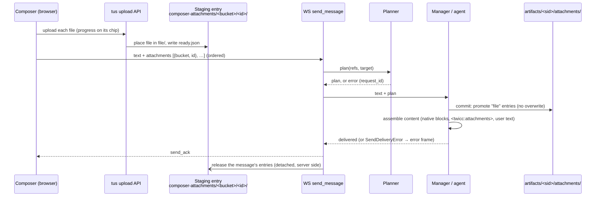

# Composer attachments: any file, any size — design

Status: design, not implemented. Date: 2026-10-03.

## 1. Goal

Let the user attach **any file of any size** to a message from the web UI
(composer file picker, paste, drag and drop, screenshots, peer delivery
into the composer). TwiCC decides, file by file and without any user
choice, whether the file goes to the model **natively** (an image, PDF or
text block, as today) or is saved as a **file** in the session's artifacts
folder and referenced in the message.

Typical case this unlocks: a 400 MB screen recording attached with the
paperclip instead of being copied by hand into the artifacts folder.

### 1.1 Non-goals

- No user control over "native vs file" (no toggle, no per-chip indicator).
- No compression whose only purpose is to reduce bytes (§6.4).
- No PDF parsing (no page count, no encryption detection): the PDF rule is
  size-based only.
- The CLI `--attach` option, the MCP tools and the backend peer path
  (`peer-send`, inbound peer messages) keep their current pipeline in this
  phase (phase 2 plugs them on the same foundation, §14). The **web** peer
  delivery, which fills the composer, is a phase-1 consumer (§9.7).
- No session-wide attachment numbering: numbering restarts at 1 in each
  message.

## 2. Decisions (settled with the user)

| # | Decision |
|---|---|
| D1 | Every attached file is uploaded to the backend as soon as it is added (staging). The sort native/file happens **on the server, at send time**. |
| D2 | The foundation is backend, low-level and entry-point agnostic. The web composer is its first consumer; CLI, MCP and peer plug in later without re-implementing the rules. |
| D3 | A native file stays in staging only until the send is confirmed (kept for Retry), then it is deleted. No permanent copy. |
| D4 | A file that is not native (unsupported type, over a limit, over a quota) becomes a permanent artifact in `artifacts/<session_id>/attachments/` and is referenced in the message. |
| D5 | An ephemeral session has no artifacts folder: it accepts only files that can go natively; a send in which any file would become a `file` is refused. |
| D6 | Send stays disabled while at least one upload is in progress. No queued send. |
| D7 | No user choice native/file. |
| D8 | Files are processed **strictly in the order they were added**. For each: unsupported type → file; supported and fits the remaining quotas → native; otherwise → file. Then the next one (a later file can still be native). |
| D9 | No TwiCC limit refuses a message for having too many files. Native capacity comes from the provider; the surplus becomes files. |
| D10 | Image dimensions: Claude capped at 2000 px (long edge) for every model; Codex keeps the current 2576 px cap. |
| D11 | No weight-driven compression. Re-encoding happens only when a resize requires it. An image still over the provider byte limit after the resize becomes a file. |
| D12 | The Claude CLI's own image recompression (it re-encodes any image over 500 KB) is accepted as provider behaviour. |
| D13 | PDF threshold: native up to **512 KiB**. Text threshold: native up to **50 KiB**. Above → file. |
| D14 | Per-message native volume budget: **16 MiB** (base64 measure), the effective limit of today's WebSocket path. Claude on a non-first-party platform: 12 MiB. |
| D15 | Claude hybrid mode: text files are always `file`. PDFs too (technical consequence: the hybrid CLI turns an `@`-mentioned PDF of more than 10 pages into a reference, not inline content, and the size rule cannot bound pages). |
| D16 | Identity and order: global number + per-kind rank, carried by a manifest present in **every** message with ≥ 1 attachment. The manifest is a TwiCC block, `<twicc:attachments>` (separate from `<twicc:context>`, whose "latest value wins" semantics, slash-command deferral and absence in hybrid do not fit). Native blocks are sent in the manifest's order; there is no per-block label. The block is extracted at ingestion like `<twicc:context>`, so it never shows raw in the UI, search, titles or history picker; the bubble renders an attachment strip from it (formats in §7.4, §10). (Supersedes the earlier "`::` label + `:::` manifest only when ≥ 1 file" decision.) |
| D17 | Superseded by D16: the manifest is never displayed raw, so it carries no Markdown links (the strip's chips link to the artifacts). |
| D18 | The old hybrid text bug on the legacy paths is not fixed separately: phase 2 replaces those paths. |

## 3. Current state (facts)

### 3.1 Frontend

- Capabilities per provider: `getAttachmentSupport()` (`frontend/src/providers/baseHelpers.js`,
  overridden in `providers/claude_code/helpers.js` and `providers/codex/helpers.js`).
  Claude: PNG/JPEG/GIF/WebP, PDF, `text/plain`, 5 MB per file. Codex: images only, 5 MB.
- `addAttachment` (`frontend/src/stores/data.js`) validates (`validateFile`,
  `utils/fileUtils.js`), resizes images to 2576 px (`resizeImageIfNeeded`),
  base64-encodes, stores a `DraftMedia` in IndexedDB (`draftMedias` store,
  `utils/draftStorage.js`) and enforces `MAX_FILES_PER_DRAFT = 100` and
  `MAX_TOTAL_BYTES_PER_DRAFT = 32 MB` (`utils/fileUtils.js`).
- Entry points: file picker and paste in `components/message/MessageInput.vue`
  (`onFileSelected`, `onPaste`), drag and drop in
  `components/session/detail/SessionItemsList.vue` (`processDroppedFile`),
  screenshots from `components/browser/BrowserPane.vue` and
  `components/files/FilePane.vue`, web peer delivery from
  `components/peer/PeerMessageReviewDialog.vue` (`addPeerAttachmentsToDraft`,
  gated by `getAttachmentSupport()`, rolled back with `removeAttachment` /
  `clearAttachmentsForSession`).
- Send: `MessageInput.handleSend` re-resizes images for the active model
  (`getEffectiveImageDimension`), converts medias with `mediasToSdkFormat`
  and sends `images` / `documents` base64 blocks inside the `send_message`
  WebSocket frame. After a successful `sendWsMessage` it calls
  `registerOutgoingSend` (in-flight snapshot), then
  `clearAttachmentsForSession`, and for a draft
  `deleteDraftSession(id, {keepInStore: true})`. For a Codex draft,
  `bindDraftSession` later calls `deleteDraftSession(draftId)`, which also
  clears the draft's attachments.
- Draft cleanup also runs in `cleanupOrphanDraftSessions` and
  `_dropOrphanAttachments` (`stores/data.js`).
- Failed-send recovery keeps the original `DraftMedia` objects
  (`registerOutgoingSend`, `utils/inflightStorage.js`, 8 MB snapshot cap,
  `mediasDropped`); `FailedSendBanner.vue` retries (`resizeMediasForSend`
  then `registerOutgoingSend`) or restores them into the draft
  (`restoreDraftAttachments`). `_applySendFailure` moves a Codex draft's
  failure to its canonical id (`draftAliases`); `recoverEphemeralDraft`
  gives a recovered ephemeral draft a fresh id. Snapshots expire after
  7 days.
- Matching of the sent message: `userMessageMatchKey`, `inflightSendMatchKey`,
  `userMessageMatchesOptimistic` (`stores/data.js`); key = text, or
  `a:<count>` for an attachments-only message. `resolveInflightSends` drops
  every snapshot and failed bubble whose key equals the arriving line's key.
- Ephemeral prompt summary: `summarizeEphemeralAttachments(medias)`
  (`utils/ephemeralSessions.js`).
- History: Claude `components/session/detail/items/claude_code/ContentList.vue`
  groups all image blocks into one `MediaThumbnailGroup`; documents render
  as a `[document]` placeholder. Codex `items/codex/Message.vue` shows all
  images above the text. The read-only share viewer reuses these renderers
  (`share-session/ShareItemsList.vue`).

### 3.2 Backend

- WebSocket `send_message` (`src/twicc/asgi.py`, `_handle_send_message_admitted`)
  passes `images` / `documents` through without validation:
  - existing session: directly to `manager.send_to_session(...)` (after a
    `has_content` gate);
  - new session: to `core/services/session_creation.create_session_from_payload`,
    which returns business errors as a `SessionCreationResult`.
  - `core/services/send_message.py` is the drop-request (CLI) path only.
  - `SendDeliveryError` (`agent/exceptions.py`) raised on the send path
    becomes an `error` frame with its `code` and the `request_id`;
    `send_ack` is sent only when the send was delivered.
- Claude SDK: `_build_query_prompt` (`providers/claude_code/agent/agent.py`)
  builds `[*images, *documents, text]` — images first, then documents,
  whatever the add order. `ClaudeCodeAgent.start` catches errors into
  `_handle_error` and the send is still reported delivered;
  `ClaudeCodeAgent.send` returns `False` on error (no ack, no error frame).
  A send whose startup settings changed is parked in
  `_pending_after_restart` and returns `False` (no ack).
- Codex: `_build_turn_input` (`providers/codex/agent/agent.py`) builds
  `[*ImageInput, TextInput]`, inside the background turn task or, for a
  mid-turn steer, directly in `CodexAgent.send`; documents are
  dropped with a warning (`_warn_about_documents`,
  `providers/codex/agent/manager.py`). The canonical session id exists only
  after `thread_start`. `create_session` runs `_start_agent` under the
  manager `_lock`. Hardcoded commands (`parse_hardcoded_command`) are
  dispatched without the attachments.
- Claude hybrid: `_materialize_attachments`
  (`providers/claude_code/agent/hybrid/agent.py`) writes base64 blocks to
  `<data>/hybrid/<sid>/att_<random>` and prepends `@<path>` lines; `text`
  sources are skipped with a log warning (the known bug, D18).
- Upload API (tus 1.0.0, `src/twicc/uploads/`): resumable, no size limit,
  staging `.part` files in `<data>/uploads/`, never-overwrite placement
  (`store.candidate_names`, `store._place`), finalization
  (`store.finalize_files`) and crash recovery (`_recover_committed`,
  `_recover_uncommitted`) both reaching state `completed`, cleanup task
  (`upload_cleanup_task.py`, 7-day expiry of stalled uploads, 24 h
  tombstones), `upload_state` WebSocket broadcasts to every client,
  frontend `stores/uploads.js` + `utils/uploads/controller.js` on
  `tus-js-client`. Allowed origins: `store.ORIGIN_PANELS = {"files",
  "artifacts"}`. Upload creation is idempotent on `client_id`, terminal
  tombstones included. Temporary names are recognized by
  `is_upload_temp_name` (`.twicc-upload-*.tmp`), which `ArtifactsWatcher`
  skips.
- Artifacts: `paths.get_session_artifacts_dir(sid)` = `<data>/artifacts/<sid>`,
  created by `agent/work_dirs.py` at agent start and granted to the agent
  (Claude `add_dirs`, hybrid `--add-dir`, Codex `writable_roots`).
- Transport ceiling: uvicorn's default `ws_max_size` = 16 MiB
  (`cli/run.py` does not set it). A `send_message` frame above it is
  rejected by the WebSocket layer, so today's effective attachment volume is
  about 12 MB raw (≈ 16 MiB base64 + JSON), below the nominal 32 MB.
- Ephemeral + hybrid cannot be combined (`ephemeral_hybrid_conflict`,
  `core/services/session_creation.py`).

## 4. Provider facts this design relies on

### 4.1 Claude (API + Claude Code CLI 2.1.286 bundled with the SDK)

| Fact | Source |
|---|---|
| Image formats: JPEG, PNG, GIF, WebP; "Animations are unsupported, and only the first frame is used." | Anthropic vision docs |
| Max per image: 10 MB base64 (direct API), 5 MB base64 (Bedrock, Google Cloud) | vision docs |
| Max dimensions 8000×8000; above 20 images per request, 2000 px per image; native resolution 2576 px (4.7+ models) or 1568 px, larger images silently downscaled | vision docs |
| Request size: 32 MB (Bedrock 20 MB, Google Cloud 30 MB), whole request including history | API overview, PDF docs |
| PDF: 600 pages (100 under 1M context) per request; each page sent as text + image | PDF docs |
| Documents (`document` blocks) accept `title` and `context`, "passed to the model" | citations docs |
| Multiple images: "introduce each one with a short text label (`Image 1:`, `Image 2:`…)" | vision docs |
| The CLI processes SDK user content in order, re-encodes every image (2000×2000 cap, JPEG re-encode above 500 KB), passes non-image blocks unchanged | bundled CLI (`mn()`, `S_()`) |
| The CLI takes the **last** content block, if it is text, as the prompt string (slash command detection) | bundled CLI (`kkn()`) |
| The CLI counts images **and documents** together against 600 (1M context active) or 100 (otherwise); above that it evicts the oldest media down to 580 / 80 (`BIo(…, w?Sqo:bqo, wqo, …)`, `wqo = 20`). When the request's cumulative media exceed 24 MiB base64 (first party with the official base URL: 32 MiB − 8 MiB; 75 MiB otherwise), it evicts the oldest media until the total is ≤ 14 MiB (24 MiB − a 10 MiB hysteresis), replacing them with `[media removed: request limit]` | bundled CLI (`BIo()`, `tengu_media_byte_cap`, `kqo = 10485760`) |
| The CLI's platform selection reads `CLAUDE_CODE_USE_BEDROCK`, `…_FOUNDRY`, `…_ANTHROPIC_AWS`, `…_ANTHROPIC_GOOGLE_CLOUD`, `…_MANTLE`, `…_VERTEX` and a gateway setting | bundled CLI (`Pe()`) |
| Claude Code turns an `@`-mentioned PDF of more than 10 pages into a reference instead of inlining it; `Read` reads PDFs by ranges of 20 pages; `Read` caps text at 25,000 tokens / 256 KB | Claude Code changelog 2.1.30, tools reference, bundled CLI |

### 4.2 Codex (runtime 0.160.0)

| Fact | Source |
|---|---|
| `UserInput` variants: Text, Image (data URL, `detail`), LocalImage (path), Audio, LocalAudio, Skill, Mention. **No document input.** | `codex-rs/protocol/src/user_input.rs` |
| Inputs are converted to model content items **in order** (`ResponseInputItem::from_user_input`) | `codex-rs/protocol/src/models.rs` |
| The canonical `UserMessage` is rebuilt in order from the model message (`parse_user_message`); only Codex's own `<image…>` tags are dropped | `codex-rs/core/src/event_mapping.rs` |
| Image formats PNG, JPEG, GIF, WebP; local resize to 2048 px + 2,500 patches; no practical byte limit (1 GiB guard) | `codex-rs/utils/image/src/lib.rs` |
| Public API: 1,500 images and 512 MB per request | OpenAI images-vision guide |

## 5. Architecture



Components:

1. **Staging store** (§6.1) — where files live between upload and send.
2. **Planner** (§6.2–6.6) — provider-agnostic engine + per-provider policy:
   detects kinds, normalizes images, applies quotas and budgets, numbers.
   It does not need the session id.
3. **Committer** (§7) — runs where the session id is known, before the
   send is delivered: promotes `file` entries and assembles the content.
4. **Frontend** (§9–§10) — upload-based composer, refs in drafts and in the
   failed-send snapshot, rendering.

The planner, committer, manifest builder and staging helpers live in a new
package `src/twicc/core/services/attachments/`, callable from any entry
point (D2).

## 6. Backend foundation

### 6.1 Staging store

- New data-dir folder `<data>/composer-attachments/`
  (`paths.get_composer_attachments_dir()`). In a worktree the data dir is
  the repo root, so `/composer-attachments` is added to `.gitignore` (next
  to `/uploads`, `/artifacts`, `/scratch`) and to the "Data Directory"
  contents list of both CLAUDE.md and AGENTS.md.
- Entry layout: `<bucket>/<attachment_id>/`
  - `file/<filename>` — the user's file, alone in its own sub-directory
    (so its name can never collide with TwiCC's markers);
  - `ready.json` — `{filename, size}`, written when the upload is complete;
  - `committed.json` — `{at}`, written the first time a committer uses the
    entry, removed when a draft takes the entry back (§6.1.4);
  - `promoted.json` — written by a promotion (§6.1.3).
- `bucket` = an opaque grouping key chosen by the client (the composer's
  session id when the attachment was added). It is **a property of each
  attachment**, never re-derived from the current session id.
- `attachment_id` = a client UUID, stable for the attachment's life, and
  validated as a UUID (canonical hyphenated form). It is **not** the tus
  `client_id`: each upload attempt has its own `client_id`.
- Both are validated with the session-id rules of `agent/work_dirs.py`:
  non-empty, not equal to `.` or `..`, and containing no `/`, `\` or NUL.
- Filename normalization for the composer origin only (the Files and
  Artifacts origins keep refusing, as today): every control character
  (U+0000–U+001F, U+007F) and every Unicode line or paragraph separator
  (U+0085, U+2028, U+2029) is replaced with `_` (so a name is always one
  line in the manifest of §7.4, whose entries are one per line); a leading
  reserved prefix
  `.twicc-upload-` gets a `_` in front; a name longer than the tus limits
  (`FILENAME_MAX_BYTES`, `PC_NAME_MAX` room) is truncated before its
  extension. `/`, `\` and NUL are replaced with `_` instead of refused.
  After the existing whitespace strip, a name that is empty, `.` or `..`
  becomes `attachment`. So any file name is accepted.
- **Ready**: an entry is ready iff `ready.json` exists and `file/<filename>`
  exists with that size. Any other content of `file/` (`.twicc-upload-*`
  temporaries, reserved placeholders) is ignored.

#### 6.1.1 Upload origin `composer`

Server (`src/twicc/uploads/`):
- `store.ORIGIN_PANELS` gains `"composer"`.
- Creation goes to the standalone route `POST /api/uploads/`. Body for this
  origin: `{filename, size, client_id, fingerprint, origin: {panel:
  "composer", key: "<bucket>/<attachment_id>"}}`; `_parse_creation_body`
  makes `target_dir` / `root` absent for this origin (and required for the
  others, as today).
- The server computes the target `<staging>/<bucket>/<attachment_id>/file/`
  and skips the project/standalone scope checks (TwiCC-owned target). The
  disk-space check, idempotence on `client_id` and resume behaviours are
  unchanged.
- **One live upload per entry.** After the `client_id` idempotence lookup
  (a repeated POST of the same attempt returns that attempt, untouched),
  a new attempt for an entry first settles every other upload whose
  `origin.key` is the same entry, each under its own upload lock with the
  **settle rule** below, then
  empties `file/` and removes `ready.json`, `committed.json` and
  `promoted.json`, then creates the target. Creation of a composer upload
  and release of an entry (§6.1.4) both run under the existing creation
  lock (`uploads/views.py`). Every release writes a **release tombstone**
  `<bucket>/.released/<attachment_id>` (an empty file, the bucket and
  `.released/` directories created if needed), **even when the entry is
  absent**; the reaper removes tombstones older than 24 h. A composer
  creation for an entry with a tombstone answers 410 and creates nothing.
  `.released` can never be an `attachment_id` (ids are UUIDs, §6.1). So a creation POST that
  was already in flight when the browser released the attachment (the
  client only aborts its fetch; the server finishes the request) can never
  re-create the entry.
- **Composer creation order**, all under the creation lock:
  1. `client_id` idempotence lookup (a repeat returns the existing
     attempt, untouched);
  2. release-tombstone check (410);
  3. filename normalization (§6.1);
  4. settle every other attempt for the entry;
  5. reset the entry (empty `file/`, remove `ready.json`,
     `committed.json`, `promoted.json`) and create `file/`;
  6. the existing target checks that need the directory (name length via
     `PC_NAME_MAX`, write access, disk space);
  7. `create_upload`.

  A check failing at step 6 leaves the entry reset with no upload: the
  creation answer is a refusal, the chip goes `failed` (§9.2) and Retry
  starts again from step 1.
- **Settle rule** (used by a new attempt and by a release; never by the
  reaper, §6.1.4). Taking
  the upload's lock already waits for any in-process finalization or
  recovery (they always run under that lock, held by their caller). Then
  the rule branches only on the state it re-reads under the lock: a
  `finalizing` upload (left by a crash, since nothing can be running) is
  first passed through `recover_upload`. Then, still under the lock, the
  metadata is re-read: if the upload is still non-terminal (recovery can
  leave it `active` or `finalizing`, and a waited-for finalization can end
  `active` with an error), it is cancelled with `store.cancel_upload`
  (which accepts any non-terminal state). Only then is the entry reset or
  removed. If that cancel write fails, nothing is reset or removed: the
  creation answers 500, the release answers 500. So the janitor can never
  later finalize an upload into an entry that was meanwhile reset or
  removed.
- The upload metadata stores `scope = {"kind": "composer"}`;
  `_revalidate_target` (which today branches on `scope.kind`: `project`,
  else standalone) gets a `composer` branch that re-checks the target is
  `<staging>/<bucket>/<attachment_id>/file/`. The scoped creation routes
  (`upload_create`, project and session) refuse `panel: "composer"` (400).
  `store.cancel_upload`'s docstring ("non-finalizing") is corrected: the
  settle rule relies on it accepting `finalizing`, which the code does.
- **Composer completion hook**: every transition of a composer upload to
  `completed` — `finalize_files` and both recovery paths
  (`_recover_committed`, `_recover_uncommitted`) — first calls
  `staging.on_upload_completed(meta, final_path)` (`final_path` passed
  explicitly: in `_recover_uncommitted` it is only known as the `found`
  value given to `_settle`), **before** the `completed` state is persisted
  and broadcast. The hook writes `ready.json` with
  `filename = basename(final_path)` (placement may have renamed the file)
  and the size, **only if** the entry directory exists, `final_path` is
  inside its `file/` and has `meta.size` bytes; it never creates
  directories. It is idempotent; if it raises, the upload stays
  `finalizing` and the existing recovery path runs it again.

Frontend (`stores/uploads.js`, `utils/uploads/controller.js`):
- `startUploads` accepts a caller-provided `client_id` and an origin without
  `targetDir` / `apiPrefix` for the composer. Composer `client_id`s are
  built with `makeClientId(tabId, …)` (`utils/uploads/ids.js`), so the
  stalled-upload rules (`isClientIdOfTab`) keep working.
- For the composer origin: no completion toast (no "Copy path"), no
  "cancelled in another tab" toast when the server cancels it (a release),
  and `PANEL_LABELS` gets a `composer` label for the remaining generic
  messages.

#### 6.1.2 REST endpoints

Under `/api/composer-attachments/` (password-protected like every `/api/`
route):

| Endpoint | Behaviour |
|---|---|
| `GET <bucket>/<id>/content` | Streams `file/<filename>`; for a promoted entry, the promoted file at `final_path` if it still exists; otherwise 404. Headers: `X-Content-Type-Options: nosniff`; `Content-Disposition: inline` with the sniffed type only for raster images (PNG, JPEG, GIF, WebP), `text/plain; charset=utf-8` and `application/pdf`; anything else `application/octet-stream` with `attachment`. |
| `POST status/` `{refs: [{bucket, id}]}` | Per ref, first match wins: `promoted` (only if the tombstone's `final_path` still exists; otherwise `missing`), `ready`, `uploading` (a live tus upload targets it; with its `client_id` and offset), `missing`. |
| `DELETE <bucket>/<id>/` | Releases one entry (§6.1.4). Idempotent (absent → 204). Never touches a promoted file in `artifacts/`. |
| `POST touch/` `{refs: [{bucket, id}], holder}` | Sets each existing entry directory's mtime to now (heartbeat). `holder` = `draft` also removes `committed.json` (the entry is a draft attachment again); `holder` = `snapshot` only touches. |

#### 6.1.3 Promotion tombstone

When the committer promotes an entry (§7.2) it writes `promoted.json` =
`{session_id, final_path, final_name, kind, original_name, size}`.
`ready.json` stays; `file/` is emptied. A later plan for the same entry
(Retry) treats it as a file (§6.6).

#### 6.1.4 Release and cleanup

**Release** of an entry: under the creation lock (§6.1.1), every tus
upload targeting it goes through the settle rule (§6.1.1) under its own
upload lock (`_run_locked`, the lock finalization holds). Then the entry
directory is removed.

**Server release at delivery.** Once a send is delivered, the server
releases that send's entries itself: after the commit, the native bytes
live in memory and the promoted files in `artifacts/`, so staging is no
longer needed, and a delivered send is never retried. This does not depend
on the ack reaching the browser. The release is a detached, best-effort
task started whenever the send is `delivered`, **after** the attempt to send
`send_ack` and whatever its outcome (it takes the creation and upload
locks, so it must never delay or suppress the ack); a failure is logged
and left to the reaper. Since the lane task can outlive its connection,
every frame it sends (ack, error) tolerates a closed connection (the
send error is caught and logged), so `delivered`, the ephemeral `finish`
and the release are never affected by a disconnect; a frame without a
`request_id` gets no ack but still triggers the release.

A send parked in `_pending_after_restart` is not delivered yet (the WS
handler sees `False`). Its parked entry stores the refs, and each of the
three places that deliver parked content calls the release after a
successful delivery, as a detached task outside the manager `_lock`. For
the two places that deliver through `_start_agent` (whose start errors are
swallowed by `ClaudeCodeAgent.start`), "successful" means: once
`_start_agent` returns, `self._agents.get(session_id)` exists and is not
DEAD. A start error removes the agent from `_agents` before `_start_agent`
returns (`_transition_to_dead` → `_on_state_change` → `_cleanup_dead`), so
an absent agent means failure; the entries are then kept for the browser's
Retry. A **hybrid** agent's `start` returns before the message is pasted
(`_first_paste_task`): for it, the release is triggered by the first-paste
task itself after a successful paste, never at `_start_agent`'s return.
Hand-off: the parked entry carries an optional `on_delivered` callback (the
release of its refs); `_start_agent` passes it through the start kwargs to
`agent.start`. `HybridClaudeAgent.start` keeps it for `_first_paste`, which
calls it after `paste_text` succeeds. `ClaudeCodeAgent.start` gains an
`on_delivered=None` keyword too (its signature has no `**kwargs` today) and
never calls it. The two `_start_agent` delivery sites read the **new**
agent with `self._agents.get(session_id)` once `_start_agent` returns (not
a local variable, which in the `send_to_session` startup-change branch
still holds the old, killed agent): absent → failure, whatever its flavor;
present and `getattr(agent, "is_hybrid", False)` (already used in the
manager) → no release by the manager (the callback does it); present SDK
agent → released unless DEAD.
The three places are:
`send_to_session` (startup-change branch, `_start_agent`),
`_restart_crons_for_session` (`agent.send`) and `_apply_pending_settings`
(`_start_agent`). Parked content that is dropped (overwritten by a newer
parked send, or discarded on failure) releases nothing; its entries age
out with the reaper.

**Browser release** happens only on explicit user actions, always by
explicit refs (never a whole bucket). `releaseAttachments` first cancels
its own local upload for the attachment (uploads store `cancel`, which
also covers an upload still `creating`), then calls the endpoint.

| Event | Released refs |
|---|---|
| Chip removed, "Remove all" | those attachments |
| Chip Retry after a failed upload | nothing: the same entry is re-used by the new attempt (§9.2) |
| Composer Reset / Clear button (`MessageInput.handleReset`) | the composer's attachments |
| Draft discarded or deleted by the user (Discard command, Cancel, list delete, bulk delete, ephemeral discard), web peer-delivery rollback | the attachment records of that draft |
| Failed send dismissed | that send's refs |

Everything else only forgets locally (`forgetAttachments`, §9.1): the
post-send clear in `handleSend`, `deleteDraftSession` called from the send
path (`keepInStore`) or from `bindDraftSession`, `cleanupOrphanDraftSessions`,
`_dropOrphanAttachments`, the resolution or expiry of an in-flight
snapshot, Edit of a failed send. `deleteDraftSession` therefore gains a
`releaseAttachments` option, **default `false`**: `true` only for the
user-initiated callers of the table above; `false` for the send path,
`bindDraftSession`, and the two calls in
`components/session/detail/items/codex/PlanImplementationBody.vue` (they
delete a draft that has just been sent or is being replaced, not one the
user abandons). (A provider switch keeps the attachments: nothing is
forgotten.)

Consequence: if a send is delivered but the browser saw it as failed
(`delivery_unconfirmed` audit, lost ack) and the user clicks Edit, the
restored chips show `missing` (§9.2): the message did reach the agent with
those files.

**Server-side retention** (new daily reaper task, modelled on
`session_dirs_cleanup_task.py`): an entry is removed when its directory
mtime (refreshed by uploads and by `touch/`) is older than:
- **7 days** if it has `committed.json` — an entry used by a send that was
  not delivered (a delivered one is already released); 7 days is the
  in-flight snapshot lifetime, so an entry still held by a live snapshot is
  never removed before the snapshot itself expires;
- **30 days** otherwise — a draft attachment no browser has referenced for
  30 days;
- and never while a live tus upload targets it.

Release tombstones (`.released/<id>`) older than 24 h are removed, then an
empty `.released/` directory, then an empty bucket directory. The reaper
checks and removes each entry and bucket under the creation lock and the
upload locks, so it never races a composer creation. Under those locks it
re-reads the uploads that target the entry and **skips** the entry if any
of them is non-terminal (server states `active`, `finalizing`); it never
cancels an upload (the tus janitor expires a stalled one after 7 days). In
`<data>/artifacts/`, the reaper only removes top-level `.twicc-upload-*.tmp`
pre-copies (§7.1) older than 24 h; it touches nothing else there. That
artifacts sweep is gated like `session_dirs_cleanup_task`
(`SESSION_DIRS_CLEANUP_ENABLED`): in a worktree, whose `artifacts/` is a
symlink shared with the main instance, only the main instance sweeps it.

**Heartbeat**: at hydrate and every 2 h (same interval as
`cleanupOrphanDraftSessions`), the browser posts `touch/` with every ref
held by a draft record (`holder: draft`) and every ref held by an
in-flight or failed snapshot (`holder: snapshot`). Edit of a failed send
posts `touch/` with `holder: draft` at once.

### 6.2 Plan target

`PlanTarget` (NamedTuple): `provider`, `hybrid`, `ephemeral`, `model`
(resolved), `context_1m` (Claude: true only when the requested effective
settings **and**, if a live agent will receive the message, its current
`agent.agent_settings` are both 1M-capable (`supports_1m`) and set to 1M —
idle settings changes apply only at the next user turn, so either side can
be the one the CLI actually runs with),
`platform` (Claude: `first_party` or `third_party`).

`hybrid` = `Session.hybrid` (new session: the payload's `hybrid`), **or** a
pending switch: `_handle_set_session_hybrid` registers the session id in an
in-memory "hybrid pending" set **synchronously**, before it spawns the
detached switch task (the composer sends `set_session_hybrid` and
`send_message` back to back), and the switch task removes it in a
`finally` of `_run_switch_hybrid` (success or failure). The hybrid
renderer (§7.5) is also robust to a plan made for the SDK target (it
writes a native text part as an `att_*` file), so a remaining race cannot
lose a file.

Claude platform: the backend purges every `CLAUDE_CODE*` variable from
its own environment at startup (`cli/run.py`, `purge_env_vars`), so the
CLI TwiCC launches can only get a platform switch from Claude's settings
files. The platform is `third_party` when any of `CLAUDE_CODE_USE_BEDROCK`,
`CLAUDE_CODE_USE_VERTEX`, `CLAUDE_CODE_USE_FOUNDRY`,
`CLAUDE_CODE_USE_ANTHROPIC_AWS`, `CLAUDE_CODE_USE_ANTHROPIC_GOOGLE_CLOUD`,
`CLAUDE_CODE_USE_MANTLE` is true by the CLI's own boolean parsing (`Le()`:
the value, trimmed and lower-cased, is `1`, `true`, `yes` or `on`) in the
`env` block of the user
settings (`settings.json` in the resolved Claude config dir,
`provider_homes`) or — only when the project is trusted, since an untrusted
project loads user settings only (`setting_sources=["user"]`) — of the
project's `.claude/settings.json` / `.claude/settings.local.json`;
otherwise `first_party` (§16).

### 6.3 Capability policy

A new `ATTACHMENT_POLICY` per provider (the existing `ATTACHMENT_SUPPORT`
stays for the phase-1 CLI path).

| Target | image | PDF | text | video / audio / other |
|---|---|---|---|---|
| Claude SDK | native if eligible (§6.4) | native if ≤ 512 KiB | native if ≤ 50 KiB | file |
| Claude hybrid | native if eligible | **file** | **file** | file |
| Codex | native if eligible | file | file | file |

Quotas per message:

| Quota | Claude | Codex |
|---|---|---|
| Native media items (images + PDFs + texts together) | 580 when `context_1m`, else 80 — the CLI's own eviction target: above 600 / 100 media in the request it evicts the oldest down to 580 / 80 (§4.1), so a message never exceeds what the CLI keeps | 1,500 (images) |
| Volume budget (§6.5) | 16 MiB; 12 MiB when `third_party` | 16 MiB |
| Per-image bytes after normalization (base64) | 10,485,760 `first_party`; 5,242,880 `third_party` (the CLI's own `maxBase64Size` is 5,242,880) | none |

### 6.4 Kinds, detection and image normalization

Kind detection never reads a whole file. Images are recognized by magic
bytes; the text and NUL rules read at most the **first 64 KiB**:

| Kind | Rule |
|---|---|
| image | magic bytes: PNG (`\x89PNG\r\n\x1a\n`), JPEG (`FF D8 FF`), GIF (`GIF87a` / `GIF89a`), WebP (`RIFF` + `WEBP` at offset 8); another raster format that Pillow opens from the head bytes alone (e.g. BMP) is also `image`, but never native; a format it cannot open from the head (HEIC without a plugin, a TIFF whose IFD lies past 64 KiB) falls through to the next rules (usually `other`) — only its manifest kind is affected, since such formats are never native |
| PDF | starts with `%PDF-` |
| text | size > 0, the head contains no NUL byte and decodes as UTF-8 (a multi-byte sequence cut at the 64 KiB boundary is tolerated) |
| video / audio | `mimetypes.guess_type(name)` top-level type |
| other | anything else (including a 0-byte file) |

A text candidate for native sending (≤ 50 KiB, so fully inside the head)
is decoded in full; a decode failure makes it a file.

**No unbounded read before a decision.** For every entry, the planner
first decides what it can from `st_size` and headers, and reads or decodes
the bytes only for an entry that will really be sent natively:

1. Count quota already exhausted → FILE (nothing read beyond the 64 KiB
   head that kind detection needs for the ranks).
2. PDF / text: over its threshold (512 KiB / 50 KiB), or over the
   remaining budget in the §6.5 measure (`4 * ceil(st_size / 3)` for a
   PDF, `st_size` for text) → FILE (nothing read beyond the 64 KiB head).
3. Image header facts (dimensions, animation), never through a whole-file
   read:
   - PNG: `IHDR` in the head; animation = an `acTL` chunk before the first
     `IDAT`, found by a chunk-header walk (read length + type, `seek` past
     the data; at most 1,000 chunks), which may go past the 64 KiB head;
     no `IDAT` found → not eligible (FILE);
   - WebP: the RIFF header in the head (`VP8X` canvas size and its
     animation flag; otherwise the `VP8` / `VP8L` frame header). Pillow is
     **not** used to open a WebP for this step, because its WebP plugin
     reads the whole file on open;
   - JPEG: a lazy `Image.open(path)` (Pillow reads the markers up to the
     start-of-scan marker and stops, so a large ICC / XMP segment is fine
     and the image data is not read);
   - GIF: dimensions from the logical screen descriptor in the head; the
     animation probe (`is_animated`, which skips through the first frame's
     data — the whole file for a still GIF) runs only after step 4.
4. Image within the target dimensions (its original bytes would be sent)
   whose `4 * ceil(st_size / 3)` exceeds the per-image limit or the
   remaining budget → FILE (nothing decoded, no animation probe).
5. Only then: decode / normalize (images), read (PDF, text).

Native eligibility of an **image**:
- magic bytes PNG, JPEG, GIF or WebP; width × height ≤ 100 megapixels
  (before any decode); not animated (`is_animated` false — an animated
  image reaches the model as its first frame only); decoding succeeds;
- Claude only: a JPEG whose Pillow mode is `CMYK` is **not** eligible
  (FILE): the bundled CLI refuses to decode a 4-component JPEG ("it is a
  CMYK JPEG, which Claude Code cannot decode") and replaces it with a
  `[Image could not be processed: …]` text block, so the model would never
  get it. No re-encode (D11). Codex decodes CMYK JPEGs and keeps them
  native;
- a JPEG that Pillow reports as `MPO` (multi-picture: Ultra HDR, gain-map
  and other camera photos) is treated as a plain JPEG: the primary frame,
  `image/jpeg`, original bytes when within the target, **not** counted as
  animated;
- after normalization, base64 size within the per-image limit (§6.3).

Normalization (native candidates only):
- Target long edge: Claude 2000 px; Codex 2576 px.
- Within the target: the **original bytes** are used unchanged.
- Above the target: `ImageOps.exif_transpose`, resize (aspect kept,
  Lanczos), re-encode in the same family: PNG → PNG, WebP → lossless WebP,
  JPEG (and MPO, primary frame) → JPEG quality 92, GIF (still) → PNG. This
  is the only re-encoding
  allowed (D11): no quality loop, no format switch to save bytes.
- Any Pillow error → the entry is a file.

Normalized bytes are kept in memory in the plan (bounded by the budget).

### 6.5 Volume budget measure

The budget counts what the native blocks carry: base64 length
(`4 * ceil(n / 3)`) for images and PDFs, UTF-8 byte length for text.
The `<twicc:attachments>` block and the user text are not counted.

### 6.6 Planning algorithm

```
plan = []
for position, ref in enumerate(refs, start=1):            # add order, D8
    entry = load(ref)       # ready file, or promoted tombstone, else error
    if entry.promoted:
        kind = entry.promoted.kind; decide FILE           # bytes already an artifact
    else:
        kind = detect_kind(entry)
        if policy(target, kind) == FILE:
            decide FILE
        elif early_file_decision(entry, kind, remaining quotas):   # §6.4 steps 1–4
            decide FILE
        else:
            candidate = normalize(entry) if kind == image else read(entry)
            if eligible(candidate) and fits(candidate, remaining quotas):
                decide NATIVE; consume quotas
            else:
                decide FILE
    plan.append(position, kind, decision, original_name, candidate)
assign per-kind ranks over ALL entries (native and file), in add order
if target.ephemeral and any FILE: error attachment_requires_artifacts
```

- A later small file can be native after a large one became a file (D8).
  The plan is deterministic for a given (refs, target).
- Errors: a promoted entry whose `final_path` is gone →
  `attachment_missing` (same answer as `status/`); otherwise an entry
  neither ready nor promoted → `attachment_not_ready` if its directory
  exists, else `attachment_missing`.
- Attachments with a Claude **hybrid** message whose text, after
  `lstrip()`, starts with `/` → `attachments_with_command` (checked by the
  planner, and again **synchronously** by the hybrid agent before anything
  is scheduled — in `HybridClaudeAgent.send`, and in
  `HybridClaudeAgent.start` before it schedules `_first_paste`, whose
  errors are swallowed — raising the same `SendDeliveryError`, which
  `_start_agent_with_admission` turns into a teardown and an error frame;
  so a plan made for the SDK target that reaches a hybrid agent through
  the race of §6.2 is refused too, before any ack). If the
  implementation shows that a paste starting with `!` enters the TUI's bash
  mode, the same refusal applies to `!`. When the TUI detects a slash
  command, the
  CLI stores the input as command XML and passes everything after the
  command name as its arguments, so the block would land inside
  `<command-args>` (a built-in such as `/model sonnet` would even receive
  it as an argument). Claude SDK slash commands are not affected (the CLI
  keeps the preceding content blocks separate from the prompt text).
- Attachments with a Codex hardcoded command (`parse_hardcoded_command`
  matches the text) → `attachments_with_command` (the command path has no
  content to carry them).

Off the receive loop. Channels handles one connection's frames one at a
time: while a handler awaits, that connection's other business frames and
outgoing broadcasts stall, and the transport stops reading once
`MAX_QUEUED_EVENTS` (32) events are queued (heartbeat pings themselves are
answered earlier by `websocket_transport.HeartbeatTransport`; the comment
in `asgi.py` about pings is outdated). Planning (image decode and resize)
and the commit's prepare step (a large cross-filesystem copy) can take
long. So every
`send_message` frame (with or without `attachments`) is handled in two
parts:
- inline, in the receive loop: only the shape checks (frame shape, refs
  shape, no duplicate `{bucket, id}` in one frame, mutual exclusion with
  `images` / `documents`); a shape error (`invalid_attachments`) is
  answered at once;
- then a detached task (`_spawn_detached`) on a **per-session ordered
  lane**: a module-level registry of one `asyncio.Lock` per session id,
  shared by every connection, held for the whole send; an entry is
  refcounted (send tasks and barriers hold a reference while they wait or
  run) and dropped when its count reaches zero. When the backend binds a
  draft id X to a canonical id Y (Codex, `ephemeral.bind`), lane(Y) is an
  alias of lane(X) until the refcount of that shared entry reaches zero
  (not merely until X's own send ends), so a send to Y queues behind the
  creation instead of meeting its still-pending admission, and every later
  send or barrier on Y joins the same queue while any of them is waiting. Inside the lock, the
  task runs what `_handle_send_message` runs today, in the same order: the
  ephemeral admission (`check_readonly`, then `reserve`), the body
  (`_handle_send_message_admitted`: planning, the manager call, the
  `send_ack` / error frame, then the detached server release), and
  `finish` in the task's `finally`. Every `send_message` for the same
  session id takes the same lane, with or without attachments, so two sends
  to one session keep their order, and a queued send never meets the
  pending admission claim of the send ahead of it (which would raise
  `agent_starting`).
- Session-scoped control frames keep their order behind queued sends
  without ever holding the lane while they run:
  - `interrupt_session` and a soft `kill_process` are spawned detached at
    once, as today; the detached task's **first** await is the barrier
    (`async with lane: pass` — it waits for the sends queued before it),
    then it runs `_run_interrupt_session` / `_run_kill_process`. The
    receive loop never awaits the lane, and spawned tasks start in creation
    order, so frame order is kept;
  - `kill_process` with `force: true` bypasses the lane entirely, as
    `hard_kill_agent` bypasses the manager `_lock` today, so a force kill
    can still interrupt a soft stop in its grace window or a send stuck in
    the lane.

Inside that task, the plan runs off the event loop (`asyncio.to_thread`).
It needs the resolved model and context, so it always runs after
`resolve_agent_settings` + `enforce_agent_settings_consistency`:
- WS, existing session: in `asgi._handle_send_message_admitted`, after
  `effective_agent_settings` is computed and before
  `manager.send_to_session`. The `has_content` gate before it counts the
  `attachments` refs as content. An error is raised as `SendDeliveryError`
  and goes through the existing error path (error frame with `request_id`,
  ephemeral admission released as for any other error).
- New session: in `create_session_from_payload`. Today `set_pending_title`
  and `set_pending_agent_settings` run **before** `resolve_agent_settings`;
  they move after the plan, so the order becomes: resolve and enforce the
  settings, plan, then every `set_pending_*` stash. A plan error therefore
  leaves no stash. It is returned as a `SessionCreationResult` error (the
  WS caller already turns it into an error frame). The service accepts
  `attachments` only when its caller passes `allow_attachments=True` (the
  WS path), like `allow_hybrid`; a drop-request payload carrying
  `attachments` is rejected (`invalid_attachments`).

## 7. Committer

### 7.1 Where it runs

The committer runs once the session id is known and **before the send is
reported delivered**. It writes `committed.json` on every entry it uses
(native or file), then promotes and assembles. It raises
`SendDeliveryError` (code `attachment_commit_failed`) on any failure, with
one exception: a tombstone whose `final_path` is gone raises
`attachment_missing` (§7.2). That error must not be caught by the agents'
generic `_handle_error`.

| Path | Commit point |
|---|---|
| Claude, existing session (`ClaudeCodeAgentManager.send_to_session`) | at entry, before taking `_lock`; the assembled content then goes to `agent.send`, to `_start_agent` (resume), or into `_pending_after_restart` |
| Claude, new session (`create_session`) | at entry (session id = draft id), before `_start_agent` |
| Codex, existing session (`send_to_session`) | at entry of `send_to_session`, before `gate_for(session_id)` (the rollout-migration gate) and before `_lock`, and before the hardcoded-command branch; the assembled content goes to `agent.send` / `agent.start` |
| Codex, new session | prepare step at entry of `create_session` (before the lock); finish step in `_create_agent`, inside its existing `try`, right after `thread_start` and the work-dir creation and **before** `notify_session_bound`. The plan is passed down to `_create_agent` through `_start_agent_with_admission` (which today forwards only `ephemeral`); the finished content is stored on the new agent (e.g. `agent._initial_content`) and `agent.start` uses it instead of the `start_kwargs` attachments, which were fixed before `_create_agent` ran. An error goes through `_create_agent`'s own `except` (it closes the Codex client and re-raises), so the browser never sees a `session_bound` for a failed send and its draft stays a draft. |

Lock discipline: everything slow runs in the **prepare** step, before any
manager lock and off the event loop. Prepare gives every byte source a
promotion will need a source file on the artifacts filesystem that finish
can claim without copying:
- a staged file: prepare hard-links it to the pre-copy name below; on
  `EXDEV` or one of the no-hard-link errnos that `uploads.store._place`
  already handles, it falls back to a real copy. Either way the pre-copy
  sits on the artifacts filesystem, and finish claims the final name from
  it with the rule of §7.2 (exclusive hard link; exclusive create +
  replace only after a no-hard-link errno). Prepare never relies on
  `st_dev` alone (two mounts of one device can still give `EXDEV`);
- a promoted tombstone whose `session_id` differs from the target session,
  or whose target session is not known yet (Codex new session): a real
  copy of its `final_path` file (never a hard link: two sessions' artifacts
  must not share an inode, or an in-place edit in one would change the
  other).

The copy goes to `<data>/artifacts/.twicc-upload-<uuid>.tmp` (fsynced), a
name `ArtifactsWatcher` already ignores. The **finish** step, which may run
under a lock, only does same-filesystem links, renames and small marker
writes. Every error path after prepare deletes its pre-copies; the reaper
removes leftovers (§6.1.4). For the paths whose session id is known at
entry, prepare and finish run back to back before the lock.

The assembled content travels as a new `content` argument: the ordered
native blocks, the **manifest as structured data** (entries with number,
name, kind, rank, mode, final name, and the owner session id and
`attachments/` path), and the **raw user text as a distinguished part**.
Each agent renders the manifest to text itself (§7.4, §7.5): the SDK and
Codex agents with the "appear above" header; the hybrid agent with its own
header and, after writing the `att_*` files, the `@<path>` on each inline
line — which is why the manifest cannot be final text when the committer
builds it. The committer never calls the
context fold. The fold stays where it runs today, at the send-time
chokepoints, which apply it to the user-text part and drop that part when
the result is empty:
- Claude SDK, `_build_query_prompt`: `_reconcile_context` →
  `apply_pending_context` → `apply_goal_instruction`;
- Codex, `_build_turn_input`: `_reconcile_context` →
  `apply_pending_context` (Codex has no goal instruction).

The one-shot pending context is therefore consumed only when the content
is really handed to the provider, as today.

Every downstream `has_content` gate counts the content
as content: `ClaudeCodeAgentManager.send_to_session`,
`_restart_crons_for_session`, and the three `if not text and not images`
gates of `CodexAgentManager._send_to_session_under_gate` (the asgi gate,
upstream, counts the refs, §6.6). `_pending_after_restart` accepts both
the legacy `{text, images, documents}` shape and the new one.

### 7.2 Promotion

New helper `staging.promote_entry(entry, session_id)`:
1. Destination folder `artifacts/<sid>/attachments/`, created if needed.
2. Pick the final name with `uploads.store.candidate_names`
   (`name (1).ext` …) and claim it with an exclusive hard link from the
   **pre-copy** (prepare always makes one for every promoted entry, §7.1);
   a name taken by a concurrent writer → next candidate. Only when that
   hard link fails with a no-hard-link errno, finish claims the name with
   an exclusive create, then `os.replace`s the pre-copy onto it — the
   staged file itself is never moved.
3. Write `promoted.json` (fsync).
4. Remove the staged file (and the pre-copy, if still there).

The staged file stays in place until step 4, so a crash before step 3
leaves the entry still ready with its file: a Retry promotes it again under
the next free name (a duplicate artifact, accepted).

Tombstone reuse:
- same session: the file at `final_path` must still exist, else
  `attachment_missing`;
- other session (e.g. a Codex creation retried on a new thread): finish
  claims the next free name in the target session's `attachments/` with
  the same exclusive link (or exclusive create + replace) from the prepared
  copy (§7.1), never a plain rename that could overwrite, then updates the
  tombstone; `final_path` gone at prepare → `attachment_missing`.

### 7.3 Numbering

- Global number `n` = position in add order (1-based), over all entries.
- Per-kind rank `k of K` over all entries of that kind (native and file),
  kinds named `image`, `PDF`, `text`, `video`, `audio`, `other`.
- Throughout this spec, "original name" means `ready.json.filename`: the
  name after the composer normalization of §6.1 and before any promotion
  rename (so it is always one line); the raw client name is never stored.
- There is **no per-block label**: the manifest (§7.4) is always present
  and the native blocks are emitted in its order (§7.5), so the manifest
  alone binds each block to its number and name.
- Claude `document` blocks carry the protocol field `title` = the file name,
  truncated to 200 characters (the API documents a length limit without a
  value; checked with a real request during implementation).

### 7.4 Manifest: the `<twicc:attachments>` block

Present in **every** message that has ≥ 1 attachment. It is a TwiCC block,
like `<twicc:context>`: the agent reads it, and TwiCC removes it from what
it stores and displays (§10). Exact shape:

```
<twicc:attachments>
Files the user attached to this message, in the order they attached them.
inline = sent to you with this message; the inline files appear above, in this same order.
file = saved on disk in /home/twidi/.twicc/artifacts/dc41829c-21fa-4714-b397-3123404319c6/attachments/
1. login.png (image 1 of 2, inline)
2. capture.mp4 (video 1 of 1, file)
3. spec.pdf (PDF 1 of 1, inline)
4. notes (1).txt (text 1 of 1, file)
5. after.png (image 2 of 2, inline)
</twicc:attachments>
```

Rules:
- The `inline` line is present when the message has ≥ 1 inline entry; the
  `file` line, with the absolute path of `artifacts/<sid>/attachments/`,
  when it has ≥ 1 file entry. In hybrid, the `inline` line reads
  `inline = attached to this message through the @ reference at the end of
  its line.` (nothing appears "above" there: the CLI attaches the
  `@`-mentioned files as separate records).
- One entry line per attachment, in add order: `N. <name> (<kind> <k> of
  <K>, inline|file)`. `inline` entries carry the original name; `file`
  entries the final name on disk (it may differ, e.g. `notes (1).txt`).
- Hybrid: an `inline` entry line ends with the file's reference,
  `… inline): @<path>` (the `att_*` file in `<data>/hybrid/<sid>/`); this
  `@<path>` is what the CLI resolves into the attachment, so the binding is
  explicit there.
- Escaping: in names, `&`, `<` and `>` are written `&amp;`, `&lt;`, `&gt;`,
  so a name can never open or close a tag; **every** `@` is written
  `&#64;`, so the CLI never takes a name for a file mention (its mention
  pattern starts after whitespace and after some CJK punctuation; the
  hybrid TUI parses the whole paste for mentions, and in an
  attachments-only SDK message the block is the last text block, which the
  CLI reads as the prompt). Nothing else is escaped. The shared parser
  unescapes these four entities in a **single pass** (one regex over
  `&(amp|lt|gt|#64);`), so a literal `&#64;` in a name (written
  `&amp;#64;`) round-trips unchanged.
- Entry-line grammar, anchored on the right so a name may contain ` (`,
  `)` or `): @`:
  `^(\d+)\. (.+) \((image|PDF|text|video|audio|other) (\d+) of (\d+), (inline|file)\)(?:: @(\S+))?$`
  (the name is group 2, greedy; the optional group 7 is the hybrid
  reference).
- No reason is given for a `file`.
- The block is rendered from the structured manifest (§7.1) by one shared
  function (Python) with a `hybrid` variant (header line, `@<path>`
  suffixes), and parsed by one shared function (Python, §10.1).

### 7.5 Content order per provider

The "user text" below is, for Claude SDK and Codex, the user-text part
after the fold of §7.1 (done at the chokepoints, not by the committer),
omitted only when that result is empty; for hybrid, the raw text (hybrid
does not fold `<twicc:context>` today, and this design does not change
that).

| Target | Content |
|---|---|
| Claude SDK | the native blocks in add order, then the `<twicc:attachments>` block as its own text block, then **the user text block last** (required by the CLI's `kkn()`, which reads the last text block as the prompt; slash commands keep working since the user text is untouched). |
| Codex | Same sequence with `ImageInput` (data URL — not `LocalImageInput`, whose own `[Image #N]` tags would contradict the global numbering) and `TextInput` items. |
| Claude hybrid | One pasted text: the user text, a blank line, then the `<twicc:attachments>` block, whose inline lines carry the `@<path>` references (files written as today in `<data>/hybrid/<sid>/`; a native **text or PDF** part, which only a plan made for the SDK target can contain, is written the same way as an `att_<hex>` file instead of being skipped). With no user text, the pasted text is the block alone (no leading blank line). A hybrid message starting with `/` never carries attachments (§6.6, `attachments_with_command`). |

## 8. WebSocket protocol

- `send_message` gains `attachments: [{bucket, id}, …]` (order = add
  order). It is mutually exclusive with `images` / `documents`: a frame
  carrying both, or the same `{bucket, id}` twice, is rejected
  (`invalid_attachments`).
- The legacy `images` / `documents` fields stay accepted unchanged (CLI,
  MCP, backend peer path, legacy failed-send retries).
- New error codes (all with the `request_id`): `attachment_missing`,
  `attachment_not_ready`, `attachment_requires_artifacts` (the message lists
  the file names), `attachments_with_command`, `attachment_commit_failed`,
  `invalid_attachments`.
- `send_ack` is unchanged.

## 9. Frontend composer

### 9.1 Draft attachment model

- New IndexedDB store `draftAttachments` (schema version bump), one record
  per attachment: `{id, sessionId, bucket, position, name, size, mimeType,
  kind}`. `sessionId` = the draft/session it is shown in; `bucket` = the
  staging bucket (set once, kept through snapshots, aliases and Edit);
  `kind` = a **display** kind derived on the client from MIME type and
  extension (image, PDF, text, video, audio, other) — the server's
  detection stays authoritative for sending.
- Upload progress and the upload state are **not** persisted; they live in
  memory, fed by the uploads store and the `upload_state` broadcasts that
  every tab receives.
- For files added in this page session, the `File` object is kept in
  memory (local previews, upload Retry).
- `addAttachment(sessionId, file)` no longer validates type or size and no
  longer encodes. It creates a record (`id` = new UUID, `bucket` =
  `sessionId`, next `position`) and starts an upload (new `client_id`)
  with origin `{panel: "composer", key: "<bucket>/<id>"}`.
- Removed: `MAX_FILES_PER_DRAFT`, `MAX_TOTAL_BYTES_PER_DRAFT`, the per-file
  `maxBytes`, the picker's `accept` attribute, the provider gate on paste
  and drop, `removeNonImageAttachments`. The paperclip is always visible.
  Paste attaches every file of the clipboard.
- Two store operations, never confused:
  - `forgetAttachments(sessionId)` — drops local records only;
  - `releaseAttachments(refs)` — drops local records **and** calls the
    release endpoint for each ref (only for the events of §6.1.4).

### 9.2 Upload states

Display states: `uploading`, `ready`, `failed`, `missing`.
- `uploading` → `ready` on an `upload_state` `completed` **for the chip's
  own current `client_id`** (never matched by `origin.key`: the settle rule
  may complete an older attempt of the same entry just before resetting
  it).
- Creation that ends with no server record after the controller's retries
  (e.g. a 500 when the settle rule's cancel write fails — the controller
  classifies it as unanswered, retries, then pauses with no record):
  `failed`, with Retry and Remove.
- A non-terminal transfer error (a PATCH answered 507 or 500: the
  controller pauses the upload): the chip shows the controller's own Retry,
  which resumes the **same** upload (same `client_id`). Still `uploading`
  for D6.
- Creation refused (the creation POST answered 4xx or 507 — e.g. no disk
  space — so the controller removes its local entry and no server record
  or `upload_state` exists): `failed`, with Retry and Remove. The composer
  watches its own upload entries for this removal; it does not wait for a
  broadcast. Any removal of the chip's upload entry (a refused creation,
  or `reconcile()` dropping an entry the server no longer lists) maps to
  `failed` **only while the chip is still `uploading`** (no `completed`
  seen for its current `client_id`); a removal after `completed` (e.g. the
  24 h tus tombstone expiry) changes nothing.
- A terminal failure → `failed`, with Retry (when the `File` is in memory:
  a new attempt with a new `client_id` into the **same** entry; the server
  cancels any other live attempt and resets `file/`, §6.1.1) and Remove.
  Chip Retry first calls the uploads store `cancel(<previous key>)`, so an
  earlier local attempt (e.g. a creation paused on the network, which the
  controller's `autoRestart` would otherwise re-send with its old
  `client_id` at the next reconnect) is dropped or orphan-reconciled and
  can never cancel the new attempt.
- A creation paused on the network (`pauseReason: 'network'`) stays
  `uploading` (the controller resumes it by itself at reconnect).
- At hydrate (and on WebSocket reconnect), the browser asks `status/` for
  every record it does not own a live local upload for (an upload this tab
  is creating or transferring keeps its local state, which wins over the
  server's answer):
  - `ready` / `promoted` → `ready`;
  - `uploading` → `uploading` (another tab or this one before the reload);
    if no tab makes progress, the tus record goes stalled and the chip
    shows it as `failed` with Remove only ("upload interrupted, attach the
    file again");
  - `missing` → `missing` ("file no longer available"), Remove only. On a
    WebSocket reconnect (not at hydrate, where no local state survives), a
    record whose in-memory state was already `failed` (a refused creation
    leaves an entry directory without `ready.json`) stays `failed`.
- Send is disabled while any attachment is not `ready` (D6).

### 9.3 Chips

- One chip per attachment, in `position` order, in the existing badge +
  popover (`MediaThumbnailGroup`): thumbnail for images (local object URL
  when the `File` is in memory, else the content endpoint), icon by display
  kind otherwise, name, size, progress bar while uploading, state message.
- Preview dialog: images and text as today (local `File` or content
  endpoint); other kinds show the icon.
- No native/file indicator (D7).

### 9.4 Send

- `handleSend` sends `attachments: [{bucket, id}]` in `position` order;
  the client resize (`resizeImageIfNeeded`, `getEffectiveImageDimension`)
  leaves the send path. After a successful `sendWsMessage` it calls
  `forgetAttachments` (not a release).
- Ephemeral sends are not pre-checked in the browser: the server refuses
  with `attachment_requires_artifacts` (§11).
- Optimistic bubble: text plus the attachment chips (names, display-kind
  icons, image thumbnails from local object URLs only — never from the
  content endpoint, whose entries the server releases at delivery). It carries
  `attachmentCount` (the total) so `userMessageMatchesOptimistic` can match
  an attachments-only message.
- Ephemeral prompt summary: `summarizeEphemeralAttachments` reads the
  attachment records (`{name, mimeType, kind}`) instead of medias.

### 9.5 Failed-send recovery

- The in-flight snapshot stores `{attachments: [{bucket, id, name, size,
  mimeType, kind}]}` instead of medias (no 8 MB cap, no `mediasDropped`
  for new snapshots).
- Retry resends the same refs (tombstones are reused, §6.6).
- Edit re-creates draft records with the same `id` and `bucket` in the
  composer's current session (alias or recovered id), **appended** after
  the attachments already there (positions continue).
- Dismiss releases the refs (§6.1.4).
- Match keys (`inflightSendMatchKey`, `userMessageMatchKey`,
  `userMessageMatchesOptimistic`): the arriving line's user text is already
  free of the block (extracted at ingestion, §10.1); for an
  attachments-only message, `a:<N>` with N = the number of entries in the
  item's `twicc_attachments` (every attachment, inline or file) when the key is
  present; otherwise the current provider count
  (`extractUserMessageAttachmentCount`, for legacy retries and CLI / MCP /
  peer sends). The optimistic side uses its `attachmentCount`. The
  snapshot side of `inflightSendMatchKey` (which today counts `medias` /
  `mediaCount`) counts `attachments.length` for new snapshots.
- `hydrateInflightSends` today deletes every snapshot that has no text and
  no `medias`; it must keep a snapshot that has `attachments` (an
  attachments-only send).
- Legacy snapshots (with `medias`) keep the legacy retry path
  (`resizeMediasForSend` + `images` / `documents`) until they expire
  (7 days). Edit of a legacy snapshot converts its medias with the
  migration routine (§9.6) instead of `restoreDraftAttachments`.

### 9.6 Migration of existing drafts

At hydrate, every legacy `draftMedias` row is turned into a `File` and
added with record `id = media.id` (idempotent: an existing record with that
id is reused, never duplicated):
- decoding by `media.type`: `image` / `pdf` rows hold base64 (→ Blob);
  `txt` rows hold plain text (→ UTF-8 Blob); original name and MIME kept;
- order: the draft's `mediaIds` order when present, then any remaining
  rows by `createdAt`;
- before uploading, the browser asks `status/` for the entry: `ready` or
  `promoted` → no upload (an earlier start already did it); `uploading`
  with another tab's `client_id` → the row is skipped until the next start
  (taking it over would cancel that tab's upload); `uploading` with this
  tab's own `client_id` (`isClientIdOfTab`; the tab id survives a reload)
  and no live local upload → a new attempt (the settle rule cancels the
  stalled one); `missing` → a new attempt with a new tus `client_id`.

The row is deleted once the entry is `ready`; on failure the row stays and
the migration retries at the next start. `releaseAttachments` and
`forgetAttachments` also delete any legacy `draftMedias` row with the same
id (and drop it from the draft's `mediaIds`), so an attachment the user
removed during its migration upload never comes back.

### 9.7 Web peer delivery

`PeerMessageReviewDialog` keeps filling the composer through
`addAttachment` (blocks → `File`, as today). Its `getAttachmentSupport()`
compatibility gating goes away (every file is now accepted; the server
decides at send). Its rollback releases the attachment records it added
(`releaseAttachments`), or the whole draft's records when it created the
draft.

## 10. Rendering and text extraction

### 10.1 Extraction at ingestion

The `<twicc:attachments>` block reaches the provider's JSONL (the agent
needs it), but **never TwiCC's stored content**: it is extracted at
ingestion by the same mechanism that strips `<twicc:context>` today.

**Scoped, not a whole-item walk.** Unlike the context strip, the
extraction must never touch a block that merely appears in content (a
`Read` of this spec, a test fixture in a `Write`, a user pasting the
example). So:

- `compute_base.transform_inline` (shared by full compute and live sync)
  calls a new provider hook, `user_text_slots(parsed)`, which returns the
  places that hold **the user's own message** in this record, and nothing
  else. Each slot is the **whole container** — the string (hybrid), or the
  full content array (SDK message content, a `queued_command` `prompt`
  array, Codex `content`) with its media blocks and their positions — since
  the checks below need the media blocks:
  - Claude: a `type: "user"` record that is neither `isSidechain` nor
    `isMeta` — its message content (a string — hybrid — or the `text`
    blocks of a content array — SDK); and the `prompt` of a
    `queued_command` attachment record with `commandMode: "prompt"` (a
    Claude SDK send accepted mid-turn is recorded only that way). Not tool
    results, not `last-prompt`, not any other record type;
  - Codex: the `input_text` entries of a `response_item` user message, and
    the text entries of an `item_completed` `UserMessage`; not
    `compacted` records, not tool items.
- On those slots only, `extract_attachments_block(slots, accepted_owners)`
  (in `context_injection.py`) works in three steps:
  1. **Locate** by position and outer tags, only where TwiCC emits it:
     - SDK and Codex (content array): the entry **immediately after the
       native media blocks** (images and documents, which come first),
       whose whole text is a block
       (`^\s*<twicc:attachments>\n…\n</twicc:attachments>\s*$`);
     - hybrid (one string): a block at the **end** of the string, preceded
       by a blank line, or the whole string (trimmed) when the message has
       no user text.
  2. **Parse and validate** (all must hold):
     - the block body is exactly: the intro line (literal, §7.4); then the
       `inline =` line (one of its two literal variants) **if and only if**
       an `inline` entry exists; then the `file = <absolute path>/` line
       **if and only if** a `file` entry exists; then ≥ 1 entry lines, each
       matching the §7.4 grammar;
     - SDK / Codex: the inline image / PDF / text count equals the number of
       media slots before the block, a media slot being an image or
       document block **or** a text block starting with
       `[Image could not be processed:` (the bundled CLI replaces, in
       place, an image it cannot process by such a block);
     - hybrid: every inline line has an `@<path>` whose end matches
       `/hybrid/<accepted owner id>/att_[0-9a-f]{12}(\.[A-Za-z0-9]+)?`
       (the `att_<hex><ext>` names `_materialize_attachments` writes; the
       comparison is a path **suffix**, since a worktree instance and the
       main instance ingest the same provider JSONL with different data
       dirs);
     - when a `file =` line is present (any target): its path ends with
       `/artifacts/<owner id>/attachments/` (suffix again) and `<owner id>`
       is in `accepted_owners`.

     `accepted_owners` is provided by the provider hook: the session id,
     plus, for a Codex rollout forked from another one (`forked_from_id`),
     the parent session id (a fork replays the parent's user records).

     The stored `owner` is, in order: the id in the `file =` path; else
     the id in the hybrid `@` paths; else the record's own session id
     (an all-inline SDK / Codex block names no owner).
  3. **Only if valid**: remove the block (with its separating whitespace;
     a content entry left empty is removed from its array) and store the
     parsed result. If anything fails, the block stays untouched, as
     content, and no key is set.

  At most one block per record. So a block the user typed or pasted (no
  matching position, count, `@` path or owner), a block inside a tool
  result or an assistant message, never changes.
- It runs **before** `strip_context_blocks_in_place` in `transform_inline`.
- It parses the block with the shared parser (§7.4, which unescapes
  `&amp;`, `&lt;`, `&gt;`, `&#64;` in names, in a single pass) and stores
  the result as a top-level
  key `twicc_attachments` **in the parsed JSON** (so it is saved in
  `SessionItem.content` and survives a full recompute, which re-runs
  `transform_inline` on the already-cleaned stored content; the extraction
  never removes an existing key):
  `{owner: <owner id>, entries: [{n, name, kind, rank, of, mode,
  artifact_name}]}`, `artifact_name` being the final file name inside the
  owner session's `attachments/` folder for a `file` entry (`null`
  otherwise). No absolute path is stored: the display derives it from the
  owner session's artifacts dir (its own, or the fork parent's), so a DB
  copied into a worktree keeps working.
- **Visibility.** An item whose `twicc_attachments` has ≥ 1 entry counts as a
  user message even when no user text and no image remains (a message whose
  attachments are all `file`, sent without text): Claude
  `compute_item_kind` (`_has_visible_content`) and Codex
  `user_message_is_visible` / `user_message_attachment_count` take it into
  account. Both changes bump `CLAUDE_CODE_COMPUTE_VERSION` and
  `CODEX_COMPUTE_VERSION` (`settings.py`), as their existing "MUST bump"
  comments require.
- Result: no user-message item stored by TwiCC contains the block. The
  bubble, the full-text search, the session title, the first-user-message,
  the message history picker (`user-messages/`) and every other reader of
  the user text see only the user's own text, with no change on their
  side — as for `<twicc:context>`. (Claude `last-prompt` records keep the
  raw prompt; they are system rows, never displayed as messages nor
  indexed.) Wherever TwiCC displays the prompt of a mid-turn
  `queued_command` today, it shows the strip instead of the block.

### 10.2 History bubbles

- Claude (`ContentList.vue`), Codex (`Message.vue` / `UserMessage.vue`)
  and hybrid user lines: when the item has `twicc_attachments`, render one
  attachment strip in its order:
  - SDK / Codex `inline` images: thumbnails (the image blocks still sit in
    the content, in the same order); `inline` documents: chips. The image
    and document blocks are then **not** rendered on their own (no
    separate image group, no `[document]` placeholder).
  - Hybrid `inline` entries: chips (icon + name). A hybrid user record
    holds only the typed text; the CLI stores the `@`-mentioned files in
    separate `attachment` records, so there is no image block to show.
  - `file` entries: chips that open
    `<session artifacts dir>/attachments/<artifact_name>` in the Artifacts
    tab.
  - A message with no user text shows the strip alone.

  Without `twicc_attachments`, the current rendering stays (older
  messages, legacy CLI / MCP / peer sends).
- Share viewer (`share-session/`): the same strip; `file` chips render
  without a link (the viewer cannot open the owner's artifacts). The share
  bundle is not HMR'd: `npm run build` after the change.

### 10.3 Codex user text

Codex `user_message_text` (`providers/codex/canonical.py`) concatenates
every text entry of the canonical `UserMessage` without separator. Since
the block is removed at ingestion (its own text entry disappears), it
keeps returning only the user's text; no change is needed there. The
implementation plan still checks every reader of user text against a real
Claude, Codex and hybrid message carrying the block, to prove nothing
leaks.

## 11. Errors

| Case | Behaviour |
|---|---|
| Upload fails | chip `failed` (§9.2); Send disabled |
| Entry not ready / missing at send | `attachment_not_ready` / `attachment_missing` → failed-send banner; entries untouched |
| Ephemeral target and the plan has ≥ 1 file | `attachment_requires_artifacts` listing the names; nothing promoted |
| Codex hardcoded command, or Claude hybrid slash command, with attachments | `attachments_with_command` |
| Pillow cannot open, verify or normalize an image; over 100 MP | the entry becomes a file; no error |
| Promotion I/O error | `attachment_commit_failed` → failed-send banner; staging untouched, Retry works |
| Disk full at upload creation | tus 507 on the creation POST → chip `failed` (Retry / Remove) |
| Disk full during the transfer | tus 507 on a PATCH → upload paused, chip still `uploading` with the controller's Retry |

## 12. Security

- Staging paths are built only from validated `bucket` / `attachment_id`
  and the sanitized filename; the content endpoint resolves the file with
  `realpath` and refuses anything outside `<data>/composer-attachments/`
  (and, for a tombstone, outside `artifacts/<tombstone session>/attachments/`).
- The content endpoint never serves active content inline (§6.1.2).
- Image decoding is bounded (100 MP header check, Pillow's own limits).

## 13. System prompt

No addendum change: the `<twicc:attachments>` block explains itself (its
header lines say what `inline` and `file` mean and where files are).

## 14. Phase 2 (not in this design's scope)

The CLI `--attach` option, the MCP tools and the backend peer path will
stage their files in the staging store (direct copy, no tus) and send refs;
the planner and the committer are already entry-point agnostic. Until then
they keep `validate_and_encode` (`cli/_drop_request/attachments.py`) and
the legacy fields, including the hybrid text bug (D18).

## 15. Testing

- Backend (pytest): kind detection on bounded heads (cut UTF-8, NUL,
  0-byte); normalization (within target untouched, above target resized and
  re-encoded in family, EXIF transpose, animated → file, Pillow error and
  > 100 MP → file); planner (order, first-fit after a file, ranks over all
  entries, quotas per provider/mode/platform/context, ephemeral rejection,
  hardcoded command, not ready / missing); committer (`committed.json`,
  promotion without overwrite and crash order, pre-copy across
  filesystems, tombstone reuse same / other session, `<twicc:attachments>`
  exact text incl. `&lt;`/`&gt;`/`&amp;`/`&#64;` escaping and hybrid
  `@<path>` lines, round-trip build → parse (unescaped) with names
  containing ` (`, `)`, `): @`, `&`, `<`, `@` anywhere, a literal
  `&#64;`); validation (count mismatch, wrong `@` path suffix, `file =`
  owner not accepted, fork parent accepted) leaves the block untouched;
  content order per provider (block
  before the user text for Claude and Codex, user text last for Claude,
  user text first for hybrid); ingestion extraction (Claude SDK text
  block, Codex canonical and response items, hybrid text with and without
  user text, mid-turn `queued_command` prompt, empty entry removed,
  `twicc_attachments` stored and kept across a full recompute, malformed
  block removed without key, title / search / first message /
  `user-messages/` free of the block; left untouched: a block inside a tool
  result, a `Write` input, an assistant message, a sidechain or meta
  record, a block the user typed as the whole message or at the end of a
  hybrid message with a non-matching `@` path, a block whose inline count
  does not match the media blocks; a message whose attachments are all
  `file` and that has no text is still a user message in both providers;
  hybrid message starting with `/` with attachments refused); commit errors become `SendDeliveryError` with no ack; every
  `has_content` gate with attachments-only content; `composer` tus origin
  (creation without `target_dir`, name normalization, one live upload per
  entry, `ready.json` on finalize and on both recovery paths, the hook
  never recreating a removed entry, release during finalization and of a
  crashed `finalizing` upload, creation refused with 507 → `failed`);
  staging endpoints (path validation, headers,
  status precedence, release idempotence, release vs concurrent creation,
  touch with both holders, release tombstone → creation 410); server release at delivery (direct and parked
  sends) and none on failure; per-session ordered send lane (order kept,
  the consumer keeps dispatching other frames and broadcasts during a long
  plan, three rapid sends to a resumed
  session while the first one plans: no `agent_starting`; soft stop then
  force stop: SIGKILL at once); `context_1m` from the live agent on a
  mid-turn send; prepare link vs copy fallback on `EXDEV`; image detection
  (JPEG with a large ICC profile, MPO photo as JPEG, CMYK JPEG → file for
  Claude and native for Codex); hybrid `/` refusal raised synchronously by
  `HybridClaudeAgent.start` (cold start) and `send`; hybrid pending switch
  (cleared on failure) and the
  hybrid renderer with a native text part; `allow_attachments` refusal on
  drop files; reaper (7-day committed, 30-day draft, live upload kept,
  artifacts-root pre-copies); platform detection from settings files
  (trust, `Le()` boolean values).
- Frontend (node:test): attachment strip built from `twicc_attachments`
  (order, inline thumbnails mapped to image blocks in order, file chips),
  match keys (text, number of `twicc_attachments.entries`, optimistic
  `attachmentCount`), `forgetAttachments` vs
  `releaseAttachments` call sites, status mapping at hydrate, legacy
  migration idempotence.
- Manual: a 400 MB video + images + a large PDF to a Claude session, the
  same set to Codex (new and existing session), a hybrid session with a
  slash command and attachments, an ephemeral session refused for a video,
  Retry and Edit after a forced failure, reload during an upload, two tabs
  on the same draft, a peer delivery with a PDF into a Codex session.

## 16. Limitations (accepted)

- Numbering restarts in each message.
- The PDF size rule does not bound tokens: a dense 512 KiB PDF can reach
  ~40 pages (~100k tokens). A password-protected PDF under 512 KiB is sent
  natively and refused by the API.
- An image's EXIF orientation is applied only when TwiCC resizes it; an
  image within the target keeps its bytes (and the API ignores metadata),
  as today.
- Claude platform detection reads the user and project settings files
  only; a platform set through managed settings or a gateway is treated as
  first party.
- In hybrid mode the manifest shows the real file names next to the
  randomized `att_*` paths, so the model sees the names (as in SDK mode).
- The binding between an inline block and its manifest line relies on
  order (the blocks are sent in the manifest's order; the manifest says
  so), not on a per-block label. In hybrid the `@<path>` on each line makes
  it explicit.
- Files promoted for a send that finally fails and is dismissed stay in
  `attachments/` (they are ordinary artifacts). A crash in the middle of a
  promotion can produce a duplicate artifact on Retry.
- A draft whose attachments no browser references for 30 days loses them
  (the chips then show `missing`).
- After a reload, an interrupted upload cannot be resumed from the chip;
  the user attaches the file again.
- The CLI's media eviction (§4.1) works on the whole request: a message
  whose own natives exceed 14 MiB after the CLI's image recompression,
  sent after older media, can see its first natives evicted (their
  manifest lines stay). In practice this needs about 28+ recompressed
  images or many PDFs in one message. The count quota (580 / 80) keeps the
  message itself under the CLI's count eviction, but media already in the
  history plus a full message can still push the oldest ones out, history
  first.
- Ephemeral sessions: their attachments sit in backend staging between
  upload and delivery (released at delivery; an undelivered send's entries
  stay up to 7 days, a discarded draft's are released at once). This is a
  new residual trace next to those listed by the ephemeral-sessions design.
- A send the browser saw as failed but the server delivered (lost ack):
  its entries are released, so Edit restores chips in the `missing` state.
