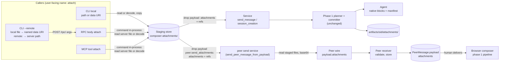

# Attachments phase 2: CLI, RPC, MCP and peer — design

Status: design, not implemented, not yet reviewed. Date: 2026-10-06.
Branch: `attach-any-files`.
Builds on: `docs/plans/2026-10-03-composer-attachments-any-file-design.md` (phase 1, §14 announces this phase).
Phase 1 handoff: `docs/plans/2026-10-06-composer-attachments-handoff.md`.

"Phase 1 design" below means the first document. `§n` refers to sections of this document unless "phase 1 §n" is written.
"MB" means MiB (1024 × 1024 bytes), as in every size constant of the repo.

## 1. Goal and non-goals

### 1.1 Goal

Every entry point except the web composer gets the phase 1 behavior. The entry points are:

- the CLI: the `--attach` option of `send-message`, `send-messages`, `create-session` and `peer-send`;
- the RPC API (`/rpc/`), whose body is generated from the CLI options;
- the MCP tools (internal per-session endpoint and external `/mcp`), whose schema is the RPC schema;
- the peer system (messages between two TwiCC instances).

The result for each of them:

- any file type is accepted;
- the phase 1 pipeline does the work once the files reach the backend: staging store, planner, committer, `<twicc:attachments>` manifest. Nothing in that pipeline is duplicated or replaced;
- the planner decides, file by file, native block or file in `artifacts/<session>/attachments/`, for the provider of the target session;
- the old hybrid text bug (phase 1 D18) and the silent drop of documents by Codex (`providers/codex/agent/manager.py:218-232`) disappear, because the legacy delivery path is no longer used by these entry points.

The field case that motivates the peer part: a peer sent a Git patch. It passed the sender checks as `text/plain` and was lost on the receiving side (Codex drops documents, hybrid skips text documents), with no visible error.

### 1.2 Non-goals

- No change to the web composer, the tus upload API, the planner rules, the committer or the manifest.
- No resumable or chunked upload for the CLI, the RPC or the MCP. Inline bytes travel in one request.
- No version or capability negotiation between peers.
- No server-side delivery of a peer message into a session. The delivery stays human-driven (§3.6).
- No new storage for peer bytes. They stay in the database, as today.
- No CHANGELOG entry. The CHANGELOG is written only on explicit request of the user.

## 2. Decisions

D1–D9 and D15 are settled with the user. Do not re-open them.
D10 and later are design decisions that follow from the code. The reviewer must challenge them.

| # | Decision | Source |
|---|---|---|
| D1 | Scope: the CLI (`--attach` of `send-message`, `send-messages`, `create-session`, `peer-send`), the RPC API, the MCP tools (internal and external) and the peer system. | User |
| D2 | Naming. `attach` is the name every caller sees: the CLI option `--attach`, the RPC body property `attach`, the MCP tool parameter `attach`. `attachments` is the name of every internal format: the drop-request payloads between the CLI command and the services, and the peer wire payload. `images` and `documents` disappear from these internal formats. No new user-facing field is added. | User |
| D3 | `attach` keeps its current input forms and their resolution (§3.2): a file path (read by the CLI process, or by the server for an absolute path in API mode), `remote:<absolute path>` over `--remote` (read by the server), and a base64 data URI. The only change to the forms is an optional `name=` parameter in the data URI (D10). The type, per-file size and count limits of `validate_and_encode` are removed. | User |
| D4 | Once the files reach the backend, the phase 1 pipeline handles them, unchanged: staging store, planner, committer, manifest. Native for Claude: images, PDF, text. Native for Codex: images. Everything else goes to `artifacts/<session>/attachments/`. Images go through the phase 1 normalizer. Hybrid: images by `@` reference, everything else in artifacts; a hybrid message that starts with `/` or `!` and carries attachments is refused (`attachments_with_command`). | User |
| D5 | One limit: 50 MB total of decoded bytes for the files that travel inline in a request (data URIs in `attach` over RPC, MCP or `--remote`; the peer wire). No per-file limit, no file-count limit. | User |
| D6 | The error message of D5 and the descriptions of every place that states the limit (CLI help, RPC/MCP schema descriptions, skills, docs) say what to do for larger files: put the file on a file storage service and pass its URL in the message text. Where the caller can use it, they also name the server-side path (`remote:` over `--remote`, an absolute server path over the RPC or the MCP). | User |
| D7 | The request body caps on the receiving side rise so that 50 MB of base64 fits (RPC, MCP, peer receiver). | User |
| D8 | Peer wire: `attachments` replaces `images` and `documents`. Each entry is `{name, media_type, data}`, `data` in base64. The receiver runs the phase 1 pipeline at delivery, for its own provider, so the sender no longer needs to know the receiver's capabilities. | User |
| D9 | No version or capability negotiation between peers. An older receiver rejects a message that carries `attachments` with its existing `unknown_keys` validation. The user accepts this: the other side has to update. | User |
| D10 | The data URI form of `attach` gets an optional parameter `name=<percent-encoded file name>`: `data:video/mp4;name=capture%20%281%29.mp4;base64,AAAA`. A URI without `name` gets the name `attachment-<n>` plus an extension guessed from the declared media type (`mimetypes.guess_extension`, else `.bin`). | Design |
| D11 | The D5 limit applies only to inline bytes. A file the CLI process or the server reads from its own disk (local path, absolute server path, `remote:`) has no limit, like a file of the web composer. | Design |
| D12 | Request body caps: 72 MB for the RPC (token scope), the MCP server and the peer receiver. Reason in §4.2. | Design |
| D13 | Staging identity outside the browser: one bucket per request (`cli-<uuid4>` or `api-<uuid4>`), one UUID4 per file, a new marker `oneshot.json`. One-shot entries are removed by the reaper once they are 24 h old; with a 24 h reaper period, an entry lives at most about 48 h. | Design |
| D14 | For drop-request callers, once the request reaches the backend, the backend owns the refs. The service releases them on every outcome, except `delivered is False` (§4.5.3). The WS path keeps the phase 1 ownership rules. | Design |
| D15 | The service send path takes the per-session send lane (`send_lane`), for every send. | User |
| D16 | Peer receiver: the legacy `images`/`documents` of an older sender are still accepted. They are converted to `attachments` entries at receive time, before the row is stored. A payload that has an `attachments` key and an `images` or `documents` key (any value, empty included) is refused: an old sender always sends both legacy keys, a new sender never sends them. | Design |
| D17 | One data migration converts the stored peer rows (`PeerMessage.payload` and `attachments_meta`) to the new shape. After it, every reader of a stored row knows only `attachments`. | Design |
| D18 | The CLI copy into staging is always a real copy. It is never a hard link of the user's file. | Design |
| D19 | A batch (`send-messages`) stages one copy per recipient. | Design |
| D20 | The legacy `ATTACHMENT_SUPPORT`, `get_attachment_support` and the bootstrap key `attachment_support` are retired once no caller is left. | Design |

## 3. Current state (verified facts)

Every line number below is read from the code of this branch.

### 3.1 Entry points today

| Entry point | Validation and encoding | Reaches the agent through |
|---|---|---|
| Web composer | refs `{bucket, id}`, planner | WS `send_message` → `asgi.py:1409-1420` → `manager.send_to_session(..., attachment_plan=...)`; new session: `session_creation.py:478-484` |
| CLI `send-message` | `validate_and_encode` (`cli/_drop_request/attachments.py:237`) in `cli/send_message/command.py:301` | drop payload `session:send_message` with `images`/`documents` (`:325-326`) → `core/services/send_message.py:196` |
| CLI `send-messages` | `validate_and_encode` per recipient (`cli/send_messages.py:308`) | same kind, one drop request per recipient (`_batch_runner.py:205-222`) |
| CLI `create-session` | `validate_and_encode` (`cli/create_session/command.py:499`) | drop payload `session:create` (`:567-568`) → `session_creation.py:478` |
| CLI `peer-send` | `validate_and_encode` with the Claude helpers (`cli/peer_send.py:157-161`) | drop payload `peer:send` (`:180-181`) → `peer_messages.py:512` |
| RPC `/rpc/<command>` | none of its own: body → argv → the same CLI command, in-process | see the CLI rows |
| MCP tool | none of its own: arguments → argv → the same CLI command, in-process | see the CLI rows |
| Peer inbound | `_validate_inbound_payload` (`peer_messages.py:475`) | stored `pending`; the human delivers it from the web UI |

The services reject composer refs from every non-WS caller:

- `send_message.py:84` rejects any `attachments` key with `invalid_attachments`.
- `session_creation.py:196-200` does the same unless the caller passes `allow_attachments=True`. Only the WS handler passes it (`asgi.py:1452-1454`).

### 3.2 CLI and the forms of `--attach`

- Four commands declare `--attach`: `send_message/command.py:37`, `send_messages.py:70`, `create_session/command.py:200`, `peer_send.py:39`.
- `_resolve_spec` (`cli/_drop_request/attachments.py:195-234`) resolves one value:

| Form | Local CLI | Command run by the RPC or the MCP (`in_api_mode()`, `cli/_output.py:44`) |
|---|---|---|
| relative path | read in the caller's directory | refused: `relative_path` (`attachments.py:222`) |
| absolute path | read by the CLI process | read by the server, from its own filesystem |
| `remote:<path>` | refused: `remote_requires_remote` | refused: `remote_requires_remote` (`attachments.py:213-219`). Over `--remote` the forwarder removes the prefix before the call (below), so only a direct RPC or MCP caller gets this error |
| `data:<mime>;base64,<data>` | decoded | decoded |

- The scheme `remote:` (`cli/_drop_request/remote_scheme.py`) exists for `--remote` only. Over `--remote`, a bare path is read on the client. With the prefix, the forwarder strips it and sends the bare absolute path, and the server reads its own file (`_remote.py:325-331`).
- The remote forwarder (`cli/_remote.py`):
  - `inline_attachments` (`:412`) rewrites each local `--attach` value into `data:<mime>;base64,...` through `_inline_one` (`:333`). A `data:` value is kept. A `remote:` value becomes the bare path;
  - it imports the legacy `_sniff_mime` (`:41`);
  - it sends `{"argv": [...]}` (`:773`, the `forward` body);
  - it does not check any size before the HTTP call.
- A data URI has no file name. `_parse_data_uri` (`attachments.py:87`) keeps only the declared media type, as a label.
- `validate_and_encode` (`attachments.py:237-361`) enforces three things:
  - a MIME allow-list from `ATTACHMENT_SUPPORT` (PNG, JPEG, GIF, WebP, PDF, and anything that decodes as UTF-8 as `text/plain`; Codex: images only);
  - 5 MB per file, 100 files, 32 MB total;
  - an image resize with the legacy Pillow code.
- It produces SDK blocks: `{type: "image", source: {type: "base64", media_type, data}}`, `{type: "document", source: {type: "base64", media_type: "application/pdf", data}}`, `{type: "document", source: {type: "text", media_type: "text/plain", data: <text>}}` (`:313-344`). No block carries a file name.
- The CLI commands call `django.setup()` first, then import lazily. They can import `twicc.core.services.attachments.staging`.
- `write_drop_file` (`_drop_request/drop_file.py`) resolves the drop directory with `twicc.paths`. The CLI and the backend share one data directory.
- The batch runner calls `prepare(resolved)` for each recipient, then submits at once (`_batch_runner.py:205-222`).
- `sub.cleanup()` deletes the drop and status files of the CLI at the end (`_drop_request/transport.py`, `Submission.cleanup`). After a CLI timeout the drop file may never be read.

### 3.3 Service layer and drop requests

- `execute_drop_payload` (`drop_requests_watcher.py:240`) routes a payload by kind to a service. `session:create`, `session:send_message` and `peer:send` are at `:45`, `:50`, `:190`.
- RPC and MCP reach the same function in-process. `transport.submit` (`transport.py`) schedules it on the backend loop when `backend_loop` is set.
- `send_message_to_session_from_payload` (`send_message.py:51`):
  - reads `images`/`documents` (`:80-81`);
  - calls `manager.send_to_session` without any plan (`:196`);
  - turns a `RuntimeError` (so a `SendDeliveryError`) into a `rejected` error with the error code (`:203`);
  - turns `delivered is False` into `send_failed` (`:208`). `False` also means a send parked or deferred by the manager (`providers/claude_code/agent/manager.py`, docstring of `send_to_session`).
- The phase 1 manager API is ready: `send_to_session(..., attachment_plan=)` and `create_session(..., attachment_plan=)` in both providers. The committer runs before the manager lock (`agent/base_manager.py:397-440`).
- The WS frame already names its refs `attachments` (`planner.validate_attachment_frame`, `planner.py:302`). The same function rejects refs together with a non-empty `images`/`documents` (`invalid_attachments`). It checks the legacy fields only when refs are present (`:316-319`): a payload with legacy fields and no refs passes it.
- `delivery_release(refs)()` (`attachments/lifecycle.py:254`) releases refs after delivery as a detached task. The WS handler calls it after the ack (`asgi.py:1509`). A parked send carries its own `on_delivered` release (`claude_code/agent/manager.py`, `_delivery_release`).
- The plan target of a send to an existing session is built in `asgi.py:493` (`resolve_existing_session_plan_target`). It uses `resolve_session_hybrid` (`asgi.py:481`) and the in-memory set `_PENDING_HYBRID_SWITCHES` (`asgi.py:463`). Services cannot import `asgi.py` without a cycle.
- The send lane `send_lane(session_id)` (`agent/send_lanes.py:62`) wraps every WS send (`asgi.py:1152-1155`). The service send path does not use it.
- The legacy hybrid renderer skips non-base64 blocks, so a `text` document is lost (`providers/claude_code/agent/hybrid/agent.py:553`). This is phase 1 D18. It does not refuse a message that starts with `/`.

### 3.4 RPC

- `rpc/generator.py` builds one route per Click command. `json_schema_for` (`rpc/schema.py:76`) turns every option into a property. A repeatable option becomes `{"type": "array", "items": {"type": "string"}}`. The property description is the CLI `help` text.
- `render_argv` (`generator.py:119`) turns a body into argv. `attach` becomes one `--attach=<value>` per element.
- So the RPC schema of the four commands has one property `attach` (array of strings). It has no `images` and no `documents` property: those names exist only in the drop payloads (§3.3). `_validate_body` (`rpc/views.py:36`) rejects unknown fields.
- `{"argv": [...]}` is a second body form, for token callers only (`views.py`, `dispatch`).
- `dispatch` reads `request.body` (`views.py:77`). Django's `HttpRequest.body` raises `RequestDataTooBig` above `DATA_UPLOAD_MAX_MEMORY_SIZE`. The repo sets 12 MB (`settings.py:194`). Only the `body` property checks the limit, `read()` does not. `peer/inbound_views.py:273-277` already relies on this.
  Consequence: today an RPC call cannot carry more than 12 MB of body. The documented 32 MB attachment cap is not reachable over `/rpc/`.
- The two `logger.exception` calls print the full `argv` (`rpc/views.py:134`) and the full `arguments` (`mcp/server.py:227`). With data URIs they would write tens of MB into `backend.log`.
- Auth: `RpcTokenAuthMiddleware` accepts a Bearer token for `/rpc/` only. `/api/` (the tus upload API, `/api/uploads/`, `/api/composer-attachments/`) accepts only the password session cookie (`auth/middleware.py`, `PasswordAuthMiddleware`). The remote CLI authenticates with a Bearer token. So it cannot use tus.
- `RPC-API.md:72-88` documents `--attach` as "absolute server path or base64 data URI".

### 3.5 MCP

- `iter_mcp_tools` (`mcp/tools.py:89`, `input_schema=` at `:98`) sets `input_schema=spec.json_schema`. The tool schema is the RPC schema.
- The four tools are `send_message`, `send_messages`, `create_session`, `peer_send`. Each has the property `attach` (array of strings) with the CLI help as description.
- `_call_tool` (`server.py:204`) → `prepare_tool` (`dispatch.py:35`, `jsonschema.validate` at `:40`) → `execute_prepared` (`server.py:85`). It renders argv, sets `backend_loop` and the caller identity, and runs the CLI command in a worker thread.
- The instructions tell agents "Always pass absolute paths (directories, attachments)" (`server.py:68`). External instructions say "Attachments can use base64 data URIs" (`server.py:295-300`).
- `MAX_REQUEST_BODY_BYTES = 48 MB` (`server.py:272`), applied to both session managers (`:285`, `:344`). `external-mcp.md:225` states this limit.
- The audit record of an external call stores only identifiers, never arguments (`server.py:101-125`).

### 3.6 Peer system

- Only `peer-send` (CLI, RPC, MCP) sends files. The owner compose dialog sends text only (`peer_message_send`, `owner_views.py:169-175`).
- Wire request: `POST <peer>/peer/messages/` with a Bearer token, JSON body `{message_id, title, reply_to, payload, origin}` (`peer/outbound.py:78-93`). `payload` is `{text, images, documents}` (`peer_messages.py:596`), with the SDK blocks of §3.2.
- Caps: 5 MB per file, 32 MB total, 100 files (`peer_messages.py:33-35`). The sender CLI checks them with the Claude rules, whatever the receiver's provider.
- `_validate_inbound_payload` (`:475-509`): only the keys `text`, `images`, `documents` (`_PAYLOAD_KEYS`, `:41`; any other key gives `unknown_keys`, `:479`); `source.type` must be `base64` or `text`; same caps. No media type check. `receive_peer_message` (`:713`) hides the reason: the wire answer is `400 invalid_payload`.
- Inbound request cap: `PEER_MESSAGE_MAX_REQUEST_BYTES = 48 MB` (`peer/inbound_views.py:30`, used at `:271-278`). It is checked on `Content-Length` before any payload validation: an oversized body gets `413 {"error": "too_large"}`, not `invalid_payload`. `too_large` has no entry in `_REMOTE_ERROR_MESSAGES` (`peer/outbound.py:14-22`), so the sender shows a generic text.
- Outbound client: `httpx.AsyncClient(timeout=30.0)`, `json=` body (`peer/outbound.py:12`, `:41-42`). httpx sends a byte body as one chunk, and the async httpcore backend puts that whole write under one 30 s deadline. Today's 43 MB maximum body therefore already needs about 12 Mbit/s of upload.
- `peer-send` waits `--timeout` (default 30 s) for the service result, which comes after the HTTP attempt (`cli/peer_send.py:46-54`). On a timeout it reports exit 5 while the backend keeps sending.
- A stored row keeps the payload (JSON field, base64 inside) and `attachments_meta`: `[{kind: "image"|"document", media_type, bytes, name?}]` (`models.py:2033-2036`, `peer_messages.py:433`). `name` comes from a block `title` or `name` (`_block_name`, `:428`), which the CLI never sets.
- The purge task empties `images` and `documents` 7 days after resolution and keeps `attachments_meta` (`peer_purge_task.py:50-68`).
- Reads: `peer_message_attachments` returns `{images, documents}` (`peer/owner_views.py:406-415`). `serialize_peer_message` returns `images: []`, `documents: []` when bytes are not requested (`serializers.py:597`, `:699`).
- Frontend readers of `attachments_meta` use only its length and the `bytes` of each row (`PeerInboxRow.vue:164`, `PeerMessageReviewDialog.vue:163-173`, `:650-651`).
- Delivery is not done by the server. `peer_message_deliver` marks the message delivered and returns the envelope text. The browser prefills a composer (`owner_views.py:418-442`). On this branch (phase 1, commit `e260452b`) the dialog turns each block into a `File` (`frontend/src/utils/peerMessageContent.js`, `peerBlockToFile`, `:74`) and calls `addAttachment` (phase 1 composer path). So the receiving side already runs the phase 1 pipeline at delivery. Without a block name, the file is named `peer-attachment-<n>.<ext>`.

### 3.7 Foundation reused as is

- `staging.py`: `validate_ref`, `normalize_filename` (`:138`), `write_marker` (`:188`), `fsync_dir`, `load_entry` (`:259`), `entry_dir`.
- `planner.plan_attachments` (`planner.py:222`), `validate_attachment_frame` (`:302`), `describe_attachment_error`, `is_hybrid_command`.
- `target.resolve_plan_target`, `committer`, `lifecycle.delivery_release`, `lifecycle.release_refs` (`:220`).
- The reaper: `composer_attachments_cleanup_task.py`. `_entry_is_expired` (`:92-99`) knows two ages: 7 days with `committed.json`, 30 days without.
- `_composer_name_max_bytes` lives in `uploads/views.py:433`.

### 3.8 Documents that mention attachments today

| File | What it says |
|---|---|
| `src/twicc/agent/plugin/twicc/skills/twicc-send-message/SKILL.md:43` | types, 5 MB, 100 files, 32 MB, auto-resize |
| `src/twicc/agent/plugin/twicc/skills/twicc-send-messages/SKILL.md:43`, `:74` | per-session validation by provider; "an attachment its provider rejects" |
| `src/twicc/agent/plugin/twicc/skills/twicc-create-session/session-behavior.md:49` (and `SKILL.md:99`) | same caps |
| `src/twicc/agent/plugin/twicc/skills/twicc-peer-send/SKILL.md:45` | types, 5 MB, 100 files, 32 MB |
| `src/twicc/agent/plugin/twicc/skills/twicc-peer-message/SKILL.md:47` | example `attachments_meta` with `kind: "image"` |
| `SKILLS-AND-CLI.md:58-59`, `:285`, `:294`, `:299`, `:353` | `--remote` inlining, `remote:`, caps, per-session validation |
| `RPC-API.md:72-88`, `:136-144` | path or data URI; remote inlining |
| `frontend/public/help/external-mcp.md:225` | 48 MiB request limit |
| `frontend/public/help/peers.md:37`, `:85`, `:122`, `:193` | peers carry attachments; purge after 7 days (no size caps stated) |
| CLI help of the four `--attach` options | caps and types |
| `src/twicc/mcp/descriptions.py`, `mcp/server.py:68`, `:295-300` | "attach is given", absolute paths, data URIs |
| `CLAUDE.md` and `AGENTS.md` ("Data Directory") | `composer-attachments/` described as the composer's staging |
| Comments to fix | `providers/helpers.py:106`, `mcp/server.py:267`, `peer_messages.py:36`, `peer/inbound_views.py:29`, `models.py:2027-2036` |

The plugin version is `0.107.3` (`src/twicc/agent/plugin/twicc/.claude-plugin/plugin.json`).

### 3.9 Findings that shape the design

1. `/rpc/` is capped at 12 MB by Django. The documented 32 MB was never reachable over HTTP.
2. Failures log the full request arguments (§3.4). Large inline data would flood `backend.log`.
3. The server does not deliver peer messages into sessions (§3.6). The receiving side already runs the phase 1 pipeline in the browser composer, at delivery time.
4. A drop request that the CLI abandons after a timeout is never read, because the CLI deletes the file. Its staged entries would leak without a short retention.
5. Peer blocks carry no file name today. The receiver invents `peer-attachment-<n>.<ext>`.

## 4. Target design

### 4.1 Overview



Rules that hold everywhere:

- The resolution of `attach` (path, `remote:`, data URI) does not change, except the `name=` parameter (D10).
- Every resolved file is copied into the staging store. From there, the phase 1 pipeline runs as for the web composer.
- The drop payloads carry `attachments` (refs `{bucket, id}`, the same shape as the WS frame). They never carry `images` or `documents` again.
- The manifest extraction at ingestion (phase 1 §10.1) does not depend on the sender. CLI, RPC and MCP messages get the attachment strip in the UI without any change.

### 4.2 Limits and body caps

New module `src/twicc/core/services/attachments/inline.py`. It is the one place that knows the inline limit.

| Name | Value | Meaning |
|---|---|---|
| `INLINE_MAX_BYTES` | 50 × 1024 × 1024 | total decoded bytes of the inline files of one request (D5) |
| `INLINE_MAX_REQUEST_BYTES` | 72 × 1024 × 1024 | body cap of an HTTP request that may carry inline data (D12) |
| `INLINE_TOO_LARGE_HINT` | text | the hint of D6 for `send-message`, `send-messages` and `create-session`: a file storage service and a URL, or a path the server reads (`remote:` over `--remote`, an absolute server path over the RPC or the MCP) |
| `PEER_TOO_LARGE_HINT` | text | the hint of D6 for `peer-send`: a file storage service and a URL only, because a server path also travels inline on the peer wire |

Why 72 MB: base64 of 50 MB is `4 × ceil(52 428 800 / 3)` = 69 905 068 bytes. The remaining 5 MB of the cap covers JSON overhead, names and the message text.

What counts toward `INLINE_MAX_BYTES` (D11):

| Source | Counts |
|---|---|
| data URI in `attach` (RPC, MCP, local CLI, built by `--remote`) | yes |
| peer wire entry | yes |
| local path read by the CLI process | no |
| absolute server path read by an RPC/MCP command | no |
| `remote:` path | no |

The local CLI never sends inline data to the backend (it copies into staging itself). A data URI given to the local CLI still counts: it is inline data, and the same parser handles it everywhere.

Functions:

- `parse_data_uri(spec)` accepts `data:<media>[;<param>]*,<data>`, as the current parser does (`attachments.py:99-102`): parameters in any order, unknown parameters (`charset=…`) ignored, `base64` required in any case. The new parameter is `name=<percent-encoded file name>`. A URI without `base64` is refused (`invalid_data_uri`), as today. It returns `(name, media_type, decoded size, data)`. It removes the whitespace inside the base64 first, as the current parser does (`attachments.py:104`), then computes the decoded size from the length and the trailing `=` before it decodes, so the running total is checked before any decoding. An empty payload is now valid: it is a 0-byte file (the current parser refuses it, `:107-108`). The `n` of a default name is the 1-based position of the value among the `--attach` values of the request.
- `InlineBudget` adds up the decoded sizes of one request and raises `AttachmentError("attachments_too_large", ...)` above `INLINE_MAX_BYTES`. The message ends with the hint of the command (`INLINE_TOO_LARGE_HINT` or `PEER_TOO_LARGE_HINT`).
- The label of a data URI in an error (the `--attach <label>` field and the message) is `data:<media>` followed by the name when present. `<media>` is cut to 255 characters; the name is the normalized name (`normalize_filename(name, name_max_bytes())`), so it is bounded. A URI without a comma has no media part: its label is `data:` followed by at most 35 characters of the value, as today for every invalid data URI (`spec[5:40]`, `attachments.py:207`). The label is never the URI itself, which can be tens of MB.
- `entries_from_legacy_blocks(images, documents)` converts SDK blocks of an older peer to wire entries (D16). Any `media_type` is accepted. A block with `source.type = "base64"` keeps its data. A block with `source.type = "text"` is encoded as UTF-8 then base64. The name is the block `title` or `name`, else `attachment-<n>.<ext>` (D10 rule; `n` counts images first, then documents, from 1).
- `transfer_timeout(body_bytes)` returns the time budget of an HTTP write of `body_bytes`: `30 s + body_bytes / INLINE_MIN_THROUGHPUT`, with `INLINE_MIN_THROUGHPUT = 256 KiB/s` (2 Mbit/s). For a full 72 MB body it gives about 5 min. It bounds the HTTP write of a peer send (§4.8.3).
- `PEER_SEND_TIMEOUT_WITH_FILES` is the wait of a caller of the peer send service when the message carries files (`peer:send_attachments`). It is computed once from the worst case, so no caller has to measure sizes (a `--remote` client cannot measure `remote:` files): `transfer_timeout(INLINE_MAX_REQUEST_BYTES)` (318 s) + 60 s for the local steps of the service (file reads and encoding, the DB write lock) + connect 30 s + the receiver's answer 30 s (both as today's `OUTBOUND_TIMEOUT_SECONDS`) + a margin of 30 s = 468 s. A message without files keeps the current default of 30 s. The command returns as soon as the service answers: the value is only an upper bound.
- Constraint: `PEER_SEND_TIMEOUT_WITH_FILES` (468 s) stays below the internal MCP tool timeout, 600 s on both providers (`codex/agent/manager.py:1277`, `claude_code/agent/agent.py:1206`). An agent that calls `peer_send` therefore gets the command's own answer, with the message id, before its tool call times out. This holds for one `peer_send` per tool call: an MCP `batch` runs its children in sequence with no per-child timeout (`mcp/batch_contract.py:66`), so two large `peer_send` children can exceed 600 s. This is accepted; the `peer_send` description advises one large peer send per tool call.

### 4.3 Staging for non-browser entry points

#### 4.3.1 API in `staging.py`

New functions, built on the existing helpers (`validate_ref`, `normalize_filename`, `write_marker`, `fsync_dir`, `entry_dir`):

- `new_bucket(origin)` returns `"<origin>-<uuid4>"`. `origin` is `cli` (the CLI process on its own) or `api` (a command running inside the backend: RPC, MCP). The bucket passes the existing key rules (no `/`, `\`, NUL, not `.` or `..`).
- `stage_path(source, *, bucket, origin, name=None)` copies a file. `name` defaults to the base name of `source`.
- `stage_bytes(data, name, *, bucket, origin)` writes bytes.
- `discard_staged(refs)` removes entries. It never touches `artifacts/`.
- `name_max_bytes()` moves from `uploads/views.py:433` to `staging.py`. `uploads/views.py` imports it from there. The CLI must not import a view module.

Each `stage_*` call does the same steps:

1. Pick a fresh `attachment_id` (UUID4). Create `<bucket>/<id>/`. If the bucket directory disappears between the two `mkdir` calls (the reaper removes empty buckets), retry the whole creation up to three times. Write `oneshot.json` `{origin, at}` with `write_marker`, then create `file/`: an entry never exists without its marker, so an interrupted stage leaves an entry with the 24 h retention, never one with the 30-day draft retention.
2. Make the name valid UTF-8 first: a file name read from the filesystem may hold undecodable bytes (surrogate escapes), which `normalize_filename` (`staging.py:125`, `encode("utf-8")`) and `orjson` refuse. The name becomes `os.fsencode(name).decode("utf-8", "replace")`. Then normalize it with `normalize_filename(name, name_max_bytes())`. Phase 1 rules apply: control characters, `/`, `\` and NUL become `_`; empty, `.` and `..` become `attachment`; a long name is truncated before its extension.
3. Write the bytes to `file/.twicc-upload-<uuid>.tmp` (the reserved temporary prefix, ignored by the readiness rule of phase 1 §6.1). `fsync` the file. Rename it to the final name. A copy uses a real copy loop (`COPY_BLOCK_SIZE`), never `os.link` (D18): a link would make the promoted artifact share an inode with the user's own file.
4. Write `ready.json` `{filename, size}` with `write_marker`. The entry is ready only now. A crash before this step leaves an entry that is not ready.
5. On any `OSError` (disk full, permission), remove the partial entry and raise `AttachmentError("attachment_stage_failed", ...)`. On any other interruption (`BaseException`: Ctrl-C, `SystemExit`), remove the partial entry and re-raise. A hard kill leaves a non-ready entry with `oneshot.json`, which the reaper removes.

No tus upload exists for these entries. So there is no creation lock, no release tombstone check and no settle rule to run.

#### 4.3.2 Retention and release

- `oneshot.json` marks an entry that has no retry path: nobody can send it twice. The reaper (`composer_attachments_cleanup_task.py:92-99`) gets a third rule: an entry with `oneshot.json` is removed when its directory mtime is older than `ONESHOT_ENTRY_AGE = 24 h`. This rule wins over the 7-day and 30-day rules. The existing rules (never while a live upload targets the entry, locks, symlink checks) stay.
- Who releases, in order of preference:
  1. The service, right after the outcome of the request (§4.5.3). It uses the phase 1 `release_refs` through `delivery_release`. A release leaves an empty tombstone file in `<bucket>/.released/` for 24 h. The reaper already removes it.
  2. The CLI, before it submits anything: it discards what it staged when a later local check fails (§4.4.4).
  3. The reaper, once the entry is 24 h old (so within about 48 h, §D13). This covers a CLI that gave up after a timeout and deleted its drop file (§3.9, item 4), and a `delivered is False` outcome (§4.5.3).
- The CLI never deletes an entry after it submitted the request. The backend may still read it.

### 4.4 CLI

#### 4.4.1 `--attach`

`--attach VALUE` stays on the four commands, with the forms of §3.2. Changes:

- No type, per-file size or count limit.
- The data URI accepts `name=` (D10).
- The help text of `send-message`, `send-messages` and `create-session` says: any file type; a local path, a `data:` URI with an optional `name=`, or `remote:` over `--remote`; inline data is limited to 50 MB in total: data URIs, and local files sent over `--remote`, which the forwarder turns into data URIs (on the local command line a data URI cannot carry much: Linux caps one argument at 128 KiB). Followed by `INLINE_TOO_LARGE_HINT`. The skills say the same.
- The help text of `peer-send` says: any file type; the same forms; every file travels inline to the peer, so all files together are limited to 50 MB, followed by `PEER_TOO_LARGE_HINT`.

A new helper module `src/twicc/cli/_drop_request/attach_sources.py` replaces `attachments.py`:

- `resolve(attach)` turns the `--attach` strings into sources. A path source keeps the current rules (`relative_path`, `not_a_file`, `remote_requires_remote`). A data URI source is parsed by `inline.parse_data_uri` and counted by one `InlineBudget`. Errors are aggregated.
- `stage(sources, *, bucket)` calls `staging.stage_path` or `staging.stage_bytes` for each source, in order, and returns the refs.

The origin is `cli` outside the backend and `api` inside it (`transport._in_backend()`).

#### 4.4.2 Command changes

The same three steps in each command: resolve sources, stage, put the refs in the payload as `attachments`.

| Command | Change |
|---|---|
| `send-message` | the block at `command.py:279-326` (bootstrap, support dict, effective model, `validate_and_encode`) goes away. The payload carries `"attachments": [{bucket, id}, ...]` and no `images`/`documents`. `missing_prompt` tests the resolved sources. |
| `send-messages` | `attach_sources.resolve` runs once, before the recipient loop: a missing file, a bad data URI or a total above the limit is one global error in the JSON `validation_error` form of §4.9 (exit 1), as the `--wait-*` checks already do (`emit_validation_errors`, `send_messages.py:344-346`), not the plain-text `emit_error` of the missing `--message` check (`:253-258`). The "Argument-level problems" paragraph of the skill (`twicc-send-messages/SKILL.md:70`) changes for `--attach`. Today `validate_and_encode` runs per recipient and gives one error per id (`:307-319`, `twicc-send-messages/SKILL.md:74`); the skill changes accordingly. Only staging runs per recipient: `_prepare` (`:278-327`) stages one copy per recipient (D19), and a staging failure stays a per-id error; a recipient's refs are consumed and released by that recipient's send. A hard link between the copies is forbidden (two sessions would share an inode, phase 1 §7.1). The per-provider rejection of a file disappears: a file is never refused by provider. `--message` is optional when at least one source exists. |
| `create-session` | in the block at `command.py:485-510`, the settings resolution and `validate_hidden_constraints` (`:495`) stay, so a hidden-session error is still a CLI `validation_error` (exit 1). Only the support dict, `effective_model` (used only for the resize cap) and `validate_and_encode` go away. Payload: `"attachments"` instead of `images`/`documents`. The text is still required (it gives the title). |
| `peer-send` | the files travel inline on the peer wire, so they all count toward `INLINE_MAX_BYTES`, paths included. Before staging, the command adds up the file sizes (`os.path.getsize`) and the decoded sizes of data URIs, and refuses a total above the limit with `attachments_too_large` (message with `PEER_TOO_LARGE_HINT`). When the message carries files, the default of `--timeout` becomes `PEER_SEND_TIMEOUT_WITH_FILES` (§4.2) instead of a flat 30 s, so the command waits for the whole service result of a large send; an explicit `--timeout` wins. The command mints the `message_id` itself (`mint_message_id`, `peer_messages.py:576` today) and passes it in the drop payload. The service validates it with `PEER_MESSAGE_ID_PATTERN`; when the key is absent (the owner REST composer, an older CLI), the service mints it as today. The "already used for this peer" check runs in `_store_outbound`, under the write lock, so a reused id ends with `invalid_message_id` and never with an `IntegrityError`. It is a defensive guard: the boot pass never runs a drop file twice, because the watcher writes the `received` status before it calls the service (`drop_requests_watcher.py:361`, `:367`) and deletes at boot every drop file that has a status (`:322-328`). Every output of the command other than a validation error includes this id, and the peer id. When the drop status carries a `message_id` (a `sent` result), the CLI prints that one: an old backend ignores the minted id of a text-only `peer:send` and stores its own. Otherwise the CLI adds the id it minted (for a `rejected` result the watcher writes only `status` and `errors`, `drop_requests_watcher.py:269-272`; the `rejected` output has only `errors` and `request_uuid`, `_drop_request/output.py:94-99`): the timeout output (exit 5) has today only `status`, `received_seen`, `message` and `request_uuid` (`_drop_request/output.py:110-121`), and the `failed` output (exit 4) only `error` and `request_uuid` (`:101-107`). The help and the skill say that exit 5, exit 4 and exit 3 with `unreachable` or `send_failed` mean the send may still have reached the peer, and that the caller runs `peer-message <id>` before it sends again. `unreachable` is the likely outcome of a read or write timeout after part or all of the body was sent; the receiver may have stored the message. Limitation, stated in the help and the skill: if the backend restarts during the POST (a 50 MB send at 2 Mbit/s takes about 5 min), the outbound row stays `pending` (as today) and the CLI ends with exit 5. A `pending` status then does not prove that the POST completed. Payload: `"attachments"` and `"message_id"`. A message with files uses a new drop kind, `peer:send_attachments`, routed to the same service; a text-only message keeps `peer:send`. Reason: an old backend's `peer:send` reads only `images`/`documents` and ignores unknown keys (`peer_messages.py:535-536`), so it would send the text without the files and with its own id, silently; an unknown kind is refused instead (`failed: Unknown payload kind`). Agents: the default wait of 468 s is longer than a typical shell tool timeout (120 s for Claude Code's Bash). The help and the skill tell agents to send files with the MCP `peer_send` tool, or to give the shell call a timeout above 8 min; a CLI killed by its shell gets the exit 7 advice (check the Peers outbox, do not resend). |

`validate_and_encode`, `resize_image_if_needed`, `AttachmentResizeError`, `_sniff_mime` and `cli/_drop_request/attachments.py` are deleted. `_remote.py` stops importing `_sniff_mime` (§4.4.3).

#### 4.4.3 Remote forwarder

The forwarder keeps the `{"argv": [...]}` body. Changes in `cli/_remote.py`:

- `_inline_one` reads the local file and builds `data:<mime>;name=<percent-encoded base name>;base64,<data>`. The base name is made valid UTF-8 first, as in §4.3.1 step 2. The media type is `mimetypes.guess_type(name)[0]` or `application/octet-stream`. It is only a label.
- Before reading anything, `inline_attachments` adds up `os.path.getsize` of every local file and the decoded size of every data URI the user gave. Above `INLINE_MAX_BYTES` it raises `RemoteUsageError` (exit 2) with the limit and the hint of the command (`INLINE_TOO_LARGE_HINT`, which names `remote:`; `PEER_TOO_LARGE_HINT` for `peer-send`). No HTTP call is made.
- After it builds the body, the forwarder checks its length against `INLINE_MAX_REQUEST_BYTES`: an inlined prompt file (`inline_prompt`) can push it above the cap. Above, it raises `RemoteUsageError` (exit 2) with the size, the cap and the hint, instead of a bare `remote returned HTTP 413`.
- `remote:` values keep their meaning: they stay a bare server path and do not count in this check. For `peer-send` they still travel inline on the peer wire: the server-side command counts them (§4.4.2).
- The read timeout of the forwarder covers the server-side wait. For `peer-send` with at least one `--attach` value and no explicit `--timeout`, the forwarder passes `PEER_SEND_TIMEOUT_WITH_FILES` to the server as an explicit `--timeout` and uses it plus its margin as read timeout, as it already does for the wait-reply commands (`_request_timeout`, `_remote.py:668-699`). No size measurement is needed, `remote:` files included.
- Peak client memory is about three times the inline size (bytes, base64, JSON). This is accepted at 50 MB.
- Write timeout: the forwarder uses the sync client (`httpx.Client`, `_remote.py:776`). The sync httpcore backend applies the timeout to each socket `send` call (`httpcore/_backends/sync.py`, `write`), so a large body is not cut by a global write deadline.
- `--timeout` keeps its meaning: the wait for the server's final status after the drop request is written. Staging runs before it and is not bounded by it. A local copy runs at disk speed, so this is short for the local CLI and for absolute server paths. Over `--remote`, the server stages `remote:` files (no size limit, D11; N copies in a batch, D19) before its own `--timeout` wait starts, and the forwarder cannot measure them.
- Read timeout: today it is `_DEFAULT_TIMEOUT` (30 s, `_remote.py:643`), the same as the default `--timeout` of the command. The server now decodes and stages inline data (up to 50 MB) and the send may wait in the lane (§4.5.5) before its answer. `_request_timeout` therefore uses the command's effective `--timeout` plus `_WAIT_TIMEOUT_MARGIN` for every drop-and-poll command, as it does for `--wait-reply` (`_remote.py:686-698`). The upload time is not in it: the read timeout starts once the body is sent. The staging of very large `remote:` files is not in it either: such a call can end in exit 7 while the send completes (next bullet). This is accepted: the case needs a multi-GB staging, either a very large `remote:` file or large inline data copied once per recipient of a `send-messages` batch (D19; the batch deadline starts only after every recipient is prepared and submitted, `_batch_runner.py:191-226`, and the forwarder cannot count recipients chosen by `--descendants` or `--siblings`). The exit 7 advice covers both.
- A `--remote` read timeout ends with `RemoteTransportError`, exit 7 (class at `_remote.py:66-75`). It does not prove that the send failed. The help, the skills and `RPC-API.md` give the same advice as for exit 5: check the session before sending again. For a peer send, exit 7 (and a client-side timeout of any RPC or MCP caller) gives no id, because the id lives in the command's answer: the advice is to look at the Peers outbox in the TwiCC UI, or for an agent to report to its user, and not to send again blindly. `RPC-API.md` also states the lane wait in its timeouts section.
- An MCP client's own tool timeout may fire before the command ends; the send then still completes on the server.

Rejected alternative: the tus endpoint. It would allow resumable uploads and no size limit. It cannot work: the remote CLI holds a Bearer token, and `/api/uploads/` accepts only the password session cookie (§3.4). A new auth path for tus would be a larger change than this phase.

#### 4.4.4 Failure handling in the CLI process

- Staging happens after all other local checks of the command (session lookup, prompt, settings), and before the drop request is written. A local error discards the refs staged so far for the current request (`discard_staged`) and reports `validation_error`, exit 1. In `send-messages`, earlier recipients are already submitted (`_batch_runner.py:205-222`): only the current recipient's refs are discarded.
- After `transport.submit`, the CLI does not touch the entries (§4.3.2).
- The status of the request keeps its meaning: `sent`/`created` exit 0, `rejected` exit 3, `failed` exit 4, `timeout` exit 5.

### 4.5 Service layer

#### 4.5.1 Drop payloads and drop-only rules

The drop payloads `session:send_message`, `session:create` and `peer:send_attachments` carry `attachments`: a list of refs `{bucket, id}`, validated by `planner.validate_attachment_frame`. The `peer:send` wrapper refuses a non-empty `attachments` key with `invalid_attachments`: refs travel only in `peer:send_attachments`, so a payload that mixes them up is a bug. The CLI stops writing `images` and `documents` in every payload, including the `send-messages` branch without files (`send_messages.py:286-294`, which writes empty lists today).

`create_session_from_payload` is shared with the WS create path (`asgi.py:1430-1455`), which still passes the legacy `images`/`documents` of the browser and owns its refs with the phase 1 rules (release on delivery only, `asgi.py:1503-1509`; nothing on failure, so the browser can retry). The phase 2 rules therefore apply only to drop-request callers. The drop routes of `execute_drop_payload` (`drop_requests_watcher.py:45`, `:50`, `:190`, plus the new `peer:send_attachments` kind of §4.4.2) call a thin drop wrapper per kind. The WS path keeps calling the services as today. Each drop wrapper:

1. refuses a payload whose `images` or `documents` is non-empty, with `invalid_attachments`. This is an explicit check: `validate_attachment_frame` checks the legacy fields only when refs are present (§3.3). An empty list or an absent key is accepted, so the rule is the same as the WS rule;
2. takes `send_lane(session_id)` before any read of the session row (§4.5.5), for `session:send_message` and `session:create` (the create payload carries its `session_id`, `session_creation.py:148`);
3. calls the service with `release_refs_on_outcome=True` (name is a proposal): the service then applies the ownership rules of §4.5.3. The `allow_attachments` switch of `create_session_from_payload` is removed: both callers (WS handler and drop wrapper) accept refs;
4. for the two peer kinds, wraps the whole service body in the release `finally` of §4.5.3.

The rejection at `send_message.py:84` is removed: this service has no WS caller. A ref is a UUID capability. Anyone who can write a drop file or call the RPC already has full control of the instance.

`allow_hybrid` and `allow_ephemeral` stay guarded. A CLI send never targets an ephemeral run.

#### 4.5.2 Send to an existing session

In `send_message_to_session_from_payload`, called inside the lane (§4.5.1), so every read below sees the state left by the previous send of the session:

- The empty-text check counts refs as content (`send_message.py:91`).
- The session lookup, the provider and `awaiting_user_input` checks and the settings resolution (`:101-191`) stay as they are, now inside the lane. Then the service:
  1. builds the plan target with the shared function (§4.5.4): `hybrid` from the session row read inside the lane or a pending switch, `ephemeral=False`, `live_agent=manager.get_live_agent(session_id)`;
  2. calls `plan_attachments_off_loop(refs, target, text=text)`;
  3. passes `attachment_plan=` to `manager.send_to_session` (the existing kwarg).
- An `AttachmentError` or `AttachmentPlanError` becomes a `SendMessageError("attachments", code, message)`. `describe_attachment_error` supplies the message and the file names.
- A `SendDeliveryError` raised by the commit or a manager with an attachment code (`attachment_*`, `attachments_*`, for example `attachment_commit_failed` or the Codex `_refuse_attachments_with_command`) is mapped the same way: field `attachments`, its names kept, as the WS path does (`asgi.py:1469-1478`). Today `send_message.py:203-206` maps every `SendDeliveryError` to field `session` and drops the names; other codes keep that mapping. `attachments_with_command` also comes from the planner (hybrid `/` or `!`, Codex hardcoded command).
- Codex keeps passing `async_questions`, `request_id` and `send_origin` as today.

For a new session (`create_session_from_payload`), the planning code exists (`session_creation.py:388-405`). The `allow_attachments` gate is removed (§4.5.1). The error mapping of §4.5.2 applies here too: `session_creation.py:485-488` maps every `RuntimeError` to field `session` and drops the names today; an attachment code (the commit errors, Codex `create_session` → `_refuse_attachments_with_command`, `codex/agent/manager.py:824`) gets field `attachments` and its names. The plan runs after the settings are resolved and before every `set_pending_*` stash.

#### 4.5.3 Release rules

For drop-request callers only (§4.5.1), the backend owns the refs once it has the payload (D14). The WS path keeps the phase 1 rules.

| Outcome | Action |
|---|---|
| Any rejection before the manager call: shape error, business rejection (`session_not_found`, `session_stale`, `awaiting_user_input`, `provider_disabled`, `empty_text`, …), plan error, unknown or not ready ref | release the refs now |
| The manager raises (`SendDeliveryError`, `RuntimeError`) | release the refs now. The CLI has no retry. |
| `send_to_session` returns `True`, or `create_session` succeeds | `delivery_release(refs)()` (detached, after the result is built) |
| `send_to_session` returns `False` | do not release. The manager may have parked the send: a parked entry holds the refs and its own `on_delivered` release (`claude_code/agent/manager.py`, `_delivery_release`). If nothing delivers it, the reaper removes the entries (§4.3.2). |
| The service raises an unexpected exception | release the refs now (a `finally` around the body), then re-raise |

The committer runs before the manager call. A failure after the commit leaves the promoted files in `artifacts/<session>/attachments/`, as in phase 1 for a WS send. With no CLI retry, nothing reuses them. This is accepted: they are the user's own files, in the session's own folder.

For the peer send service (both kinds), the refs are released on every outcome, the early validation returns included (empty text, unknown project, unknown peer, peer state, unknown `reply_to`, `peer_messages.py:539-574`): a `finally` covers the whole service body once the refs are read (§4.8.3).

#### 4.5.4 Plan target outside `asgi.py`

`resolve_session_hybrid`, `_PENDING_HYBRID_SWITCHES`, `is_hybrid_switch_pending` and `resolve_existing_session_plan_target` move to an importable module (proposal: `attachments/target.py` for the target resolution and a small `agent/hybrid_switch.py` for the pending set). `asgi.py` imports them from there and keeps the same names for the switch handler. Re-exporting is not enough for the tests that patch a module global and then call the function (`tests/test_hybrid_attachment_delivery.py:587-605` patches `asgi._read_session_hybrid`): after the move, the function reads the global of its new module, so these tests patch the new module.

#### 4.5.5 Send lane (D15)

The send lane is a per-session queue: one send at a time per session, in arrival order. Today it wraps only WS sends. With D15, the service send path takes the same lane, for every send, with or without attachments.

- Reason: two sends to one session keep their order for every caller, and the commit of one send cannot interleave with the commit of another (for example two files with the same name in `artifacts/<session>/attachments/`).
- Consequence: a plain CLI send can now wait in the lane behind a slower WS send. Before, it could fail at once with `agent_starting`. The CLI waits up to `--timeout` (default 30 s) for the final status.
- Creation takes the lane too, on the session id of the payload (§4.5.1), as the WS creation does in phase 1: a send that arrives right after the row appears queues behind the creation instead of meeting its pending admission (`agent_starting`).
- The lane is taken before any read of the session row or of the settings (§4.5.1, §4.5.2). A send that waited therefore never applies a settings bundle that the previous send replaced.

### 4.6 RPC

- The body keeps the property `attach` (array of strings). No property is added. The schema description comes from the CLI help (§4.4.1), so it states the forms, the 50 MB inline limit and the hint of the command.
- A data URI in `attach` is decoded inside the command (`attach_sources.resolve`) and counted by its `InlineBudget`. An absolute server path is copied from the server filesystem and does not count (D11).
- Django's `ASGIHandler.read_body` spools the whole request body into a `SpooledTemporaryFile` before the view runs (`django/core/handlers/asgi.py:260-288`). A cap check in the view therefore saves the parsing, not the transfer or the disk use of the spool. This is accepted: the callers are token holders.
- Body reading and parsing: the `read` of the spooled body (a disk read once the spool rolled over) and `orjson.loads` run together in a worker thread (`asyncio.to_thread`), as for the peer receiver (§4.8.2); today the parse runs on the event loop (`rpc/views.py:82`).
- Body cap: `rpc/views.dispatch` reads the body with `request.body` today (12 MB cap). For a full-scope (token) call, it reads with `request.read(INLINE_MAX_REQUEST_BYTES + 1)`. A `Content-Length` above the cap is refused before the parse; a missing `Content-Length` (chunked body, accepted today) stays accepted and is bounded by the read itself. Above the cap it answers `413 {"error": "Request body too large"}`. A cookie-scope (read-only) call keeps `request.body` and the 12 MB cap.
- Logging: `rpc/views.py:134` uses a new `redact_for_log(argv)`. The argv tokens have the form `--attach=data:...` (`render_argv`, `rpc/generator.py:115`), or a separate `data:...` token after `--attach` (the forwarder keeps the user's form, two tokens at `_remote.py:389-398` or `--attach=` at `:399-406`), so the rule does not look at a prefix: any string longer than 512 characters is cut to its first 64 characters followed by `…<N chars>`.

### 4.7 MCP

- The four tools keep the parameter `attach` (array of strings), with the description of §4.4.1. No parameter is added.
- Internal MCP (agents inside TwiCC, on the server machine): an absolute path or a data URI. The instructions (`server.py:68`) say so.
- External MCP (a different machine): a data URI, with `name=` to keep the file name. The external instructions (`server.py:295-300`) say so, with the 50 MB inline limit and the hint of the command: an absolute server path is valid for an external client too (`server.py:297`, "Paths refer to the server filesystem") when the file is already on the server; `peer_send` has its own hint.
- `MAX_REQUEST_BODY_BYTES` (`server.py:272`) becomes `INLINE_MAX_REQUEST_BYTES` for both managers. The MCP SDK reads and parses the body on the event loop (`mcp/server/streamable_http.py`: `await request.body()`, then `pydantic_core.from_json`). TwiCC does not own that code; at 72 MB this blocks the loop briefly and is accepted. `external-mcp.md:225` and its sentence "retains the existing 48 MiB limit" change.
- Logging: `mcp/server.py:227` uses `redact_for_log(arguments)`, which also walks lists and dicts. The audit record of external calls already stores identifiers only (`server.py:101-125`).
- `batch`/`batch_read` accept the same `arguments` and use the same validation. The whole batch request is under the body cap (72 MB). The 50 MB limit applies per command.

### 4.8 Peer

#### 4.8.1 Wire format

```json
{
  "message_id": "...", "title": "...", "reply_to": "...", "origin": {...},
  "payload": {
    "text": "...",
    "attachments": [
      {"name": "fix.patch", "media_type": "text/x-diff", "data": "<base64>"}
    ]
  }
}
```

- `attachments` is an ordered list. The order is the `--attach` order. It is kept up to the composer at delivery.
- `name` is the real file name. `media_type` is advisory: the phase 1 pipeline detects the kind from the bytes. `data` is base64 (RFC 4648, standard alphabet). An empty `data` is a valid empty file.
- The sender puts `attachments` in the payload only when it has at least one entry. Reason: an old receiver rejects any unknown key. A text-only message from a new sender is `{"text": ...}` and still passes an old receiver (`_validate_inbound_payload` treats absent `images`/`documents` as `[]`, `peer_messages.py:488-490`). Only a message with files is rejected by an old receiver (D9).
- Limit: `PEER_ATTACHMENT_MAX_TOTAL_BYTES = INLINE_MAX_BYTES` (decoded). `PEER_ATTACHMENT_MAX_BYTES_PER_FILE` and `PEER_ATTACHMENT_MAX_FILES` are deleted.
- Request cap on the receiver: `PEER_MESSAGE_MAX_REQUEST_BYTES = INLINE_MAX_REQUEST_BYTES` (`peer/inbound_views.py:30`).

#### 4.8.2 Receiver

`receive_peer_message` and `_validate_inbound_payload`:

- `_PAYLOAD_KEYS` becomes `{"text", "attachments", "images", "documents"}` (`peer_messages.py:41`). The last two exist only to accept older senders (D16). Any other key still gives `unknown_keys`.
- A payload with an `attachments` key and an `images` or `documents` key is invalid, whatever their values (D16).
- Each entry is an object with exactly `name` (non-empty string), `media_type` (string) and `data` (string). Any other key is invalid. The decoded size is computed before decoding, and one total over all entries is checked against the limit. Then `data` is decoded with `base64.b64decode(validate=True)`.
- Legacy fields: the block shape check stays (`source.type` `base64` or `text`). The per-file and count caps go away. The blocks are converted with `inline.entries_from_legacy_blocks` and counted in the same total.
- Sanitation at receive, for new and legacy entries alike: `name` goes through `normalize_filename(name, name_max_bytes())`; `media_type` is kept only if it is a `type/subtype` token of at most 255 characters, else it becomes `application/octet-stream`. These values are stored forever in `attachments_meta` and shown in every summary, so they are bounded once, here.
- The read of the request body (`request.read`, `inbound_views.py:277`, a disk read once Django's spool rolled over), the JSON parsing (`:281`) and the base64 validation run together in a worker thread (`asyncio.to_thread`), not on the event loop: a 72 MB body takes noticeable time.
- The stored row has no `images` or `documents` key (`clean_payload`, `:753-757`). Its `attachments` key is written only when the list is not empty, as the sender (§4.8.1) and the migration (§4.8.5) do: an old sender sends `images: [], documents: []` with every text-only message, and these rows store no `attachments` key.
- `attachments_meta` (`_attachments_meta`, `:433`) becomes `[{name, media_type, bytes}]`, one row per entry, in order. `kind` is dropped: no frontend reader uses it (§3.6).
- The receiver stages nothing at receive time: it has no target session or provider yet. The phase 1 pipeline runs at delivery (§4.8.4).

#### 4.8.3 Sender

`send_peer_message_from_payload` (`peer_messages.py:512`):

1. Read the refs of the payload (`validate_attachment_frame`, plus the explicit legacy-key check of §4.5.1). From here on, a `finally` releases the refs on every outcome, the early validation returns included (§4.5.3).
2. Read each entry with `staging.load_entry`. Add up `entry.size` and refuse a total above the limit with `PeerError("attachments", "attachments_too_large", ...)` (message with `PEER_TOO_LARGE_HINT`), before reading any byte.
3. Read each file and encode it to base64 in a worker thread (`asyncio.to_thread`). `name` is the staged file name. `media_type` is `mimetypes.guess_type(name)[0]` or `application/octet-stream`. Peak memory is about 50 MB (bytes) + 67 MB (base64) + the JSON body.
4. Build `wire_payload = {"text": text}` plus `attachments` when not empty. Serialize the whole request body once, with `orjson.dumps`, in a worker thread. If its length is above `INLINE_MAX_REQUEST_BYTES`, refuse with `message_too_large` before the POST. The body includes the text, which has no cap of its own, and the entry names and count, which are not bounded: the decoded limit alone does not bound the body. The message says so: "The message (text and attachments) is N MB once encoded; the limit is 72 MB.", followed by `PEER_TOO_LARGE_HINT`.
5. Store the row with its payload and `attachments_meta`, as today.
6. `outbound.post_message` sends the serialized bytes (`content=`, JSON content type). The client of this call gets its own timeouts: connect and read as today, write bounded by `transfer_timeout` of the serialized body length known at step 4 (§4.2) instead of 30 s, because the async httpcore backend applies the write timeout to the whole body (§3.6). The other peer calls (handshake, status) keep `OUTBOUND_TIMEOUT_SECONDS`. Limitation, accepted: `transfer_timeout` covers only the sender's write. A proxy or a tunnel that buffers the whole request before forwarding it (tunnels are a documented way to reach a peer, `frontend/public/help/peers.md:47-62`) moves the second leg and the receiver's work (parse, decode, insert under the lock) into the 30 s read timeout. A large message can then end in `unreachable` while the receiver stores it. The exit 3 advice of §4.4.2 covers this case; scaling the read timeout too would push the wait above the MCP tool timeout.
7. Error texts when the payload had attachments, chosen on the HTTP status (a proxy or a tunnel can answer 413 without a JSON body, so the body code is not reliable):
   - `400`: "The remote instance rejected the message. It may be too old to receive attachments."
   - `413`: "The remote instance, or a proxy in front of it, refused the message size. An older instance also refuses any attachment." A smaller retry does not help an older instance (D9).
   - Without attachments, `413` gets a plain size text, also on the HTTP status.

The human composer (`peer_message_send`) is unchanged: text only.

#### 4.8.4 Read APIs, purge, UI

- `peer_message_attachments` (`owner_views.py:406`) returns `{"attachments": [...]}`. It is an async view and the answer can be about 67 MB: it loads the full row, `payload` included, with its own loader (not the deferring `_load_message`), and loads and serializes it with `orjson` in a worker thread, then returns the bytes, instead of `JsonResponse` on the event loop. The detail endpoint does the same whenever it includes the bytes: for any `include_attachments` value other than `0`, absent included (`owner_views.py:401`). These two endpoints are the only readers of the full payload.
- `serialize_peer_message` without bytes returns `attachments: []` instead of the two legacy keys (`serializers.py:597`, `:697-701`).
- Summary readers load whole rows, `payload` included, only to serialize a summary. The summary serializer reads only `payload.text` (`serializers.py:635`, for `text_preview` and `text_bytes`), the parent row through `select_related("reply_to_message")`, and `created_at` and `origin` of the replies (`serializers.py:641-644`). With rows up to about 67 MB, every summary reader:
  - defers `payload` and `reply_to_message__payload`, and annotates the text instead: `payload_text=KT("payload__text")`. The serializer reads `payload_text` when present. SQLite still parses the JSON of a large row to extract the text, but no Python object of the payload is built;
  - prefetches the replies with `only("pk", "reply_to_message_id", "created_at", "origin")`.
  The summary readers are: the WS snapshot (`asgi.py:853-860`), the inbox list and its search branch (`owner_views.py:315-330`), `_load_message` (`owner_views.py:40-47`) for the project, done, refuse, link-session and deliver endpoints and for the detail endpoint with `include_attachments=0`, `_fresh_message` (`peer_messages.py:1053-1061`), the parent re-read in `peer_message_send` (`owner_views.py:219-224`), `_serialize_for_broadcast` (`peer_messages.py:381-387`), and the CLI `peer-message` (`cli/peer_message.py:30-35`).
- A reader that defers `payload` never touches `message.payload`: a deferred field loaded lazily in an async view raises `SynchronousOnlyOperation`. It reads `payload_text`. This includes the delivery: `mark_delivered` re-reads the row with `_fresh_message` (`peer_messages.py:1137`) and `build_delivery_envelope` reads only the text (`:933`), so it takes `payload_text` too. The detail endpoint (`owner_views.py:390`) and the attachments endpoint (`:410`) use the full loader of the previous bullet when they need the bytes.
- Other whole-row readers that need no payload defer it too, two of them under the DB write lock: `_resolve_reply_to_message` (`peer_messages.py:111-112`, called by the receiver inside `_store`, `:783`, and by the sender), the receiver's replay check (`:778-781`) and `apply_status_callback` (`:820-824`).
- `purge_expired_attachment_bytes` (`peer_purge_task.py:50`) removes the `attachments` key and keeps `text` and `attachments_meta` (an absent key means no attachment for every reader). It selects candidates with `payload__has_key="attachments"`, so a text-only or already purged row is never a candidate again. Today it loads every candidate row at once (`:61-62`); it reads the primary keys first, then loads, purges and saves one row at a time.
- Frontend (`peerMessageContent.js`, `PeerMessageReviewDialog.vue`):
  - `mergePeerAttachments` sets `payload.attachments` from the endpoint answer;
  - `peerBlockToFile` is replaced by `peerEntryToFile(entry)`, which builds a `File` with the real name and `media_type`;
  - `addPeerAttachmentsToDraft` walks the entries in order and adds them to the composer: the phase 1 pipeline takes over from there;
  - the preview list shows an image thumbnail for `image/*` entries and the kind icon for the others, as the composer chips do.
  - The "load attachments" confirmation (`ATTACHMENTS_CONFIRM_BYTES`, 1 MiB) stays. The answer can be about 67 MB of JSON.
- A message with a purged payload keeps its current behavior.

#### 4.8.5 Data migration (D17)

One migration (`0153`, after `0152_async_question_state`) converts every `PeerMessage` row that is still in the old shape: its payload has an `images` or `documents` key, or one of its `attachments_meta` rows has a `kind` key. Every existing row matches, because the old code always stored both legacy keys, even for a text-only message (`peer_messages.py:596`, `:753-757`).

For each row:

- `text` is never touched.
- `payload.attachments` is built from the blocks, with the rule of `entries_from_legacy_blocks` and the receive-time sanitation of §4.8.2. The key is set only when the list is not empty. The logic is copied inline in the migration: a migration never imports application code.
- `images` and `documents` are always removed from the payload.
- `attachments_meta`: rebuilt from the blocks when the blocks are present; otherwise (a purged row, whose blocks are already `[]`) converted from the old meta rows. In both cases the shape is `[{name, media_type, bytes}]` in the same order, `kind` dropped, `name` set by the default rule when absent. The receive-time sanitation of §4.8.2 applies to both paths, old `name` and `media_type` values of the meta included. The migration copies these rules inline with a fixed name bound of 255 bytes: the runtime bound `name_max_bytes()` reads `PC_NAME_MAX` of the staging directory through application code (`uploads/views.py:439-447`), which a migration must not import. The receiver then normalizes again with the runtime bound at delivery time, through the phase 1 composer path.
- `reverse_code` is `RunPython.noop`: the old shape is not rebuilt. A rollback of the code would need the old readers, which this phase removes.
- Memory: SQLite has no server-side cursor, so `.iterator()` would still fetch rows in chunks of 2000. The migration reads the primary keys first (`values_list("pk", flat=True)`), then loads, converts and saves one row at a time.

No compute-version bump: message ingestion already extracts `<twicc:attachments>` for every user record of both providers (phase 1 §10.1). It does not depend on who sent the message.

### 4.9 Errors

New and reused codes. Phase 1 codes keep their meaning (phase 1 §8, §11).

| Code | Where | Meaning |
|---|---|---|
| `invalid_attachments` (reused) | service, peer receiver | the list has a wrong shape; a drop payload has a non-empty `images` or `documents`; a `peer:send` payload carries a non-empty `attachments`; a peer payload has `attachments` and an `images` or `documents` key (D16) |
| `invalid_data_uri` (existing) | CLI | malformed data URI, bad base64, bad `name=` encoding |
| `attachments_too_large` (new) | CLI (`peer-send`, data URIs, `--remote`), peer sender | more than 50 MB of inline data in one request; the message carries the hint of the command. Over `--remote` the forwarder raises it before any HTTP call as `RemoteUsageError`: exit 2, plain text on stderr, no JSON and no code |
| `message_too_large` (new) | peer sender | the serialized peer request (text and attachments) is above 72 MB |
| `invalid_message_id` (new) | peer send service (`send_peer_message_from_payload`, both kinds) | the `message_id` minted by the CLI does not match `PEER_MESSAGE_ID_PATTERN`, or is already used for this peer |
| `attachment_stage_failed` (new) | CLI, `stage_*` | the copy into staging failed (disk full, permission) |
| `not_a_file`, `relative_path`, `remote_requires_remote` (existing) | CLI | unchanged |
| `attachment_missing`, `attachment_not_ready`, `attachments_with_command`, `attachment_commit_failed` (phase 1) | service | now also reachable from CLI/RPC/MCP; they surface as `rejected`, exit 3 |
| `size_exceeded`, `too_many`, `total_size_exceeded`, `unsupported_mime`, `resize_failed` (legacy) | CLI | removed |
| `invalid_payload` (400), `too_large` (413) | peer receiver | unchanged opaque answers; the sender maps both to the texts of §4.8.3 |

Where the codes surface:

- CLI local errors: `{"status": "validation_error", "errors": [{field: "--attach <label>", code, message}]}`, exit 1. The label follows §4.2 (never a full data URI).
- `--remote` forwarder errors before the HTTP call: `RemoteUsageError`, exit 2, plain text on stderr.
- Service errors: `{"status": "rejected", "errors": [{field: "attachments", code, message}]}`, exit 3. For `send-messages` the error sits in `results[<id>]`.
- RPC: HTTP 200 with the envelope (`exit_code`, `result`, `error`), as for any command. `413` for a body above the cap.
- MCP: a schema violation is `Input validation error: ...` (`server.py:215-219`). Other errors are in the envelope.

### 4.10 Concurrency

- Staging entries have unique ids and no tus upload. Concurrent requests never share an entry.
- The send lane (§4.5.5) orders sends per session for every entry point.
- The reaper and a staging call can meet only on an empty bucket directory. The retry of §4.3.1 covers it.
- A batch stages recipients one after another in the CLI process, while earlier recipients are already submitted (`_batch_runner.py:205-222`). The copies are independent.
- Peer sender: the DB write lock is taken only for the row insert, as today. The base64 encoding and the request serialization run outside it, in a worker thread. Inside the lock, Django's `JSONField` serializes the payload again with the standard `json` module during `save()`, for the sender (`_store_outbound`) and the receiver (`_store`). This extra lock time, for rows of up to about 67 MB, is accepted.
- The peer receiver writes a row of up to about 67 MB of JSON under `run_under_db_write_lock` (`receive_peer_message`). Today the maximum is about 43 MB. The write blocks other writers for the duration. This is accepted at this size. Parsing and validation run before, in a worker thread (§4.8.2).
- Summary readers of peer rows defer `payload` (§4.8.4). A large row still costs its `attachments_meta` in every summary (`serializers.py:664`: WS snapshot, inbox, broadcasts, CLI `peer-message`), for as long as the row exists: the meta survives the purge (§4.11).

### 4.11 Security

- File names go through `normalize_filename`. Control characters and path separators become `_`. The name is never used as a path outside `<bucket>/<id>/file/`.
- Staging paths are built from validated refs only (`validate_ref`, UUID ids; buckets follow the session-id key rules).
- Size is bounded before decoding: the decoded size is computed from `len(data)` and the padding, before `b64decode` (§4.2). The body is capped before parsing (§4.6, §4.7, §4.8.1).
- Server paths in `attach` keep the rights they have today: a token holder (RPC), an external MCP client after the owner's approval, an agent on the server machine. This phase adds no new path reading.
- The CLI copy never creates a link to the user's file (D18).
- Logs never contain attachment bytes (§4.6, §4.7). The external MCP audit never stored arguments.
- Peer: the human gate before delivery stays. No file is written outside the database on receive. The receiver validates strictly: unknown keys, unknown entry keys, base64 validity, total size. It sanitizes names and media types before storing them (§4.8.2).
- No file-count limit (D5): a paired peer or a token holder can send many tiny entries within 72 MB. For a peer message, each entry also adds one `attachments_meta` row (name up to 255 bytes) to every summary of that message, forever (§4.10). Both parties are trusted (a peer is approved by the owner, a token holder controls the instance). This is accepted.
- A staged one-shot entry has the same filesystem permissions as the rest of the staging store. The content endpoint stays behind the password session. It serves only active-content-safe types inline (phase 1 §6.1.2).

## 5. Backward compatibility

| Caller | Before | After |
|---|---|---|
| CLI script with `--attach file.png` | works, 5 MB, types limited | works, no limit on a local file |
| CLI script that expected a refusal for a video or a big file | error | accepted. Scripts that parse the old error codes lose them. |
| `--attach` data URI without a name | works | works. The staged file gets `attachment-<n>.<ext>` |
| RPC / MCP `attach` strings | works, 12 MB body (RPC), 48 MB (MCP) | works, 50 MB of inline data, 72 MB body |
| RPC `{"argv": [...]}` | works | works. Cap raised to 72 MB for token callers |
| `--remote` with a local file | works up to 12 MB of body | works up to 50 MB; above, the hint names `remote:` (except for `peer-send`, §4.4.3) |
| New `--remote` client, old server | works up to 12 MB of body, old types | unchanged: an inline payload above 12 MB gets HTTP 400 from the old server (Django `RequestDataTooBig`), and the old type and size limits apply. A data URI with `name=` is accepted by the old parser (it ignores parameters other than `base64`), the name is lost. |
| Drop file with non-empty `images`/`documents` (an older `twicc` CLI of another install sharing the data directory; nothing checks the version, `discovery.py`) | works, no plan | refused (`invalid_attachments`). The message says that the CLI is older than the server and must be updated. |
| New local CLI, old backend (another install sharing the data directory, or an upgraded CLI before the backend restarts) | n/a | `send-message`, `create-session`: the old backend refuses refs ("attachments are only accepted from the web composer", `send_message.py:84`; `allow_attachments=False`). `peer-send` with files: the CLI writes the new drop kind `peer:send_attachments` (§4.4.2), which the old watcher answers with `failed: Unknown payload kind`; nothing is sent. `peer-send` without files: the old backend sends the text and stores its own id, which the CLI prints from the `sent` status. On exit 3, 4 or 5 of such a send, the status carries no id and the CLI prints the one it minted, which the old backend did not use: `peer-message <id>` then finds nothing, and the check is the Peers outbox. Accepted, as the other transitional cases. The staged entries carry `oneshot.json`, which the old reaper does not know: they stay up to its 30-day rule. Accepted: the fix is to update or restart the backend. |
| Old `--remote` client, new server | works up to 12 MB | works up to 50 MB of inline data. No `name=` is sent, so files get default names. The client keeps its flat 30 s read timeout: a send that waits in the lane can end in exit 7 while it completes on the server. |
| WS frame with `images`/`documents` (legacy retry of the web UI) | works, no plan | unchanged in this phase. Optional T11 converts it. |
| Peer: old sender, new receiver | works | works: legacy fields converted at receive, one 50 MB limit |
| Peer: new sender, old receiver, text only | works | works (the key is absent) |
| Peer: new sender, old receiver, with files | n/a | rejected by the old receiver: `400 invalid_payload` (`unknown_keys`), or `413 too_large` when the body exceeds its 48 MB cap (files above about 36 MB). The sender shows the texts of §4.8.3 (D9). |
| `peer-message` output (CLI, RPC, MCP) | `attachments_meta` rows `{kind, media_type, bytes, name?}` | rows `{name, media_type, bytes}`: `kind` removed, `name` always present. Scripts that read `kind` must change. |
| Stored peer rows | `images`/`documents` | converted by the migration (§4.8.5) |

Other behavior changes to state in the release notes (not written by this task):

- a plain CLI send can wait in the send lane (§4.5.5);
- `send-messages` no longer reports a per-provider attachment rejection;
- a staged copy is made per recipient in a batch (disk use is N times the file size until delivery);
- peer attachments keep their file names.

## 6. Documentation, skills and plugin

- Every `SKILL.md` or skill file change needs a bump of `version` in `plugin.json` (CLAUDE.md, "TwiCC Plugin"). The change adds an input form (`name=`) and lifts the limits. The bump is minor: `0.107.3` → `0.108.0`. Read `src/twicc/agent/plugin/README.md` before editing a skill.
- Skills to edit (§3.8): `twicc-send-message`, `twicc-send-messages`, `twicc-create-session` (`session-behavior.md`), `twicc-peer-send`, `twicc-peer-message` (example `attachments_meta`). Each skill describes its own fields. A skill does not point to another skill's file. Every place that states the 50 MB limit gives the hint of its command (`INLINE_TOO_LARGE_HINT` or `PEER_TOO_LARGE_HINT`). The error section of each skill and of `SKILLS-AND-CLI.md` lists the codes that are new or newly reachable for its command: `attachments_too_large`, `message_too_large` and `invalid_message_id` (peer), `attachment_stage_failed`, `attachments_with_command`, `attachment_missing`, `attachment_not_ready`, `attachment_commit_failed`, and the advice for exit 5 and exit 7.
- `SKILLS-AND-CLI.md` must follow every CLI or skill change (lines in §3.8).
- `RPC-API.md`: rewrite the "Attachments" section (forms of `attach`, `name=`, the 50 MB inline limit with the hint, the 72 MB body cap, the exit 5 and exit 7 advice) and the `--remote` bullet.
- `frontend/public/help/external-mcp.md` (limit, `name=`), `frontend/public/help/peers.md` (the 50 MB limit, file names, the old-peer remark, and one sentence: a proxy or a tunnel in front of the peer address must accept request bodies of 72 MB; one sized for the old 48 MB cap refuses large messages).
- `CLAUDE.md` and `AGENTS.md` stay in sync: the "Data Directory" line for `composer-attachments/` becomes "staging of attached files: the composer's, and one-shot entries of the CLI/API".
- Update the stale comments listed in §3.8.
- CHANGELOG: not written. It is written only on the explicit request of the user, and only under `## [Unreleased]`.

## 7. Tests

Backend (pytest, `TWICC_DATA_DIR=$PWD uv run pytest` in the worktree).

| Area | Cases |
|---|---|
| Staging API | `stage_path` and `stage_bytes`: name sanitation (control characters, `/`, `.`, long name), real copy (inode differs from the source), `oneshot.json` written before the copy, a `KeyboardInterrupt` during the copy removes the entry, crash before `ready.json` leaves a non-ready entry, `ENOSPC` removes the partial entry, bucket removed between two `mkdir` calls |
| Reaper | `oneshot.json` entries removed at 24 h, kept before; 7-day and 30-day rules unchanged; live upload still protects |
| Inline module | data URI with and without `name=` (percent-encoded name, bad encoding), with `charset=` and parameters in any order, `BASE64` in upper case, without `base64` (refused); error label is `data:<media>` plus the name, never the URI; 50 MB exactly accepted, +1 byte refused; size refused before decoding (a spy proves `b64decode` is not called); the error message carries the hint; legacy block conversion (names, text source, any media type) |
| CLI local | `--attach` of a PNG, a PDF, a text file, a video, a 0-byte file, a directory (`not_a_file`), a missing file; a local file above 50 MB accepted; refs in the drop payload; no `images`/`documents` key; staged entries discarded on a later local error; order kept |
| CLI batch | a bad `--attach` is one global `validation_error` before any recipient is prepared; one copy per recipient (inodes differ); a staging failure is a per-id error; a recipient with an error does not block the others and does not discard the refs of earlier recipients; the no-file branch writes no `images`/`documents` |
| CLI peer-send | total above 50 MB (paths and data URIs together) refused before any copy; with files it writes `peer:send_attachments`, without files `peer:send` (both with `message_id`); both kinds route to the same service; `peer:send` with a non-empty `attachments` refused; a watcher without the new kind answers `failed: Unknown payload kind` and nothing is sent; on `sent` the printed id is the one of the status |
| Remote forwarder | named data URI; local total above 50 MB refused without HTTP, hint names `remote:` (URL only for `peer-send`); `remote:` value not counted; read timeout = effective `--timeout` + margin; body above 72 MB (large inlined prompt) refused before the POST with exit 2 |
| Service send | refs planned for Claude SDK, Claude hybrid, Codex; hybrid `/` and `!` refused; Codex hardcoded command refused; hybrid text document delivered; a commit or Codex attachment `SendDeliveryError` surfaces with field `attachments` and its names; a drop payload with a non-empty `images`/`documents` → `invalid_attachments` (empty lists accepted); release table of §4.5.3 (delivered, manager raises, `False` keeps the entries, unexpected exception); lane order of two sends |
| Service create | same checks for `session:create` through the drop wrapper; plan error leaves no `set_pending_*` stash; the WS create path still accepts legacy `images`/`documents` and keeps its refs on failure (phase 1 rules) |
| Lane | a drop send that waits behind a WS send that changed the settings uses the new settings and sees the new `awaiting_user_input` state; a drop send right after a drop creation queues instead of `agent_starting` |
| RPC | `attach` with a data URI stages and reaches the service; absolute server path above 50 MB accepted; 12 MB body accepted for a token call, 72 MB + 1 refused with 413; cookie scope keeps 12 MB; a chunked body without `Content-Length` accepted and bounded; `redact_for_log` cuts a long `--attach=data:` token |
| MCP | `tools/list` schema unchanged except descriptions; a call with a data URI stages and reaches the service; external call; body cap 72 MB; the log line of a failing call has no base64 |
| Peer sender | wire has no `images`/`documents`; `attachments` absent when empty (a text-only wire payload equals `{"text": ...}`); entries carry the real names and keep the order; 50 MB boundary; serialized body above 72 MB refused before the POST; texts on `400` and `413`; write timeout follows `transfer_timeout` (a throttled transport: a body that takes more than 30 s to send still succeeds); `peer-send` default `--timeout` is `PEER_SEND_TIMEOUT_WITH_FILES` with files and 30 s without; the id and the peer id are printed on exit 3, 4 and 5; the CLI-minted `message_id` is used by the service and printed on a timeout; a bad or reused id refused; refs released after success, after failure and after each early validation return |
| Peer receiver | new payload accepted; legacy payload accepted, converted, stored as `attachments`; `attachments` + legacy key (empty or not) refused; unknown key still `unknown_keys`; unknown entry key refused; 50 MB boundary on decoded bytes; body cap boundary; names normalized and media types sanitized (new and legacy entries); `attachments_meta` rows; purge removes the `attachments` key, keeps `text`, and never selects the row again; purge processes rows one at a time |
| Peer summaries | every summary reader of §4.8.4 builds no payload object (deferred field never fetched, text from the annotation); the query count does not grow with the number of rows (no N+1); attachments endpoint serialized off the event loop |
| Peer read API | `attachments` endpoint; `serialize_peer_message` without bytes |
| Migration | rows with images, PDF and text blocks; a text-only row (legacy keys removed, `text` kept, no `attachments` key); a purged row (meta converted, `text` kept); names, sanitation and order; rows processed one at a time |
| Old-peer behavior | an old-style validator (a fixture with the previous `_PAYLOAD_KEYS`) rejects a payload with `attachments` and accepts a text-only payload from the new sender |

Frontend (`node:test`): `peerEntryToFile`, `mergePeerAttachments`, `addPeerAttachmentsToDraft` (order, names), the preview list for image and non-image entries.

Manual (real binaries, worktree instance):

- 400 MB video through the local CLI to a Claude session and to a Codex session;
- one image, one PDF and one text file through the CLI to a hybrid session; one message starting with `/` refused;
- remote CLI over `--remote` with a 40 MB file, then a 60 MB file (refused with the hint), then the same file with `remote:`;
- an MCP internal call with a path and one with a named data URI;
- an external MCP call with a named data URI;
- two instances paired as peers: a Git patch delivered into a Codex session and into a hybrid session (the field case of §1.1); a 49 MB message, then 51 MB;
- a peer message with a file sent to an older build: a small one (`400`, hint) and one of 40 MB or more, whose body exceeds the old 48 MB cap (`413`, hint); a 35 MB file still fits in the old cap and gets `400`.

## 8. Tasks

Each task is one commit. The order respects dependencies. Between tasks, every old path keeps working until the task that replaces it.

| # | Task | Depends on |
|---|---|---|
| T1 | `attachments/inline.py` (constants, hint, `parse_data_uri`, `InlineBudget`, `entries_from_legacy_blocks`), `staging.stage_*`, `discard_staged`, `oneshot.json`, `name_max_bytes` move, reaper rule. Tests. | — |
| T2 | Move the plan-target resolution and the pending-hybrid set out of `asgi.py` (§4.5.4). No behavior change. | — |
| T3 | Service layer: drop wrappers for `session:send_message` and `session:create` (the `peer:send` wrapper lands in T6, so the legacy `peer-send` keeps working until then), refs accepted from drop payloads, `images`/`documents` removed, send lane, plan and commit in the `send_message` service, release rules, error mapping (attachment codes of `SendDeliveryError` included). Remove `allow_attachments`. Tests. Lands together with T4 for the payload switch (one commit, or T3 accepts both shapes until T4 lands; the plan decides). | T1, T2 |
| T4 | CLI: `attach_sources.py`; rewire `send-message`, `create-session`, `send-messages`; help texts. Tests. `peer-send` and `attachments.py` stay until T6. | T1, T3 |
| T5 | Remote forwarder (named data URI, local size check, body precheck, read timeout, no more `_sniff_mime` import), `/rpc/` body cap for token callers, MCP body cap, `redact_for_log`, MCP instructions and descriptions. Tests. | T1, T4 |
| T6 | Peer, end to end in one commit, so no intermediate state mixes shapes: `peer:send` and `peer:send_attachments` drop wrappers; `peer-send` rewired to refs and its `PEER_SEND_TIMEOUT_WITH_FILES` default; wire; receiver validator, legacy conversion, sanitation, worker-thread parsing; limits; `attachments_meta`; sender service from refs, serialized body check, outbound timeouts and error texts; read API, deferred `payload` on summaries; purge; request cap; migration; frontend (`peerMessageContent.js`, `PeerMessageReviewDialog.vue`); delete `attachments.py`. Tests (backend and node). | T1, T4, T5 (T5 removes the `_sniff_mime` import of `_remote.py` before T6 deletes `attachments.py`) |
| T7 | (merged into T6) | — |
| T8 | Docs: skills, plugin version, `SKILLS-AND-CLI.md`, `RPC-API.md`, help pages, `CLAUDE.md`/`AGENTS.md`, stale comments. | T4–T6 |
| T9 | Retire `ATTACHMENT_SUPPORT`, `get_attachment_support`, the bootstrap `attachment_support` key (`providers/helpers.py:1166`, `cli/_drop_request/bootstrap_local.py:30,74`) and the comments that mention them (D20). Tests that import them are updated. | T4, T6 |
| T10 | Manual validation matrix of §7 and a short validation record. | T1–T9 |
| T11 | Optional, deferrable: convert legacy `images`/`documents` of the WS frame too, then delete the legacy `images`/`documents` parameters of the managers and agents and the legacy path of `_materialize_attachments`. Safe only after the 7-day lifetime of legacy failed-send snapshots. | T3 |

## 9. Open questions

None.
